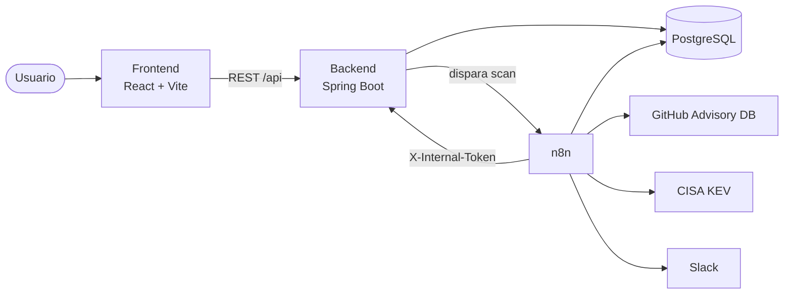

<p align="center">
  
</p>

<h1 align="center">GEF Secure</h1>

<p align="center">
  Gestión automatizada de vulnerabilidades: cruza tu inventario de activos y software<br>
  contra GitHub Advisory Database y CISA KEV, prioriza por riesgo real de negocio —no solo<br>
  por CVSS— y lleva la trazabilidad completa de cada remediación, de la detección al cierre.
</p>

<p align="center">
  
  
  
  
  
  
  
  <br>
  <a href="https://github.com/Federico-Frankenberger/GEF_Secure_App/actions/workflows/ci.yml"></a>
  <a href="https://github.com/Federico-Frankenberger/GEF_Secure_App/actions/workflows/codeql.yml"></a>
</p>

<p align="center">
  <a href="#quick-start"><strong>Quick Start</strong></a> ·
  <a href="docs/architecture/README.md">Arquitectura</a> ·
  <a href="docs/adr/README.md">Decisiones de diseño</a> ·
  <a href="knowledge-base/README.md">Base de conocimiento</a> ·
  <a href="CHANGELOG.md">Changelog</a>
</p>

---

Un analista de seguridad hoy tiene que cruzar manualmente "qué software corre en cada
servidor" contra "qué vulnerabilidades salieron esta semana" — un proceso que no escala y
que se hace tarde. GEF Secure automatiza ese cruce todos los días, prioriza lo que
realmente importa (no todo lo que tiene CVSS alto es urgente si el activo no es crítico
para el negocio) y deja un historial auditable de quién decidió qué y con qué evidencia.

No es un producto en producción con clientes — es un sistema completo y funcional pensado
para levantarse localmente vía Docker Compose, con datos de ejemplo precargados para
evaluarlo en minutos.

## Capacidades

- **Inventario de activos y software** — hosts/apps/VMs con su criticidad de negocio, y el software instalado en cada uno vía importación de SBOM ([Syft](https://github.com/anchore/syft)) o carga manual.
- **Escaneo automatizado** — cruza ese inventario contra [GitHub Advisory Database](https://github.com/advisories) y [CISA KEV](https://www.cisa.gov/known-exploited-vulnerabilities-catalog), en 4 alcances (activo / componente / entorno / global) más un escaneo global automático diario.
- **Priorización por riesgo real** — CVSS + criticidad de negocio del entorno + presencia en CISA KEV + condición de zero-day, no solo severidad técnica aislada.
- **Gestión de vulnerabilidades en 4 vistas** (Resumen, Análisis, Listado con SLA y filtros server-side, Kanban) con cierre estilo [VEX](https://www.cisa.gov/resources-tools/resources/vulnerability-exploitability-exchange-vex) — Mitigada / No aplica / Riesgo aceptado, con justificación obligatoria.
- **Dashboard** con MTTR declarado y MTTR **verificado** (este último solo cuenta cierres con evidencia técnica real, no una declaración humana), aging y breakdowns por severidad/estado/responsable.
- **RBAC de 4 roles** (`ADMIN`, `SECURITY_ANALYST`, `ASSET_OWNER`, `AUDITOR`) con scoping de activos por usuario, reforzado en el backend con `@PreAuthorize` — el frontend nunca es la única barrera.
- **Auditoría append-only** de cada hallazgo (quién, cuándo, con qué nivel de evidencia), con reconciliación automática de escaneos huérfanos.
- **Automatización con [n8n](https://n8n.io/)** (self-hosted) y notificaciones a Slack.
- **Reportes PDF** ejecutivos, por escaneo, por comparación o por CVE.
- **Landing pública** para presentar el producto antes del login.

## Screenshots

Todavía no hay capturas versionadas en el repositorio. Se recomienda incorporar, en este
orden de prioridad: **Dashboard** (vista general de KPIs), **módulo de Vulnerabilidades**
(vista Resumen y Kanban), **Centro de Escaneos** (progreso de un escaneo en curso) y la
**Landing** pública.

## Cómo funciona



1. **Se dispara un escaneo** — por activo, por componente, por entorno o global (botón en el frontend), o solo el scheduler diario de n8n a las 09:00 sin intervención humana.
2. **n8n consulta las fuentes externas** (GitHub Advisory Database, CISA KEV) y las cruza contra el software instalado en el alcance pedido.
3. **n8n calcula el score de riesgo** (CVSS + criticidad del entorno + CISA KEV + zero-day) y persiste los hallazgos directamente en Postgres — solo notifica de vuelta al backend para registrar el escaneo (`POST /api/webhook/scan-report`, autenticado con `X-Internal-Token`).
4. **El backend aplica el ciclo de vida** de cada hallazgo (modelo dual detección/triage) y actualiza el historial append-only.
5. **El analista trabaja el hallazgo** desde el módulo de Vulnerabilidades, moviéndolo `Detectada → En Análisis → Resuelta` y cerrándolo con justificación estilo VEX cuando corresponde.
6. **n8n notifica por Slack** el resultado, y el **Dashboard** agrega MTTR, aging y breakdowns en tiempo real.

Detalle completo del pipeline (50 nodos) en [`docs/architecture/04-n8n-pipeline.md`](docs/architecture/04-n8n-pipeline.md).

## Arquitectura

| Servicio | Stack | Rol |
|---|---|---|
| `frontend` | React 18 + TypeScript + Vite, servido por nginx | UI |
| `backend` | Spring Boot 3 / Java 21 | API REST, lógica de negocio, JWT, RBAC |
| `postgres` | PostgreSQL 15 | Esquema `security` (dominio de la app) + `n8n` (estado interno) |
| `n8n` | n8n self-hosted (imagen propia + bootstrap automático) | Pipeline de detección y scoring de riesgo |
| `pgadmin` | pgAdmin 4 | Administración de base, solo para debug |

Detalle por módulo: [`docs/architecture/`](docs/architecture/README.md) (system overview,
backend, frontend, pipeline de n8n, modelo de datos, ciclo de vida de una vulnerabilidad,
disponibilidad y recuperación). El **por qué** de cada decisión relevante está en 8
[ADRs](docs/adr/README.md) — JWT sin revocación, esquema SQL manual, n8n como motor de
scoring, modelo dual de estado, cierre VEX, RBAC con scoping, token interno n8n↔backend,
auditoría append-only.

## Quick Start

**Requisitos**: Docker y Docker Compose. Opcional: cuenta de Slack y un Personal Access
Token de GitHub (sube el rate limit de la GitHub Advisory API de 60 a 5000 req/h).

```bash
git clone https://github.com/Federico-Frankenberger/GEF_Secure_App.git
cd GEF_Secure_App
cp .env.example .env
```

Editar `.env` y completar como mínimo (ver tabla de variables más abajo):

- `POSTGRES_PASSWORD`, `PGADMIN_DEFAULT_PASSWORD`, `N8N_OWNER_PASSWORD` — contraseñas propias
- `N8N_ENCRYPTION_KEY` — generar una sola vez con `openssl rand -base64 32` y no volver a cambiarla
- `SLACK_BOT_TOKEN` / `GITHUB_TOKEN` — opcionales, dejar vacío si no se van a usar todavía

```bash
docker compose up -d
```

Sin pasos manuales adicionales en la interfaz de n8n. El primer arranque tarda un poco más
que los siguientes (n8n crea su usuario, importa el workflow y lo activa) — seguir el
progreso con `docker compose logs -f n8n` hasta ver
`[gef-bootstrap] Bootstrap inicial completo.`

| Servicio | URL | Notas |
|---|---|---|
| Frontend | http://localhost:3000 | Landing pública; login con datos de ejemplo precargados |
| Backend (API + Swagger) | http://localhost:8081/swagger-ui.html | |
| n8n | http://localhost:5678 | Owner y workflow ya creados y activos |
| pgAdmin | http://localhost:8080 | Login con las credenciales de `.env` |
| PostgreSQL | localhost:5433 | Bases `security` y `n8n` (5433 en el host para no chocar con un Postgres nativo en 5432) |

La base arranca con datos de ejemplo (3 entornos, 6 activos, 9 vulnerabilidades en
distintos estados) para que Dashboard, Inventario y el módulo de Vulnerabilidades se vean
funcionando desde el primer momento. Usuarios del seed, **solo para entorno local**
(`init/05-auth.sql`):

| Usuario | Password | Rol |
|---|---|---|
| `fede.frankenberger` | `GefSecure2026!` | ADMIN |
| `auditor.demo` | `GefSecure2026!` | AUDITOR |

**Validación rápida**:

```bash
docker compose ps                            # todo healthy/running
docker compose exec n8n n8n list:workflow    # workflow presente y activo
docker compose exec n8n n8n list:credentials # 3 credenciales cargadas
```

<details>
<summary><strong>Problemas comunes</strong></summary>

- **n8n reinicia en loop**: `N8N_ENCRYPTION_KEY` cambió respecto al valor usado cuando se crearon las credenciales guardadas en el volumen. Restaurar el valor original o borrar el volumen `n8n_data` para que se reconstruya (se pierde el historial de ejecuciones).
- **El backend no arranca**: revisar `docker compose logs n8n` — suele ser que n8n todavía no llegó a `healthy`.
- **Instalación limpia falla al crear el volumen de Postgres**: correr `docker compose down -v` antes de un `docker compose up -d` en un entorno de prueba (nunca contra datos reales sin backup — ver `scripts/backup.sh`).

</details>

## Variables de entorno

Plantilla completa en [`.env.example`](.env.example) (con valores de ejemplo, nunca
secretos reales). Las más relevantes:

| Variable | Para qué sirve |
|---|---|
| `POSTGRES_*` | Credenciales de la base — obligatorias |
| `N8N_ENCRYPTION_KEY` | Cifra las credenciales guardadas por n8n — generar una vez y no rotar |
| `N8N_OWNER_*` | Usuario owner de n8n, creado automáticamente en el primer arranque |
| `SLACK_BOT_TOKEN` | Habilita las notificaciones a Slack — opcional |
| `GITHUB_TOKEN` | Sube el rate limit de la GitHub Advisory API — opcional pero recomendado |
| `JWT_SECRET` | Firma de los tokens de sesión — obligatorio en cualquier entorno real |
| `N8N_INTERNAL_TOKEN` | Autentica los webhooks n8n → backend ([ADR-0007](docs/adr/0007-token-interno-compartido-para-webhook-n8n.md)) |

## Seguridad

- **Autenticación**: JWT autocontenido y sin estado, BCrypt para passwords. Un token
  emitido sigue siendo válido hasta que vence aunque el usuario se borre o cambie de rol
  mientras tanto — decisión consciente de alcance, no un descuido
  ([ADR-0001](docs/adr/0001-jwt-stateless-sin-revocacion.md)).
- **Autorización**: RBAC de 4 roles reforzado con `@PreAuthorize` a nivel de método (nunca
  solo en el frontend); `ASSET_OWNER` queda restringido a sus activos asignados.
- **Rate limiting** en `/api/auth/login` (10 intentos/min por IP).
- **Comunicación interna n8n ↔ backend** protegida con un token compartido
  (`X-Internal-Token`), no JWT — n8n es un servicio interno de confianza.
- **Auditoría append-only** de cada hallazgo y cada transición de estado, con nivel de
  evidencia asociado.
- **CodeQL** (SAST, Java + TypeScript) y **Dependabot** sobre las dependencias propias del
  proyecto.

Modelo de amenazas (STRIDE) y detalle completo de cada control en [`SECURITY.md`](SECURITY.md).
Este es un proyecto en etapa de desarrollo/demo — ninguna afirmación de "production-ready"
está implícita.

## Testing

```bash
# Backend — Gradle, 23 archivos de test (servicios con repos mockeados, mappers, un @DataJpaTest)
cd backend && ./gradlew test

# Frontend — Vitest + Testing Library, 5 archivos / 11 tests, todos regresión de un bug real
cd frontend && npm run test
```

Ambas suites corren en cada push/PR vía GitHub Actions ([`.github/workflows/ci.yml`](.github/workflows/ci.yml)).
Detalle de qué cubre cada suite en [`backend/README.md`](backend/README.md) y
[`frontend/README.md`](frontend/README.md).

## Estructura del proyecto

```
GEF_Secure_App/
├── backend/             Spring Boot 3 / Java 21 — API REST, lógica de negocio
├── frontend/            React 18 + TypeScript + Vite — UI
├── n8n/                 Dockerfile + script de arranque (bootstrap.sh)
├── n8n-provisioning/    Credenciales placeholder que usa el workflow (sin secretos)
├── workflows/           Workflow de n8n versionado en git
├── init/                Scripts SQL de inicialización de Postgres
├── scripts/             Backup y restore de Postgres/n8n
├── docs/                Arquitectura, ADRs, glosario, deuda técnica
├── knowledge-base/      Base de conocimiento del proyecto
└── docker-compose.yml
```

## Documentación

- [Arquitectura](docs/architecture/README.md) — qué es cada módulo y cómo se conectan
- [Decisiones de diseño (ADRs)](docs/adr/README.md) — por qué se tomó cada decisión relevante
- [CHANGELOG](CHANGELOG.md)
- [SECURITY](SECURITY.md) — modelo de amenazas (STRIDE) y controles implementados
- [Glosario](docs/glosario.md)
- [Deuda técnica](docs/deuda-tecnica.md) — gaps conocidos, con lo ya cerrado y cómo
- [Base de conocimiento](knowledge-base/README.md)
- READMEs por módulo: [backend](backend/README.md) · [frontend](frontend/README.md) · [n8n](n8n/README.md)

## Roadmap

Todo lo registrado en [`docs/deuda-tecnica.md`](docs/deuda-tecnica.md) (DT-01 a DT-11) está
cerrado — el archivo queda como registro histórico de qué se implementó vs. qué se decidió
dejar así conscientemente.

- [x] Inventario de activos + software, escaneo automatizado, priorización de riesgo
- [x] Módulo de Vulnerabilidades en 4 vistas + cierre VEX
- [x] RBAC con 4 roles + scoping por activo
- [x] Dashboard con MTTR declarado y verificado
- [x] Landing pública
- [x] CI/CD, Dependabot y CodeQL
- [x] Rate limiting en login
- [x] Backup real de Postgres/n8n (`scripts/backup.sh`)
- [ ] Ejecución periódica automática del backup (cron/Task Scheduler) — hoy es manual, no hay servidor productivo real donde programarlo todavía

## Licencia

Software propietario — todos los derechos reservados. Ver [`LICENSE`](LICENSE).

## Equipo

- Federico Frankenberger
- Guadalupe Maricchiolo
- Emilia Barros
