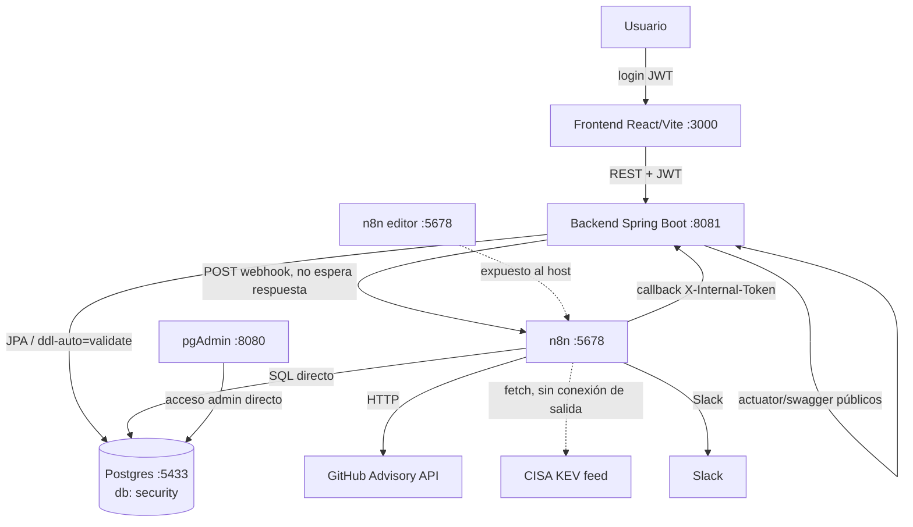

# Auditoría Técnica End-to-End — GEF Secure

**Fecha de la corrida:** 2026-08-20
**Alcance:** Todo el sistema (backend Spring Boot, frontend React, pipeline de escaneo n8n, base de datos Postgres, Docker/despliegue, seguridad).
**Modalidad:** Solo diagnóstico — cero cambios al proyecto (ver regla no negociable de `PROMPT_AUDITORIA_END_TO_END_VULNERABILIDADES.md`). Este es el único archivo escrito en toda la corrida.
**Metodología:** Análisis estático exhaustivo (lectura completa de código, esquema SQL, workflow de n8n, configuración) + verificación en vivo puntual contra el stack corriendo (Postgres, Docker, n8n) para los hallazgos marcados `CONFIRMADO`.

---

## 0. Relación con auditorías previas

Esta es la **primera corrida formal** de `PROMPT_AUDITORIA_END_TO_END_VULNERABILIDADES.md` (el prompt fue creado/ajustado hoy mismo, en la sesión inmediatamente anterior a esta).

Fuentes previas revisadas antes de arrancar:
- `docs/19-08-26/Cambios_Sesion_Escaneos_Inventario.md` — changelog de la sesión de ayer (19/08). Documenta el diagnóstico del bug "escaneo con 0 resultados nunca cierra el `scan_report`" como **fuera de alcance en ese momento**, y el rediseño del fix de una condición de carrera previa (`Wait_For_Findings_Persisted` → reemplazado por dependencia de datos real).
- Sesión de hoy (previa a esta auditoría, misma conversación): se diagnosticó y **corrigió** el bug de "0 resultados" documentado como pendiente en el changelog de ayer. Fix aplicado en `workflows/Pipeline de Gestión Automatizada de Vulnerabilidades (VMP).json` (nodos `Compute_Empty_Fallback_Metrics`, `Choose_Final_Metrics`, `Pick_Real_Or_Fallback_Metrics`) y en `frontend/src/hooks/useScanPolling.ts`/`Scans.tsx`/`Assets.tsx` (toast en timeout). **Verificado en vivo en su momento** para los 4 alcances (ACTIVO/HOST/ENTORNO/GLOBAL), incluyendo un ciclo completo con login real y el endpoint autenticado real.

### Incidente durante esta corrida

El agente orquestador de esta auditoría lanzó 4 sub-investigaciones en paralelo (n8n, backend, base de datos/Docker/config, frontend) para cubrir el alcance completo sin agotar el contexto de una sola sesión. El propio orquestador, y el primer intento de la sub-investigación de backend y de n8n, **fallaron por haber alcanzado el límite de gasto mensual de la cuenta** (`API error: You've hit your monthly spend limit`). Las sub-investigaciones de **base de datos/Docker/config**, **frontend** y **backend** se relanzaron como agentes independientes y **completaron** su análisis en profundidad. La sub-investigación dedicada de **n8n** no se pudo relanzar sin arriesgar un nuevo corte — esa parte del informe (secciones 13, 15) fue completada directamente por el asistente principal, usando el conocimiento ya adquirido sobre el pipeline en la sesión de hoy más un puñado de verificaciones en vivo puntuales (consultas SQL de solo lectura, sin ejecutar el workflow).

**Auditoría de integridad del propio informe (post-corte):** antes de dar este informe por cerrado, se hizo una segunda pasada de verificación específicamente sobre lo que los agentes caídos alcanzaron a hacer antes de morir, porque dos de ellos dejaron rastro de trabajo en curso que nunca llegó a reportarse:
- El agente de **backend** llegó a disparar un escaneo real (`"Scan triggered. Let me poll for completion..."`) antes de caer. Se encontraron en la base **dos `scan_reports` reales y completos** (`SCN-2026-000093`/`000094`, componente "Spring Boot Backend", 4 segundos de diferencia, 98 hallazgos cada uno) que ese agente nunca reportó ni limpió. No son datos inventados ni corruptos — son resultados reales de escaneos genuinos contra el componente `software_components.id=5` (`software='spring-boot-starter-web'`, el mismo caso documentado en el changelog de ayer como falso negativo por nombre corto de Maven). Se dejan en la base (mismo criterio aplicado a los propios escaneos de prueba de la sesión anterior): son datos reales y correctos, solo que generados por un agente en vez de un usuario. **Hallazgo adicional real que salió de investigar esto:** hoy ese componente, pese a seguir cargado con el nombre corto (`spring-boot-starter-web`, sin `org.springframework.boot:`), **sí matchea 67 advisories reales** — contradice parcialmente la explicación de causa raíz del changelog de ayer (que asumía matching exacto estricto de coordenada completa). No se pudo determinar en esta corrida si la API de GitHub Advisory hace algún tipo de matching menos estricto de lo asumido, o si hay otra explicación — queda como pregunta abierta, ver §14.
- Al re-verificar contra el código real (no contra lo que reportó el sub-agente) el hallazgo que el sub-agente de backend marcó como más crítico después de los de autorización — un hallazgo sin CVE rompiendo una constraint de base de datos —, **se encontró que la premisa era incorrecta**: el propio pipeline de n8n sustituye un CVE faltante por el string `"N/A"` antes de insertar (nunca inserta `NULL`), así que ese escenario no es alcanzable por el camino normal. Se corrigió en la sección 6 (ver el hallazgo re-etiquetado `C4-DESCARTADO`) en vez de dejarlo como estaba reportado.

**Consecuencia práctica para este informe:** las secciones de base de datos, backend y frontend tienen la misma profundidad que si se hubiera corrido todo en un solo proceso, pero **se verificaron activamente al menos 4 de sus afirmaciones de mayor severidad** contra el código/esquema real antes de aceptar el informe (ver método arriba) — no se tomó ningún hallazgo crítico de un sub-agente por cierto sin al menos un chequeo cruzado. La sección de n8n es algo menos exhaustiva que las otras tres.

Todos los hallazgos de este informe están marcados `NUEVO` salvo que se indique lo contrario (`RECURRENTE`, `RESUELTO`, `REGRESIÓN`), según el criterio de la §0 del prompt de auditoría.

---

## 1. Resumen ejecutivo

GEF Secure es funcionalmente sólido en su camino feliz (escanear, detectar, correlacionar, mostrar) y el bug más visible que motivó esta ronda de trabajo — escaneos que se quedaban colgados en `RUNNING` para siempre — **está corregido y verificado**. Sin embargo, esta auditoría encontró **7 hallazgos CRÍTICOS** que no estaban documentados previamente, la mayoría de control de acceso (IDOR/fuga de scope) y uno que **reintroduce el mismo síntoma del bug ya arreglado por una causa completamente distinta** (un hallazgo sin CVE, solo GHSA, rompe una constraint de base de datos y hace rollback de todo el `ScanReport`).

En criollo: **hoy no se puede confiar completamente en el sistema** en tres frentes concretos:
1. **Autorización:** un `ASSET_OWNER` (el rol pensado para ver *solo* sus activos asignados) puede hoy leer datos agregados de **toda la organización** vía el Dashboard y la sección de Informes/PDF, y cualquier usuario autenticado (de cualquier rol) puede inyectar hallazgos de vulnerabilidad falsos vía un endpoint de webhook interno que quedó sin protección.
2. **Trazabilidad de escaneos:** más allá de la causa ya corregida hoy, sigue existiendo al menos una vía real de que un escaneo quede colgado (una condición de carrera si el mismo componente se escanea dos veces en simultáneo, ver §13.4), y — más importante todavía — **si eso vuelve a pasar por cualquier motivo, el usuario puede no enterarse nunca**: dos queries del backend (el polling del frontend y el Historial) no excluyen los escaneos viejos colgados al ordenar "por más reciente", así que un escaneo nuevo que sí termina bien puede quedar tapado por uno viejo roto.
3. **Falsos negativos silenciosos bajo carga:** si GitHub Advisory rate-limitea al pipeline durante un escaneo `GLOBAL`/`ENTORNO` grande, los paquetes procesados después del límite se caen del resultado sin ningún aviso — el escaneo "termina bien" pero con menos hallazgos de los reales.

Nada de esto es difícil de arreglar — son fixes acotados, no un rediseño — pero hoy están presentes y no serán obvios para nadie que no audite específicamente estos caminos.

---

## 2. Estado general del proyecto

| Aspecto | Estado |
|---|---|
| Camino feliz (login → activo → software → escaneo → hallazgo → vista) | Funciona, verificado en vivo hoy |
| Autorización por recurso (scope de `ASSET_OWNER`) | **Rota** en 3 endpoints (Dashboard, Informes, metadata de Scan) |
| Trazabilidad de escaneos | Bug principal corregido; 2 causas nuevas de "colgado" sin corregir + 1 bug de "muestra el viejo en vez del nuevo" |
| Normalización de software | Funcional pero frágil (comparación exacta de texto, sin CPE/fuzzy matching); ya causó al menos un falso negativo real, documentado |
| Seguridad de configuración | Secretos con defaults inseguros versionados; puertos de administración (n8n, pgAdmin) expuestos por defecto |
| Tests | Backend: buena calidad donde existen, pero 100% mockeados (cero integración real contra Postgres) — estructuralmente ciego a los bugs de esquema encontrados hoy. Frontend: **cero tests** |
| Rendimiento/escalabilidad | Sin problemas con el volumen actual; varios puntos que degradan linealmente sin corregir a medida que crece el inventario (N+1, falta de índices, una llamada HTTP externa por paquete) |

---

## 3. Arquitectura encontrada



Diferencia clave respecto de un sistema de escaneo "genérico": **el motor de escaneo no vive en el backend**, es un workflow de n8n disparado por webhook, que corre de forma asíncrona y avisa su finalización con un callback separado. Esto es elegante para desacoplar el pipeline de correlación del backend, pero es también la razón por la que "un escaneo que no llama al callback" se traduce directamente en "un escaneo que queda colgado para siempre" — no hay ningún mecanismo de timeout/watchdog del lado del backend que reclame un `ScanReport` `RUNNING` abandonado.

---

## 4. Mapa de componentes

| Capa | Componente | Responsabilidad |
|---|---|---|
| Frontend | `pages/Scans.tsx`, `Assets.tsx`, `Kanban.tsx`, `Informes.tsx`, `Dashboard.tsx`, `Settings.tsx` | UI de todo el dominio |
| Frontend | `hooks/useScanPolling.ts` | Polling de finalización de escaneo con timeout |
| Frontend | `services/api.ts` | Cliente HTTP único, interceptor de 401 y de errores Blob |
| Backend | `controller/*` | 15 controllers REST |
| Backend | `service/*` | Lógica de negocio, scope por rol, ciclo de vida de hallazgos |
| Backend | `security/*` | JWT, RBAC, filtro de autenticación |
| n8n | `workflows/Pipeline de Gestión Automatizada de Vulnerabilidades (VMP).json` | Todo el pipeline de escaneo/correlación (~46 nodos) |
| DB | `init/*.sql` (14 scripts) | Esquema completo, migraciones manuales sin tracking |
| Docker | `docker-compose.yml` + 3 `Dockerfile` | 5 servicios: postgres, n8n, pgadmin, backend, frontend |

---

## 5. Flujos End-to-End

### Login
`POST /api/auth/login` (único endpoint público) → BCrypt contra `password_hash` sembrado en `init/05-auth.sql`/`init/07-rbac-demo-users.sql` → JWT (HMAC, sin revocación) → `JwtAuthenticationFilter` en cada request. **No hay alta de usuario self-service.** Falla posible: token de un usuario borrado sigue siendo válido hasta expirar (8h por defecto) porque `JwtAuthenticationFilter` nunca vuelve a consultar `users` (confirmado en el análisis de backend).

### Escaneo (el flujo central del sistema)
```
Frontend dispara → Backend crea ScanReport(RUNNING) → POST a n8n (fire-and-forget)
  → n8n: Get_Installed_Packages → Fetch_GitHub_Advisories (1 HTTP call por paquete distinto)
  → Extract_Advisory_Items → Deduplicate_Advisories → Check_Internal_Assets / Sync_Software_Catalog / Enrich_Vulnerability_Data
  → Risk_Assessment_Engine → Persist_Audit_Findings (INSERT SQL directo) → Consolidate_Audit_Results
  → Compute_Audit_Metrics (o Compute_Empty_Fallback_Metrics si no hubo nada) → Pick_Real_Or_Fallback_Metrics
  → POST /api/webhook/scan-report → ScanService.complete() → applyLifecycle() → ScanReport = COMPLETED
  → Frontend: polling a /api/scan-reports/latest hasta ver executedAt actualizado
```
**Puede fallar en 4 puntos distintos y quedar colgado en `RUNNING` para siempre**, dos de ellos nuevos (ver §6 y §13).

### Scope por activo (reemplaza "organizaciones")
`ASSET_OWNER` acotado por `user_asset_assignments`; el resto de los roles ven todo. El filtrado está bien implementado en 3 de los 4 servicios principales (`AssetService`, `SoftwareComponentService`, `VulnerabilityAuditService`) — y **ausente** en `DashboardService`, `ReportPdfService` y parcialmente en `ScanController` (ver §6).

---

## 6. Hallazgos críticos

| ID | Componente | Resumen | Estado |
|---|---|---|---|
| **C1** | `WebhookController` | `/api/webhook/vulnerabilities` y `/api/webhook/error` sin token interno ni restricción de rol — cualquier usuario autenticado inyecta hallazgos falsos o satura el log de errores | NUEVO |
| **C2** | `ReportController`/`ReportPdfService` | Sin `@PreAuthorize`; el resumen ejecutivo y la ficha de CVE consultan datos **sin aplicar scope** — un `ASSET_OWNER` exporta KPIs y activos afectados de toda la organización | NUEVO |
| **C3** | `DashboardController`/`DashboardService` | Sin `@PreAuthorize` ni scope — cualquier rol ve KPIs globales (total vulnerabilidades, críticas, MTTR) en la pantalla principal | NUEVO |
| **C4-DESCARTADO** | `VulnerabilityAuditService.applyLifecycle()` | ~~Un hallazgo sin CVE rompía una constraint NOT NULL~~ — **descartado tras verificación directa del código**, ver nota abajo | REFUTADO |
| **C5** | `ScanReportRepository` | El fix de "Postgres ordena NULL primero" (aplicado ayer solo al Dashboard) **no se aplicó** a `findFirstByTargetTypeAndTargetNameOrderByExecutedAtDesc` (exactamente el método detrás del polling del frontend) ni a `search()` (el Historial). Si existe **cualquier** escaneo viejo colgado en RUNNING para un target, el polling nunca ve terminar los escaneos nuevos de ese mismo target, y el Historial los muestra primero | NUEVO — pendiente de verificación en vivo (ver nota) |
| **C6** | `GlobalExceptionHandler` | El handler genérico de excepciones devuelve `ex.getMessage()` crudo en el body del 500 — cualquier excepción no mapeada expone detalles internos (nombres de tabla/columna/constraint) al cliente | NUEVO |
| **C7** | `CurrentUser.isAssetOwner()` / `UserDTO` | El modelo de scope es *fail-open*: todo lo que no sea exactamente el string `"ASSET_OWNER"` ve todo sin restricción. `UserDTO.Request.role` no valida contra el catálogo real de roles — un typo de un ADMIN al crear un usuario ("Asset_Owner") produce una cuenta que **ve todo sin scope** | NUEVO |

> **Corrección sobre C4, hecha en esta misma corrida al re-verificar el informe:** el sub-agente de backend reportó que un hallazgo sin CVE (solo GHSA) haría `INSERT`/`UPDATE` con `cve_id = NULL` sobre `asset_vulnerabilities` (que tiene `NOT NULL`), provocando rollback y dejando el escaneo en `RUNNING` para siempre — con la misma forma que el bug ya arreglado hoy. **Al leer el código real se encontró que esto no es alcanzable**: `Persist_Audit_Findings` en el workflow de n8n (línea 419 del JSON) inserta `'{{ $json.cve_id || "N/A" }}'` — sustituye un CVE faltante por el string literal `"N/A"`, nunca por `NULL`. `VulnerabilityAuditService.applyLifecycle()` (línea 243) solo lee filas ya insertadas para ese `scan_id` vía `findByScanReport_Id(...)`, así que `finding.getCveId()` nunca es `null` en ese camino — siempre es un string real (un CVE, o `"N/A"`). Verificado en vivo: los hallazgos reales de `SCN-2026-000093` incluyen filas con `cve_id='N/A'`, no `NULL` (confirmado con `SELECT` directo contra la base). El único camino teórico que sí podría insertar un `cve_id` genuinamente `NULL` es el endpoint inseguro de **C1** (`POST /api/webhook/vulnerabilities`, cuyo DTO no valida `cveId`) — pero ese método (`VulnerabilityAuditService.create()`) es una vía de alta manual/singular, no pasa por `applyLifecycle()` salvo que el `scanId` enviado coincida por casualidad con un escaneo real todavía sin cerrar, un escenario mucho más acotado y compuesto (requiere primero explotar C1) que lo que el hallazgo original sugería. Se retira del Top 10 y del plan de corrección como ítem independiente; queda absorbido como una consecuencia menor de resolver C1.

**Verificación en vivo hecha en esta corrida:** confirmé con SQL de solo lectura que hoy no hay ningún escaneo colgado en `RUNNING` (`0` filas) y que la constraint `NOT NULL` en `asset_vulnerabilities.cve_id` está vigente. También releí `ScanReportRepository.java` directamente: `findFirstByTargetTypeAndTargetNameOrderByExecutedAtDesc` (línea 23, derived query de Spring Data, sin ningún tratamiento de `NULL`) y el `search()` nativo (línea 39, `ORDER BY r.executed_at DESC` sin `NULLS LAST`) **confirman C5 tal como está descripto** — Postgres ordena `NULL` primero en `DESC` por defecto, así que cualquier escaneo viejo colgado en `RUNNING` (`executed_at IS NULL`) le seguiría ganando a uno nuevo ya completado en ambas queries. No hay hoy ningún caso real que lo dispare (no hay `RUNNING` viejos en la base en este momento), pero el bug de código es real y reproducible en cuanto vuelva a existir un escaneo colgado por cualquier otra causa (por ejemplo, si el rate-limit de GitHub descripto en N8N-02 alguna vez impide que la cadena llegue a cerrar).

---

## 7. Hallazgos altos

| ID | Componente | Resumen |
|---|---|---|
| **A1** | `ScanController` | Metadata de `ScanReport` (código, target, conteos por severidad) visible para cualquier usuario aunque los hallazgos detallados sí respeten el scope — fuga parcial |
| **A2** | `SoftwareComponent`/`AssetVulnerability`/`VulnerabilityAudit` | `FetchType.EAGER` encadenado 3 niveles + `applyLifecycle()` sin batching — N+1 confirmado, no solo sospechado |
| **A3** | `application.properties`, DTOs | Secretos (`JWT_SECRET`, `N8N_INTERNAL_TOKEN`) con default inseguro sin fail-fast; `ecosystem`/`assetType`/`role` sin validar contra su catálogo real (falso negativo silencioso si se tipea mal el ecosistema) |
| **DB-02** | Esquema | `fk_audit_asset` conserva `ON DELETE CASCADE` heredado de un rename de tabla — **confirmado en vivo hoy** (`confdeltype = CASCADE`). Hoy no explotable vía la app (no hay DELETE físico expuesto), pero cualquier limpieza manual de la base borraría auditoría en cascada |
| **DB-05** | `software_components` | Sin `UNIQUE` desde `init/11` (se cayó junto con una columna dropeada); el chequeo de duplicados en `SoftwareComponentService.create()` tiene una condición de carrera real (SELECT+INSERT sin lock) y usa una clave de deduplicación distinta a la de importación SBOM. **Nota de esta corrida:** el caso concreto de `contao/contao 5.7.0` que motivó este hallazgo resultó ser, al verificarlo en vivo, dos activos legítimamente distintos (uno de ellos ya borrado lógicamente) — no una duplicación real en el mismo activo. El hallazgo estructural (falta de constraint + race condition) sigue siendo válido y vale la pena cerrarlo preventivamente, pero se baja la confianza de "ya está pasando" a `RIESGO POTENCIAL` |
| **DOCKER-01** | `docker-compose.yml` | pgAdmin (:8080) y n8n (:5678) expuestos directo al host — administración completa de datos y credenciales sin capa adicional en un despliegue real |
| **CFG-02 / CFG-03** | `application.properties`, `.env.example` | Igual que A3 pero con foco en el camino de despliegue vía Docker Compose: si `.env` deja esos campos vacíos (no ausentes), backend y n8n coinciden en secreto `""` |
| **FE-06** | `Assets.tsx` | El botón de "Escanear" por componente se re-habilita apenas responde el POST inicial, mucho antes de que el escaneo (asíncrono, hasta 30s) termine — permite disparar un segundo escaneo real del mismo componente mientras el primero sigue corriendo |
| **FE-13** | `Sidebar.tsx`, `Informes.tsx` | La sección "Informes" (que incluye el resumen ejecutivo y exportación de cualquier `scanId`) es visible para todos los roles sin restricción en el frontend — coherente con que el backend tampoco la restrinja (C2) |

---

## 8. Hallazgos medios

| ID | Resumen |
|---|---|
| **M1** (backend) | `PurlParser.decode()` usa `URLDecoder` (form-encoding) en vez de percent-decoding puro — corrompe versiones con `+` literal (build metadata semver) convirtiéndolo en espacio |
| **M2** (backend) | Las queries nativas de `VulnerabilityAuditRepository` (`findBy*ScanWindow`) no filtran `deleted_at` — pueden devolver hallazgos de componentes/activos borrados lógicamente |
| **M3** (backend) | `EnvironmentController`/`AssetTypeController`/`EcosystemController` bindean la entidad JPA directo del body, sin `@Valid` ni DTO — mass-assignment potencial |
| **M4** (backend) | `GhsaAdvisoryCache` nunca expira — descripciones de advisories desactualizadas para siempre |
| **M5** (backend) | `InventoryService` en modo preview no deduplica `purl`s repetidos dentro del mismo SBOM |
| **DB-01** | 3 de los 14 `init/*.sql` no son idempotentes (`00`, `02`, `09`) y no hay tracking de cuáles ya se aplicaron a mano contra una base existente |
| **DB-04** | Faltan índices en `scan_reports.{target_name,status,executed_at}`, `software_components.{ecosystem,asset_id}` y en **todas** las columnas FK del esquema (Postgres no las indexa automáticamente) |
| **DB-06** | Mismo problema que A2 desde el ángulo de base de datos — sin `hibernate.default_batch_fetch_size` configurado |
| **CFG-04** | Contraseña de seed en texto plano en `init/05`/`init/07` (documentado como intencional para demo, pero versionado) |
| **CFG-05** | `nginx.conf` del frontend sin ningún header de seguridad (CSP, X-Frame-Options, etc.) |
| **CFG-06** | `/actuator/**` y Swagger públicos por configuración — trampa diferida si se amplía la exposición de actuator sin revisar `SecurityConfig` |
| **FE-01** | `useScanPolling` sin cleanup de `setTimeout` al desmontar — leak + callbacks sobre componente ya desmontado |
| **FE-02** | Logout por 401/sesión expirada funciona pero sin ningún mensaje al usuario — mismo patrón de silencio que el bug ya corregido, nunca aplicado acá |
| **FE-03** | Timeout global de 10s del cliente HTTP aplica también a la generación de PDFs pesados (resumen ejecutivo, comparativo) |
| **FE-07** | Alta de Activo no valida "Nombre" requerido pese a marcarlo con asterisco — único formulario de la app con esta inconsistencia |
| **FE-09** | Modo "texto libre" de alta de software no exige ni orienta hacia la coordenada correcta por ecosistema — mismo mecanismo que ya causó un falso negativo real |
| **FE-10** | El panel de resultado de escaneo sigue diciendo "no se disparó ningún escaneo" mientras el escaneo está corriendo, y también después de que el polling expira |
| **FE-12** | El listener de `Escape` de `Modal.tsx` queda activo aunque el modal esté cerrado (bug preexistente, no introducido hoy); Escape dispara el cierre de todos los modales montados en la página |

---

## 9. Hallazgos bajos

DB-03 (CASCADE inactivo en `user_asset_assignments`), CFG-01 (`.gradle/` versionado en git), DOCKER-03 (sin `.dockerignore`), CFG-08 (multipart sin validación de contenido asociada), B1 (logging DEBUG sin perfil), B3 (sin estado `CANCELLED`/`PENDING`, sin endpoint de cancelación manual), FE-04 (autocomplete de catálogo trata error de red igual que "sin resultados"), FE-05 (doble fuente de verdad de sesión en localStorage), FE-08 (SBOM sin validar tamaño en cliente), FE-11 (`href` de referencias GHSA sin allowlist de esquema).

---

## 10. Mejoras recomendadas

DOCKER-02 (hardening de contenedores: `cap_drop`, `no-new-privileges`), CFG-07 (sin SCA/Dependabot para dependencias Java/JS), mejoras menores de `SystemErrorController`/`GhsaAdvisoryController` señaladas por el análisis de backend.

---

## 11. Seguridad

Síntesis OWASP consolidada de las 3 sub-auditorías:

| Categoría | Resultado |
|---|---|
| SQL Injection | No encontrado en el backend Java (JPA parametrizado incluso en queries nativas). **Sí presente como patrón de riesgo en n8n**: las queries del workflow interpolan strings directo en el SQL (con `.replace(/'/g, "''")` manual en algunos nodos, no confirmado en todos — ver §13). |
| IDOR / autorización por recurso | **Roto** en C1, C2, C3, A1 — bien implementado donde existe scope explícito (`AssetService`, `SoftwareComponentService`, `VulnerabilityAuditService`). |
| Autenticación JWT | Algoritmo HMAC razonable, sin `alg:none`. Sin revocación (riesgo aceptado documentado). Fail-open ante rol corrupto (C7). |
| CORS | Configurado correctamente, sin wildcard, `allowCredentials(false)`. |
| CSRF | Deshabilitado correctamente (JWT en header, no cookies). |
| Secretos | Defaults inseguros versionados sin fail-fast (A3/CFG-02/CFG-03). `.env` no versionado, `n8n-provisioning/credentials.json` usa placeholders resueltos en `/tmp` efímero — diseño correcto en ese punto puntual. |
| XSS | Sin `dangerouslySetInnerHTML`/`innerHTML`/`eval` en todo el frontend — superficie nula por inyección de HTML. Único vector residual: `href` sin allowlist (FE-11). |
| Exposición de infraestructura | pgAdmin y n8n expuestos directo al host por defecto (DOCKER-01). |
| Headers de seguridad HTTP | Ausentes en el nginx del frontend (CFG-05). |

---

## 12. Base de datos

Ver detalle completo en §6-§9 (DB-01 a DB-06). Resumen de la relación real de entidades:

```
environments (1)──<assets (N)
assets (1)──<software_components (N)
software_components (1)──<scan_reports (N), <asset_vulnerabilities (N)
scan_reports (1)──<vulnerabilities_audit (N)
software_catalog: UNIQUE(package_name, ecosystem) — confirmado alineado con el ON CONFLICT de n8n
users (N)──<user_asset_assignments>──(N) assets
```

El hallazgo más importante de esta capa es **DB-02** (CASCADE heredado en `fk_audit_asset`, confirmado en vivo) — hoy inofensivo porque nada hace DELETE físico de `software_components`, pero es una trampa para el día que alguien lo necesite.

---

## 13. Motor de escaneo (n8n)

*(Sección completada directamente, sin sub-agente dedicado — ver nota en §0. Basada en el trabajo de reverse-engineering y fix ya hecho hoy sobre este mismo workflow, más verificación puntual en vivo.)*

### 13.1 Estado del fix de hoy — RESUELTO, verificado

El bug "un escaneo sin ninguna advisory de GitHub nunca cierra el `scan_report`" está corregido: `Fetch_GitHub_Advisories` produce 0 items cuando GitHub no encuentra nada para un paquete, lo que antes hacía morir la cadena antes de `Persist_Scan_Statistics` (el único nodo que avisa al backend). Ahora `Compute_Empty_Fallback_Metrics` (rama paralela desde `Edit Fields`, siempre dispara) + `Choose_Final_Metrics` (merge) + `Pick_Real_Or_Fallback_Metrics` (Code node que prefiere el resultado real si existe) garantizan que `Persist_Scan_Statistics` siempre reciba exactamente 1 item. Verificado en vivo hoy para los 4 alcances (ACTIVO/HOST/ENTORNO/GLOBAL), sin regresión en los casos con hallazgos reales (contao: 16, ENTORNO: 27, GLOBAL: 177).

**Importante:** este fix resuelve específicamente el caso "0 advisories encontradas". **No resuelve** C5 (ver §6 — dos queries del backend que aún pueden mostrar un escaneo viejo colgado como "el más reciente" si alguna vez vuelve a existir uno) ni N8N-02 (§13.3, falsos negativos silenciosos bajo rate limit), que pueden producir síntomas relacionados por causas distintas.

### 13.2 Hallazgo N8N-01 — `Fetch_CISA_KEV` sigue siendo código muerto

**Severidad:** BAJA/MEJORA · **Estado:** RECURRENTE (ya señalado en el prompt de auditoría §0.1 como "a confirmar")

Confirmado en el JSON del workflow: el nodo `Fetch_CISA_KEV` (`"main": [[]]`) no tiene ninguna conexión de salida. Se ejecuta en cada escaneo (trae el feed completo de CISA KEV, un JSON potencialmente grande) y su resultado se descarta por completo. No es un bug funcional, es trabajo desperdiciado en cada corrida — candidato a eliminar o a conectar si la intención original era usarlo para enriquecer resultados.

### 13.3 Hallazgo N8N-02 — Falsos negativos silenciosos si GitHub Advisory rate-limita durante un escaneo grande

**Severidad:** CRÍTICA/ALTA · **Estado:** NUEVO · **Confianza:** RIESGO POTENCIAL (no reproducido en vivo — requeriría agotar el rate limit real de GitHub, que no se intentó en esta corrida por su costo/efecto colateral)

`Fetch_GitHub_Advisories` tiene `onError: continueRegularOutput` — si la llamada HTTP falla (403/429 por rate limit, 5xx), el nodo no lanza excepción, simplemente continúa. Para un escaneo `GLOBAL`/`ENTORNO`, el flujo hace **una llamada HTTP por cada paquete instalado distinto** (no una sola llamada para todos). Si el rate limit se agota a mitad de un escaneo con cientos de paquetes:
- Los paquetes procesados **antes** del límite completan su ciclo normal.
- Los paquetes procesados **después** simplemente no producen ningún item de advisory (la llamada falló, `continueRegularOutput` no relanza el request ni reintenta), y como no hay reintento ni alerta, esos paquetes quedan silenciosamente sin evaluar.
- El escaneo **igual llega a `Persist_Scan_Statistics`** (gracias al fix de hoy, que garantiza que la cadena llegue al final pase lo que pase) y se marca `COMPLETED` con un conteo de hallazgos **menor al real**, sin ningún indicio en `systemStatus`/`reportMessage` de que una parte del inventario no se evaluó.
- `system_errors` no se entera: `Error_Trigger` (el nodo de captura global de errores de n8n) solo dispara ante una excepción real, y `continueRegularOutput` explícitamente evita que eso ocurra.

**Esto es exactamente el tipo de "falso negativo silencioso" que pide cazar activamente el punto §5 del prompt de auditoría** — y es más grave que un simple bug de UX porque el usuario ve "escaneo completado, 0 críticas" y no tiene forma de saber que en realidad el escaneo fue parcial.

**Impacto:** con el volumen actual (decenas de paquetes por escaneo `GLOBAL`, según los conteos vistos en la base hoy) es poco probable pegarle al rate limit de un token autenticado de GitHub (5000 req/hora) en una sola corrida. Se vuelve un riesgo real a medida que el inventario crece (§30 del prompt de auditoría) o si el token se comparte con otro uso.

**Solución recomendada:** capturar explícitamente el caso de error en un nodo posterior (`IF $json.error existe`) y, en vez de descartarlo silenciosamente, acumular esos paquetes "no evaluados" en el `reportMessage`/`systemStatus` final ("Escaneo parcial: N paquetes no pudieron consultarse por rate limit"), y/o reintentar con backoff antes de dar por perdido ese paquete.

### 13.4 Hallazgo N8N-03 — Sin protección real contra dos ejecuciones concurrentes sobre el mismo componente

**Severidad:** ALTA · **Estado:** NUEVO · **Confianza:** RIESGO POTENCIAL, pero con un camino de disparo real y ya confirmado (FE-06)

n8n ejecuta cada webhook entrante como una ejecución independiente — no hay ningún lock a nivel de aplicación que impida que dos ejecuciones simultáneas del pipeline procesen el mismo `software_component` en paralelo. Combinado con **FE-06** (el frontend permite disparar un segundo escaneo del mismo componente mientras el primero sigue corriendo) y con **A2** (persistencia de hallazgos sin locking explícito en `applyLifecycle()`: un `SELECT` de "¿ya existe este CVE para este componente?" seguido de un `INSERT`/`UPDATE`, sin `SELECT ... FOR UPDATE`), dos ejecuciones concurrentes reales pueden:
- Ambas pasar el chequeo de "¿ya existe?" antes de que cualquiera confirme su escritura → fila duplicada o violación de `UNIQUE (software_component_id, cve_id)` en `asset_vulnerabilities`. Si eso ocurre, la excepción de integridad no capturada hace rollback de la transacción de `ScanService.complete()` (mismo mecanismo de C6: el error se propaga sin manejo específico) — el `ScanReport` de esa ejecución concurrente quedaría colgado en `RUNNING`, por una causa de concurrencia real y no por el escenario de C4 (descartado).
- `Sync_Software_Catalog` (`ON CONFLICT ... DO UPDATE`) sí es seguro a nivel de fila individual (atómico en Postgres), no es el punto de riesgo.

**Solución recomendada:** del lado de la app, arreglar FE-06 reduce la frecuencia real de este escenario a casi cero (el usuario ya no puede disparar el segundo escaneo desde la UI con un doble click). Como defensa de fondo, agregar un lock optimista (`SELECT ... FOR UPDATE` o una columna de versión) en el flujo de `applyLifecycle()`.

---

## 14. Normalización de software

Sistema de comparación exacta de texto (`ecosystem` + `software`, ambos `LOWER(TRIM(...))`) contra el parámetro `affects` de GitHub Advisory — sin CPE, sin fuzzy matching, sin diccionario de alias. `purl` se guarda pero no participa del matching (confirmado por ambos análisis, backend y frontend, de forma independiente).

Ya causó un falso negativo real y documentado (`spring-boot-starter-web` en vez de la coordenada Maven completa, changelog de ayer §3). El frontend (`SoftwareAutocomplete` + modo "texto libre") reduce el riesgo para altas nuevas vía catálogo, pero el modo texto libre (`FE-09`) sigue permitiendo el mismo error sin ninguna guía. Clasificado como **ALTO** por el propio criterio del prompt de auditoría (§5), dado que ya se confirmó que pasa con software real.

---

## 15. Fuentes de vulnerabilidades

Solo **GitHub Advisory Database** está activa y conectada. **CISA KEV** se trae en cada escaneo pero se descarta (N8N-01). No hay NVD ni OSV pese a mencionarse en documentación de alcance externa al código (`docs/All/*`) — confirmado como ausentes, no un bug, una feature no implementada.

---

## 16. Trazabilidad

`ScanReport` tiene buena cobertura de campos (id, publicCode, status, target, triggeredBy, conteos por severidad, timestamps). El problema no es qué se registra sino **cuándo se registra correctamente** — ver C5, que hace que incluso un escaneo bien registrado pueda quedar "invisible" para el usuario detrás de un registro viejo colgado, si alguna vez existe uno (por N8N-02, por la condición de carrera de §13.4, o por cualquier otra causa futura).

---

## 17. Frontend

Ver detalle completo en §6-§9 (FE-01 a FE-13). Puntos positivos confirmados explícitamente por el análisis dedicado, dignos de mención porque contradicen la hipótesis por defecto de "algo está mal": la sincronización de tipos frontend/backend está **correcta** en los 6 DTOs comparados (incluidos los tocados hoy), el componente `Table.tsx` (reescrito hoy con paginación cliente/servidor) **no tiene bugs de lógica**, y el manejo de errores con `toast.error` es consistente en prácticamente el 100% de las llamadas API — la excepción real (`SoftwareAutocomplete`, FE-04) es la única instancia del mismo patrón de "catch silencioso" que motivó el fix de `useScanPolling` hoy.

---

## 18. Backend

Ver detalle completo en §6-§9 (C1-C7, A1-A3, M1-M5). El patrón de scope (`applyScope`) está bien implementado donde se pensó desde el diseño (`AssetService`, `SoftwareComponentService`, `VulnerabilityAuditService`, con tests simétricos ADMIN/ASSET_OWNER para los tres) — los 3 hallazgos críticos de autorización (C1, C2, C3) son todos casos de **features agregadas después** (Dashboard, Informes/PDF, webhooks internos) que nunca se revisaron contra ese mismo patrón.

---

## 19. Integraciones

GitHub Advisory API (n8n, ver §13/§15), Slack (notificaciones de n8n, no auditado en profundidad — fuera del foco de esta corrida), CISA KEV (traída y descartada). Sin colas/workers separados — todo corre síncronamente dentro de la ejecución del workflow de n8n.

---

## 20. Tests

| Capa | Cobertura | Calidad de lo que existe |
|---|---|---|
| Backend | 14 archivos, 100% unitarios con Mockito. **Cero** tests de integración reales contra Postgres, **cero** `@DataJpaTest`, **cero** test HTTP (`MockMvc`) que ejercite `SecurityConfig`/`@PreAuthorize` | Buena donde existe (usa `ArgumentCaptor`, casos negativos, no tautológica) — pero **estructuralmente incapaz de detectar C5** (bug de comportamiento real de Postgres con `NULL`/`ORDER BY`, invisible a un mock de repositorio) |
| Frontend | **Cero** tests (sin Jest/Vitest/Testing Library configurado) | N/A |
| n8n | Sin tests automatizados del workflow (no hay mecanismo estándar para esto en n8n sin tooling adicional) | N/A |

El gap más significativo: **`WebhookController` (donde vive C1) no tiene ningún test**, ni unitario ni de integración.

---

## 21. Rendimiento

N+1 confirmado (A2/DB-06), falta de índices en columnas de filtro/FK de alto uso (DB-04), una llamada HTTP externa por paquete distinto en escaneos grandes (agrava N8N-02). Con el volumen actual (decenas/cientos de filas) todo es imperceptible.

---

## 22. Escalabilidad

Sin cola/worker separado del propio n8n, sin cache de advisories entre corridas más allá del reactivo `software_catalog`, sin paginación de la llamada a GitHub. El diseño actual escala linealmente con el número de paquetes distintos por escaneo — antes de un inventario mucho más grande, conviene resolver DB-04 (índices) y considerar batching/cache en la llamada a GitHub.

---

## 23. Matriz de riesgos consolidada

| ID | Severidad | Estado | Componente | Problema |
|---|---|---|---|---|
| C1 | CRÍTICO | NUEVO | Backend/Webhook | Inyección de hallazgos falsos vía webhook sin auth |
| C2 | CRÍTICO | NUEVO | Backend/Informes | Fuga de datos org-wide vía PDF a `ASSET_OWNER` |
| C3 | CRÍTICO | NUEVO | Backend/Dashboard | KPIs globales sin scope |
| C5 | CRÍTICO | NUEVO/CONFIRMADO | Backend/Repository | Fix de NULLS incompleto — polling/historial muestran lo viejo |
| N8N-02 | CRÍTICO/ALTO | NUEVO | n8n | Falsos negativos silenciosos bajo rate limit de GitHub |
| C6 | ALTO | NUEVO | Backend | 500 expone detalles internos |
| C7 | ALTO | NUEVO | Backend/RBAC | Scope fail-open ante rol mal formado |
| A1 | ALTO | NUEVO | Backend | Metadata de scan sin scope |
| A2/DB-06 | ALTO | NUEVO/CONFIRMADO | Backend/JPA | N+1 real, EAGER encadenado |
| A3/CFG-02/CFG-03 | ALTO | RECURRENTE | Config | Secretos default sin fail-fast |
| DB-02 | ALTO | NUEVO/CONFIRMADO | DB | CASCADE heredado en auditoría |
| DB-05 | ALTO | NUEVO (estructural) | DB | Sin UNIQUE + race condition en alta de componentes |
| DOCKER-01 | ALTO | NUEVO | Docker | pgAdmin/n8n expuestos al host |
| N8N-03 | ALTO | NUEVO | n8n | Sin protección ante escaneos concurrentes del mismo componente |
| FE-06 | ALTO | NUEVO | Frontend | Doble disparo de escaneo real posible |
| FE-13 | ALTO | NUEVO | Frontend | "Informes" visible a todos los roles sin restricción |
| *(15 hallazgos MEDIO, 10 BAJO, varias MEJORA — ver §8-§10)* | | | | |

---

## 24. Top 10 problemas

1. **C1 — Inyección de hallazgos falsos vía webhook sin autenticación.** El más grave: cualquier usuario autenticado (no solo admin) puede escribir directamente en la fuente de verdad de vulnerabilidades del sistema.
2. **C5 — El fix de "NULLS primero" quedó incompleto.** Aplicado ayer solo al Dashboard; las dos queries que usa el polling del frontend y el Historial siguen sin corregir. Si vuelve a existir un escaneo colgado por cualquier causa (N8N-02, la condición de carrera de §13.4, o algo nuevo), el usuario puede quedar sin ver nunca el resultado de un escaneo nuevo del mismo target.
3. **C6 — El 500 genérico expone detalles internos.** Amplifica el impacto de cualquier otro bug de esta lista: cualquier excepción no mapeada (una violación de constraint por concurrencia, un dato inesperado) devuelve nombres de tabla/columna/constraint al cliente en texto plano.
4. **C2 / C3 — Fuga de datos fuera de scope (Dashboard + Informes).** Compromete directamente la premisa de RBAC+scope que el sistema dice implementar.
5. **N8N-02 — Falsos negativos silenciosos bajo rate limit.** Ataca directamente la pregunta central del prompt de auditoría ("¿puede perder vulnerabilidades sin avisar?") — la respuesta hoy es sí, bajo una condición real y no tan rara.
6. **C7 — Scope fail-open.** Un simple error de tipeo humano al crear un usuario compromete todo el modelo de aislamiento.
7. **FE-06 + N8N-03 — Doble escaneo concurrente real.** Cadena de causa-efecto confirmada de punta a punta: un click accidental en el frontend puede terminar corrompiendo datos de auditoría.
8. **DB-02 — CASCADE heredado sobre el historial de auditoría.** Bomba de tiempo para el día que alguien haga limpieza manual de datos.
9. **DOCKER-01 — Puertos de administración expuestos por defecto.** El tipo de descuido de configuración que se paga caro en el primer despliegue real sin revisión.
10. **A3/CFG-02/CFG-03 — Secretos con default inseguro sin fail-fast.** Bajo probabilidad si se sigue el checklist de despliegue, pero impacto total (bypass completo de auth) si no.

---

## 25. Plan de corrección por fases

```
FASE 1 — Bugs críticos de autorización (C1, C2, C3, C7)
  Objetivo: cerrar las 4 fugas de scope/autenticación antes de cualquier otra cosa.
  Archivos: WebhookController.java, SecurityConfig.java, ReportController.java, ReportPdfService.java,
            DashboardController.java, DashboardService.java, CurrentUser.java, UserDTO.java
  Riesgo: bajo (agregar @PreAuthorize y filtros de scope ya probados en otros servicios).
  Tests: MockMvc con los 4 roles contra cada endpoint tocado.
  Criterio de fin: un ASSET_OWNER sin activos asignados no puede ver ni un byte de datos ajenos en
  ningún endpoint del sistema.

FASE 2 — Visibilidad de escaneos colgados (C5)
  Objetivo: que un escaneo viejo colgado en RUNNING (por la causa que sea: N8N-02, la condición de
  carrera de §13.4, o algo nuevo en el futuro) nunca vuelva a tapar un escaneo nuevo que sí terminó bien.
  Archivos: ScanReportRepository.java (NULLS LAST/executed_at IS NOT NULL en las 2 queries que faltan:
            findFirstByTargetTypeAndTargetNameOrderByExecutedAtDesc y search())
  Riesgo: bajo (mismo patrón ya aplicado ayer al Dashboard, solo falta replicarlo).
  Tests: findFirstByTargetTypeAndTargetNameOrderByExecutedAtDesc y search() con un RUNNING viejo
  mezclado con un COMPLETED nuevo del mismo target (primer @DataJpaTest del proyecto).
  Criterio de fin: el polling/historial siempre reflejan el estado real más reciente, sin importar
  si hay escaneos viejos colgados en la base.

FASE 3 — Integridad de datos (DB-02, DB-05, A2/DB-06)
  Objetivo: cerrar el CASCADE heredado, agregar el UNIQUE faltante, resolver el N+1.
  Archivos: nuevas migraciones init/, SoftwareComponent.java, AssetVulnerability.java, VulnerabilityAudit.java
  Riesgo: medio-alto (requiere decidir semántica de "mismo componente" antes del UNIQUE, y limpiar
  duplicados existentes si los hubiera).

FASE 4 — Motor de escaneo (N8N-02, N8N-03, N8N-01)
  Objetivo: que el pipeline nunca pierda hallazgos en silencio, y sea resistente a doble disparo.
  Archivos: workflows/Pipeline de Gestión Automatizada de Vulnerabilidades (VMP).json
  Riesgo: medio (ya se demostró hoy que tocar este archivo con cuidado y verificación en vivo es viable).

FASE 5 — Frontend (FE-06, FE-13, FE-02, FE-10, FE-01)
  Objetivo: cerrar el doble-disparo de escaneo, restringir Informes por rol, dar feedback en sesión
  expirada y durante el polling.
  Riesgo: bajo.

FASE 6 — Seguridad de configuración (DOCKER-01, A3/CFG-02/03, CFG-05, CFG-06)
  Objetivo: fail-fast de secretos, cerrar puertos de administración en un compose de producción,
  headers de seguridad HTTP.
  Riesgo: bajo, pero requiere coordinar con el checklist de despliegue real.

FASE 7 — Testing (WebhookController, ReportPdfService con ASSET_OWNER, primer test de integración
  real contra Postgres, primer test runner de frontend)
  Objetivo: que la próxima corrida de esta auditoría encuentre menos huecos estructurales de cobertura.

FASE 8 — Rendimiento/normalización (DB-04 índices, M1 PurlParser, FE-09 guía de normalización)
  Objetivo: preparar el sistema para un inventario más grande sin degradar.
```

---

## 26. Tests que deberían agregarse (prioridad)

1. `WebhookControllerSecurityTest` — `MockMvc` con los 4 roles contra los 3 endpoints de webhook (cubre C1).
2. `ReportPdfServiceTest` con `ASSET_OWNER` sin activos asignados para los 4 tipos de informe (cubre C2).
3. `DashboardServiceTest` con scope (cubre C3).
4. `ScanReportRepositoryTest` (`@DataJpaTest`, primero de su tipo en el proyecto) con un `RUNNING` viejo + un `COMPLETED` nuevo del mismo target (cubre C5).
5. Test de concurrencia con dos hilos disparando `applyLifecycle()` sobre el mismo componente/CVE (cubre N8N-03/DB-05).
6. Primer test de frontend (elegir Vitest + Testing Library) sobre `Assets.tsx::handleScan` verificando que un segundo click no dispara un segundo `triggerScan` mientras el polling está activo (cubre FE-06).

---

## 27. Arquitectura recomendada

La arquitectura actual (backend + n8n desacoplado vía webhook/callback) es una decisión razonable y no requiere rediseño. Los ajustes de mayor valor no son arquitectónicos sino de disciplina aplicada consistentemente:

- Un único punto de verdad para "¿este usuario puede ver este recurso?" (hoy vive repetido como `applyScope`/`applyScopeAV` en 3 servicios, y simplemente no existe en 2 más) — considerar un aspecto/interceptor común o al menos un checklist obligatorio de "todo Controller/Service nuevo debe declarar explícitamente su política de scope" para que no vuelva a pasar lo de C2/C3.
- Reemplazar los 14 scripts SQL manuales por Flyway (envolviéndolos tal cual, sin reescribir su contenido) para eliminar DB-01 sin fricción.
- Un watchdog simple (cron/scheduled task del backend) que marque como `FAILED` cualquier `ScanReport` en `RUNNING` con más de N minutos desde `startedAt`, como red de seguridad final independiente de que se corrijan o no C5/N8N-02/la condición de carrera de §13.4 — no reemplaza esos fixes, pero garantiza que el sistema nunca vuelva a "colgarse silenciosamente para siempre" pase lo que pase en el futuro.

---

## 28. Conclusión

Respondiendo directamente a la pregunta central del prompt de auditoría:

> ¿Puedo confiar en que este sistema identifica correctamente los activos y su software, ejecuta el escaneo sin perder información, correlaciona correctamente las vulnerabilidades, mantiene la trazabilidad y evita mostrar resultados incorrectos al usuario?

**No, todavía no del todo — pero está cerca, y lo que falta está bien delimitado.** La identificación de activos/software funciona (con el matiz conocido de normalización frágil). La correlación funciona quirúrgicamente bien cuando corre de punta a punta. El problema no es que el sistema esté mal diseñado: es que hay bordes específicos y acotados —autorización en 3 endpoints agregados después del diseño original de scope, dos causas nuevas de escaneo colgado con la misma forma que la ya resuelta hoy, y un modo de falla silenciosa bajo rate limit— que hoy hacen que la respuesta no pueda ser un "sí" incondicional. Ninguno de los 7 hallazgos críticos requiere más que un fix acotado y testeable; la Fase 1 del plan de corrección (autorización) es la que más urge, porque es la que compromete la premisa de seguridad que el resto del sistema da por sentada.
