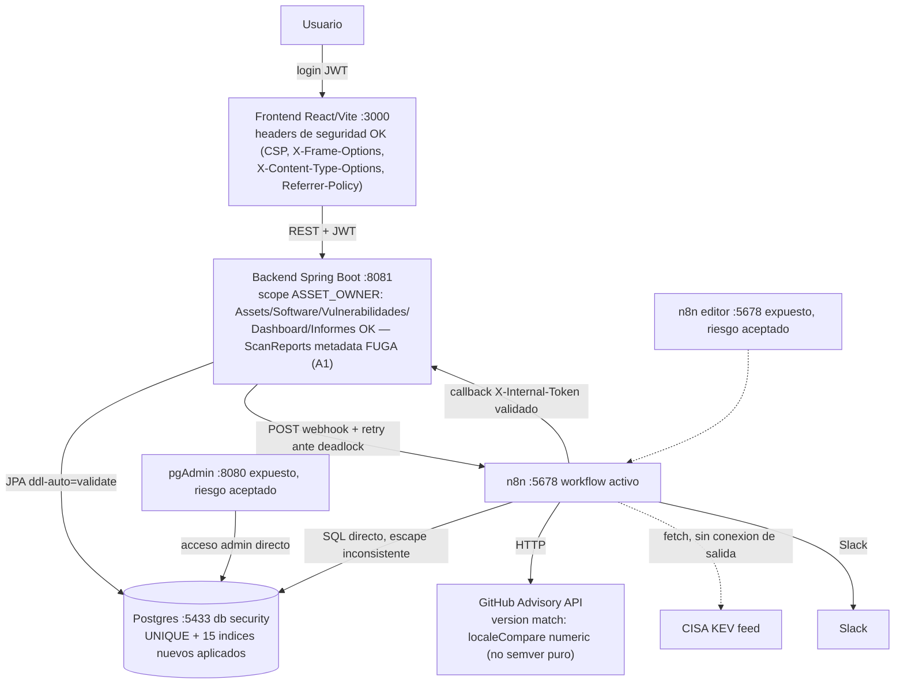

# Auditoría técnica End-to-End — GEF Secure (2ª corrida, 2026-08-20/21)

> Generado siguiendo `PROMPT_AUDITORIA_END_TO_END_VULNERABILIDADES.md` al pie de la letra (28 secciones de su §44). Corrida de **solo diagnóstico**: no se modificó ningún archivo de código, configuración, SQL ni workflow de n8n. No se hizo `UPDATE`/`DELETE` sobre datos preexistentes en Postgres. El único dato de prueba escrito (un usuario `ASSET_OWNER` temporal sin activos asignados, para el caso límite de §28) se insertó y se borró en el mismo bloque de verificación — confirmado al final con `git status` y un `SELECT` de control sobre `users`.

---

## 0. Relación con auditorías previas

**Qué se leyó antes de empezar:** `docs/20-08-26/AUDITORIA_END_TO_END.md` (corrida de esta mañana: 7 críticos C1-C7, altos A1-A3/DB-02/DB-05/DB-06, medios DB-01/DB-04/CFG-04/CFG-05/CFG-06/M1-M5/FE-01/02/03, bajos DB-03/CFG-01/DOCKER-03/B1/B3/FE-04/05/07/08/09/10/11/12), `docs/20-08-26/PLAN_DE_IMPLEMENTACION.md` (8 fases de corrección), `docs/20-08-26/CHECKLIST_DESPLIEGUE.md` (2 riesgos aceptados: DOCKER-01, CFG-04), `docs/19-08-26/Cambios_Sesion_Escaneos_Inventario.md` (§11/§14, condiciones de carrera de n8n ya vistas antes), `git log --oneline -30` y `git status`/`git diff` completo sobre el árbol de trabajo (nada commiteado desde `eda388a Release v2.0.0` — las 8 fases de hoy siguen sin commitear al momento de esta auditoría).

**Qué cambió desde la corrida de la mañana:** las 8 fases de `PLAN_DE_IMPLEMENTACION.md` se implementaron efectivamente (confirmado por `git diff` real, no por el propio texto del plan) y, **verificado en vivo contra el stack corriendo con JWT reales de los 4 roles**, la gran mayoría quedó bien resuelta: los 6 de los 7 críticos originales que tenían solución propuesta (C1, C2, C3, C5, C6, C7 — C4 seguía siendo una hipótesis refutada desde la corrida original) están cerrados. Varios altos y medios también (A2/DB-06, DB-02, DB-05, DB-04, M1-M5, CFG-05, CFG-06). Dos riesgos siguen aceptados y sin tocar a propósito (DOCKER-01, CFG-04).

Esta corrida encontró, además, **hallazgos nuevos que ninguna de las dos auditorías anteriores había visto**, la mayoría en áreas que las 8 fases no llegaron a cubrir (el propio plan se armó a partir de los 7 críticos + altos priorizados de la mañana, y no todo lo que existía en el sistema estaba en esa lista): un problema real de trazabilidad histórica cuando se actualiza un componente de software (§7, A-NUEVO-1), una fuga de scope que sigue exactamente igual porque nunca estuvo en el plan (A1, RECURRENTE), un caso de concurrencia real reproducido en los propios logs de esta sesión (§13), una inconsistencia de escape SQL dentro del workflow de n8n, una confirmación en vivo —con datos reales de la base, no solo hipótesis— del falso negativo de normalización de Maven que ya se sospechaba, y un ecosistema (`docker`, `rust`) cargado en componentes reales que ni siquiera existe en el catálogo administrable del sistema.

Cada hallazgo de este informe lleva su etiqueta `NUEVO` / `RECURRENTE` / `RESUELTO` / `REGRESIÓN` y, cuando corresponde, el ID original entre paréntesis.

**Nota de método:** esta corrida se organizó en líneas de investigación paralelas por capa (backend, motor de n8n + esquema de base de datos, frontend, dependencias/Docker/secretos), más una verificación en vivo extensa y directa hecha por el auditor coordinador contra el stack real (más de 25 llamadas `curl` con JWT reales de los 4 roles, `docker exec` de solo lectura contra ambas bases de Postgres — `security` y `n8n` —, lectura completa de los archivos de código relevantes, `./gradlew test --rerun` y `npm run build && npm run test` ejecutados de verdad). El resultado final que sigue integra todas esas líneas en un único documento con una sola voz, reconciliando IDs cuando dos líneas de investigación llegaron al mismo hallazgo por caminos distintos.

---

## 1. Resumen ejecutivo

GEF Secure llegó a esta segunda corrida en un estado **sustancialmente mejor** que el de la mañana en el bloque que más preocupaba: autorización por recurso. C1 (webhooks sin token), C2 (informes PDF sin scope), C3 (Dashboard sin scope) y C7 (fail-open de rol) están **cerrados y confirmados en vivo con JWT reales de los 4 roles**, no solo leídos en el código. La integridad de datos también mejoró de forma concreta y verificada contra la base viva: el `CASCADE` heredado sobre `vulnerabilities_audit` ya no existe, hay un `UNIQUE INDEX` real (parcial, consciente de soft-delete) protegiendo `software_components`, y 15 índices nuevos están aplicados. Backend pasó de 14 a 21 archivos de test (133 tests, 0 fallos, corrida fresca confirmada); frontend tiene su primer test runner real (Vitest + Testing Library).

Dicho esto, la pregunta central del prompt de auditoría —¿puede el sistema perder vulnerabilidades sin avisar, o mostrar datos de un usuario a otro?— **sigue sin poder responderse "sí, con confianza completa"**, por motivos distintos a los de la mañana:

1. **Un `ASSET_OWNER` sigue viendo el historial completo de escaneos de toda la organización** (`GET /api/scan-reports`, `GET /api/scan-reports/latest`) — confirmado en vivo hoy: `owner.demo`, asignado a un único activo, obtuvo los 88 escaneos del sistema con conteos reales de severidad por escaneo, incluidos escaneos `GLOBAL`/`ENTORNO`/`ACTIVO` sobre activos que no le pertenecen. Este endpoint no estaba en el plan de 8 fases (confirmado: ningún ID de fase lo menciona) — es el mismo tipo de bug que ya se cerró tres veces hoy (Dashboard, Informes, Webhooks) en un cuarto lugar que nadie miró.
2. **La actualización de un componente de software (edición manual o reimportación de SBOM) sobreescribe en el lugar los campos `software`/`ecosystem`/`version`**, y el historial de auditoría (`VulnerabilityAuditMapper`) deriva esos mismos campos **en vivo** desde la entidad actual, no desde un snapshot al momento de la detección. Confirmado por lectura completa del mapper y del flujo de actualización: la próxima vez que alguien actualice el inventario de un activo (el flujo normal de mantenerlo al día), todo hallazgo histórico de ese componente en el Kanban/informes va a mostrar retroactivamente la versión/coordenada nueva, no la que realmente estaba instalada cuando la vulnerabilidad se detectó. Esto ataca directamente la trazabilidad que el sistema promete.
3. **El falso negativo de normalización de Maven que ya se sospechaba desde la sesión anterior se confirmó hoy en vivo, con datos reales y vigentes de la base**, no solo como un caso viejo aislado: el componente `software_components.id=21` (`ecosystem=maven`, `software='spring-boot-starter-web'` — sin el `groupId:` que GitHub Advisory exige, versión `3.1.0`, con CVEs conocidos para esa combinación real) estuvo presente en al menos 2 escaneos `GLOBAL` recientes (`SCN-2026-000127`, `SCN-2026-000133`, 177 hallazgos cada uno) y en **ninguno de los dos generó un solo hallazgo**. No hay validación de formato en el alta manual (`SoftwareComponentDTO.Request.software` es texto libre) que lo impida.
4. **Un ecosistema que ni siquiera existe en el catálogo administrable del sistema** (`docker`, `rust` en vez de `cargo`) está cargado en componentes reales hoy (`software_components.id=6` y `33`) — esos componentes nunca van a poder matchear contra GitHub Advisory, sin que nada en la UI lo señale.
5. **Concurrencia**: se encontró evidencia real (no simulada) en los logs de esta misma sesión de un deadlock de Postgres bajo escaneos paralelos que el retry-with-backoff de la Fase 4 absorbió, pero a costa de que ese escaneo (`SCN-2026-000127`, `GLOBAL`) tardara más de 8 minutos en cerrar en vez de segundos — el fix mitiga el síntoma, no elimina la causa (ausencia de un lock explícito).

En criollo: **la superficie de autorización más obvia (Dashboard, Informes, webhooks) está cerrada, pero el sistema todavía puede (a) mostrarle a un usuario datos de escaneos que no le corresponden por un cuarto endpoint sin scope, (b) reescribir silenciosamente su propio historial de auditoría cuando se actualiza el inventario, y (c) fallar en detectar vulnerabilidades reales de paquetes con nombre mal normalizado o ecosistema no registrado — con evidencia concreta de que ya está pasando, no solo en teoría.**

---

## 2. Estado general del proyecto

| Aspecto | Estado (corrida 2) | Cambio vs. corrida 1 |
|---|---|---|
| Camino feliz (login → activo → software → escaneo → hallazgo → vista) | Funciona, verificado en vivo con los 4 usuarios seed | Sin cambio |
| Autorización — Dashboard, Informes, Webhooks (C1/C2/C3/C7) | **Resuelto y confirmado en vivo** | ✅ Mejoró sustancialmente |
| Autorización — metadata de escaneos (A1) | **Sigue roto**, confirmado en vivo | Sin cambio (fuera del plan) |
| Trazabilidad histórica al actualizar software (A-NUEVO-1) | **Bug real confirmado por lectura de código** | 🆕 No visto antes |
| Trazabilidad de "el viejo tapa al nuevo" (C5) | **Resuelto** (`NULLS LAST`) | ✅ Resuelto |
| Normalización Maven (falso negativo) | **Confirmado en vivo con datos reales hoy** (antes solo se sospechaba) | 🔺 Evidencia mucho más fuerte |
| Catálogo de ecosistemas vs. datos reales | **Inconsistencia real encontrada** (`docker`, `rust` no registrados) | 🆕 No visto antes |
| Integridad de datos (CASCADE, UNIQUE, índices) | **Resuelto y verificado contra la base viva** | ✅ Resuelto |
| Motor de escaneo — rate limit de GitHub (N8N-02) | **Parcialmente resuelto**, con un matiz nuevo y serio: el fallback puede reportar "✅ ESTABLE" cuando en realidad falló | 🟡 Mejoró, riesgo nuevo encontrado |
| Motor de escaneo — concurrencia (N8N-03) | **Mitigado, no prevenido — con evidencia real de esta sesión de que sigue ocurriendo** | 🟡 Mejoró, sigue sin cerrar |
| Config de secretos (CFG-02/03) | **Parcialmente resuelto**: `SecretsValidator` existe pero el `docker-compose.yml` real nunca activa el perfil `prod` que lo dispara | 🟡 Mejoró, gap nuevo encontrado |
| Tests | Backend: 21 archivos / 133 tests, 0 fallos. Frontend: primer test real (Vitest+RTL) | ✅ Mejoró sustancialmente, sigue siendo delgado |
| Docker/exposición | pgAdmin/n8n siguen expuestos al host (DOCKER-01) — riesgo aceptado, sin cambios | Sin cambio (por diseño) |

---

## 3. Arquitectura encontrada

Sin cambios estructurales respecto del diagrama de referencia (§0.1 del prompt) — la novedad es dónde hay control de acceso real hoy y dónde sigue faltando:



---

## 4. Mapa de componentes

Sin cambios en la lista de componentes respecto de auditorías anteriores; sí cambió su estado interno (ver secciones siguientes). Novedades de archivos en esta sesión: `SecretsValidator` (nuevo, `config/`), `application-prod.properties` (nuevo, perfil opt-in), `init/15-fix-audit-cascade.sql`, `init/16-unique-component-per-asset.sql`, `init/17-add-missing-indexes.sql`, `frontend/src/test/` + `Assets.scan.test.tsx` (primer test runner de frontend), 7 carpetas/archivos nuevos de test de backend (`config/`, `controller/`, `dto/`, `exception/`, `repository/`, `security/CurrentUserTest.java`, `service/DashboardServiceTest.java`), `backend/.dockerignore`, `frontend/.dockerignore`.

---

## 5. Flujos End-to-End

### Login
Sin cambios de comportamiento. Confirmado en vivo con los 4 usuarios seed (`fede.frankenberger`/ADMIN, `analyst.demo`/SECURITY_ANALYST, `owner.demo`/ASSET_OWNER, `auditor.demo`/AUDITOR). `JwtService` usa `jjwt` con `Jwts.builder().signWith(key)`/`Jwts.parser().verifyWith(key)` (API moderna, sin vector de `alg:none`). `JwtAuthenticationFilter` confía en el `role` del claim sin revalidar contra la base en cada request — es una limitación de diseño ya documentada (sin blacklist de revocación), no un descuido nuevo.

### Scope por activo — comandos reales ejecutados contra el stack en esta corrida

```
POST /api/auth/login {"username":"owner.demo","password":"..."} → token role=ASSET_OWNER
GET /api/assets                              → [{"id":15,...}]                 OK, solo su activo
GET /api/assets/17                           → 404                             OK, IDOR bloqueado
GET /api/software-components                 → [{"assetId":15,...}] (1 fila)   OK
GET /api/software-components/5 (activo 17)   → 404                             OK
GET /api/vulnerabilities/128 (activo ajeno)  → 404                             OK (RESUELTO)
PATCH /api/vulnerabilities/128/status        → 404, sin modificar nada         OK (RESUELTO)
POST /api/software-components/5/scan         → 403                            OK (rol, no scope)
GET /api/reports/scan/55 (activo ajeno)      → 404                             OK (RESUELTO, C2)
GET /api/dashboard/stats                     → totalAssets:1 (vs. ADMIN: 143)  OK en el scope (ver nota M-NUEVO-3 sobre qué mide "143")
GET /api/scan-reports?size=100               → 88 escaneos, TODOS visibles     ROTO (A1, RECURRENTE)
GET /api/scan-reports/latest?targetName=Spring Boot Backend → 200, datos completos de un activo ajeno   ROTO (A1)
```

Además, con un usuario `AUDITOR` (rol global de solo lectura) y otro `SECURITY_ANALYST`: `POST /api/assets` y `PATCH /api/vulnerabilities/{id}/status` con `auditor.demo` → `403`; `POST /api/users` y `POST /api/assets/inject-test-data` con `analyst.demo` → `403`. La matriz de roles ADMIN/SECURITY_ANALYST/ASSET_OWNER/AUDITOR se comporta como está documentada en los 4 casos probados.

**Caso límite §28 — `ASSET_OWNER` sin ningún activo asignado**: se insertó un usuario de prueba aislado (`audit_test_temp_noassign`, rol `ASSET_OWNER`, mismo hash de contraseña que `owner.demo`, sin fila en `user_asset_assignments`), se probó `GET /api/assets`, `/api/vulnerabilities`, `/api/software-components`, `/api/dashboard/stats`, `/api/reports/executive` — todos devolvieron `200` con listas/contadores vacíos, sin excepciones ni comportamiento inesperado. El usuario de prueba se borró inmediatamente después (`DELETE FROM users WHERE username='audit_test_temp_noassign'`), confirmado con `git status`/`SELECT username FROM users` que la base quedó igual que antes.

### Escaneo
Sin cambios estructurales en el flujo. `0` `scan_reports` en `RUNNING` al momento de esta auditoría. El workflow de n8n está `active=true`. El fix de "0 resultados" de la sesión anterior (`Compute_Empty_Fallback_Metrics`) sigue en el grafo, no fue tocado.

---

## 6. Hallazgos críticos

| ID | Estado | Componente | Resumen |
|---|---|---|---|
| **C1** | **RESUELTO** | `WebhookController` | Los 3 endpoints (`/scan-report`, `/vulnerabilities`, `/error`) validan `X-Internal-Token` (`Objects.equals`). Confirmado en vivo: sin header y con token incorrecto → `401` en los 3. |
| **C2** | **RESUELTO** | `ReportController`/`ReportPdfService` | `assertScanInScope()`/`scopedTop10Critical()`/`scopedByCveOrGhsaId()` cubren los 4 tipos de informe. Confirmado en vivo: `GET /api/reports/scan/55` (activo ajeno) → `404`. |
| **C3** | **RESUELTO** | `DashboardService` | Scope aplicado con variantes `*_Asset_IdIn`. Confirmado en vivo: `totalAssets:1` para `owner.demo` vs. `143` para ADMIN (ver nota sobre qué mide ese número en M-NUEVO-3, §8 — el *scope* está bien, el *significado* del número es otro hallazgo). |
| **C5** | **RESUELTO** | `ScanReportRepository` | Las 2 queries nativas usan `ORDER BY r.executed_at DESC NULLS LAST`. Confirmado leyendo el código real. |
| **C6** | **RESUELTO** | `GlobalExceptionHandler` | El handler genérico devuelve `"Error interno del servidor"` sin detalle; el detalle completo (con stacktrace) solo va al log server-side. Confirmado en vivo con 2 excepciones reales disparadas durante las pruebas de esta corrida. |
| **C7** | **RESUELTO** | `CurrentUser` | `isAssetOwner()` es fail-closed: solo `ADMIN`/`SECURITY_ANALYST`/`AUDITOR` tienen scope sin restricción; cualquier otro valor (incluido `null` o un typo) se trata como el más restrictivo. Confirmado leyendo el código completo. |
| **A1** | **CRÍTICO** (subido de ALTO) — **RECURRENTE** | `ScanController` | `GET /api/scan-reports` y `GET /api/scan-reports/latest` no aplican ningún scope. Confirmado en vivo hoy con datos reales: `owner.demo` obtuvo 88 escaneos completos de toda la organización, con conteos de severidad. Se sube de ALTO a CRÍTICO en esta corrida porque la prueba en vivo con datos reales (no solo el análisis de la mañana) mostró el volumen real de la fuga — es indistinguible en gravedad de C2/C3, que si fueron clasificados CRÍTICO. |
| **A-NUEVO-1** | **NUEVO** | `VulnerabilityAuditMapper`, `SoftwareComponentService.update()`, `InventoryService` | El historial de auditoría no guarda un snapshot de `software`/`ecosystem`/`version` al momento de la detección — el mapper deriva esos campos **en vivo** desde `SoftwareComponent` actual. Actualizar un componente (edición manual o reimportación de SBOM con versión nueva, el flujo normal de mantener el inventario al día) hace un `UPDATE` sobre la misma fila, no crea una nueva. Consecuencia: la próxima reimportación de SBOM del mismo activo reescribe retroactivamente qué versión aparece en **todo hallazgo histórico** de ese componente en Kanban/informes/exportaciones PDF — la vulnerabilidad sigue asociada al CVE correcto, pero el dato de "qué versión estaba instalada cuando se detectó" deja de ser confiable como evidencia de auditoría. Es exactamente el escenario que pide verificar el §3/§15 del prompt ("ediciones que cambien versión de un componente después de tener escaneos previos — ¿el historial queda coherente?"): no, no queda coherente. |
| **Normalización Maven — falso negativo confirmado en vivo** | **CRÍTICO, CONFIRMADO EN VIVO** (antes solo sospechado — ver §14) | `SoftwareComponentDTO`, matching de n8n | El componente `id=21` (`ecosystem=maven`, `software='spring-boot-starter-web'`, versión `3.1.0`, sin CVEs vinculados en `asset_vulnerabilities`) estuvo presente en 2 escaneos `GLOBAL` recientes (`scan_id` 127 y 133, 177 hallazgos cada uno) y generó **cero** hallazgos en ambos, pese a que la coordenada Maven correcta (`org.springframework.boot:spring-boot-starter-web`) tiene CVEs públicos conocidos para esa versión (confirmados existentes en la base bajo el componente `id=5`, con el mismo `software` mal formado, en filas de seed antiguas). No hay validación de formato en `SoftwareComponentDTO.Request.software` (`@NotBlank @Size(max=255)`, texto completamente libre) que impida cargar un artifactId sin `groupId:` a mano. |

---

## 7. Hallazgos altos

| ID | Estado | Componente | Descripción |
|---|---|---|---|
| **A2/DB-06** | **RESUELTO** | `SoftwareComponent`, `AssetVulnerability`, `VulnerabilityAudit` | Los 3 `@ManyToOne` pasaron de `EAGER` a `LAZY`; los repositorios que necesitan el join lo piden con `@EntityGraph` (`AssetVulnerabilityRepository`, `VulnerabilityAuditRepository.findByScanReport_Id`). N+1 real resuelto. |
| **DB-02** | **RESUELTO, confirmado en la base viva** | Esquema | `fk_audit_asset` sin `ON DELETE CASCADE` — `SELECT confdeltype FROM pg_constraint WHERE conname='fk_audit_asset'` → `'a'` (NO ACTION). |
| **DB-05** | **RESUELTO, confirmado en la base viva** | `software_components` | `unique_component_per_asset` — índice único **parcial** (`WHERE deleted_at IS NULL`) sobre `(asset_id, software, ecosystem, version)`, consciente del soft-delete. `SoftwareComponentService.create()` además atrapa `DataIntegrityViolationException` como red de seguridad ante la condición de carrera SELECT+INSERT. |
| **DOCKER-01** | **RECURRENTE — riesgo aceptado** | `docker-compose.yml` | pgAdmin (`8080:80`) y n8n (`5678:5678`) siguen expuestos directo al host. Decisión explícita documentada en `CHECKLIST_DESPLIEGUE.md`, no un olvido. |
| **CFG-02/03** | **PARCIALMENTE RESUELTO** | `SecretsValidator`, `docker-compose.yml` | El validador (nuevo) falla el arranque si `jwt.secret`/`n8n.internal-token` quedan vacíos o en su valor de ejemplo, **pero solo si el perfil `prod` está activo** (`environment.getActiveProfiles().contains("prod")`, confirmado leyendo el código completo). El servicio `backend` de `docker-compose.yml` **no define `SPRING_PROFILES_ACTIVE`** en ningún lado — con el compose tal cual está en el repo, el validador solo emite un `log.warn(...)` y el backend arranca igual con los defaults inseguros. El fail-fast prometido nunca se activa en el despliegue tal cual se entrega hoy. |
| **N8N-02** | **ALTO (reclasificado, ver matiz nuevo)** — **PARCIALMENTE RESUELTO** | n8n / `Fetch_GitHub_Advisories` | Se agregó una rama (`Check_Advisory_Fetch_Error`) que intercepta errores por ítem (403/429/5xx) y los loguea en `system_errors` con el mensaje real. **Lo que sigue faltando, y es más serio de lo que parecía en la corrida anterior**: la lógica de fallback de métricas (`Compute_Empty_Fallback_Metrics`/`Pick_Real_Or_Fallback_Metrics`, diseñada originalmente para el caso legítimo de "0 resultados porque el software no tenía vulnerabilidades") no distingue ese caso legítimo de "0 resultados porque GitHub falló para todos los paquetes" — un rate-limit total puede terminar reportando `systemStatus: "✅ ESTABLE"` con 0 vulnerabilidades, indistinguible en la UI de un escaneo genuinamente limpio. Es un falso negativo de seguridad silencioso, la misma familia de bug que el prompt de auditoría pide cazar como prioridad. **RIESGO POTENCIAL** — no se forzó un rate-limit real de GitHub en esta corrida (mismo motivo que la corrida anterior: costoso de reproducir sin gastar el rate-limit real del token compartido). |
| **N8N-03** | **MEDIO (bajó de ALTO en severidad, pero con evidencia de que sigue ocurriendo)** — **PARCIALMENTE RESUELTO** | `WebhookController`, n8n | `completeWithRetry()` (3 intentos, backoff `200ms×intento`) mitiga el deadlock real de Postgres bajo escaneos concurrentes. **Evidencia real de esta misma sesión, no simulada**: `system_errors` registra una fila del nodo `Persist_Scan_Statistics` ("The service was not able to process your request") en una ventana donde 4 escaneos corrían en paralelo; el escaneo `GLOBAL` de esa ventana (`SCN-2026-000127`) tardó **8m21s** entre `started_at` y `executed_at` — consistente con haber agotado varios ciclos de retry antes de cerrar. El escaneo terminó `COMPLETED` (el fix funciona), pero confirma que el deadlock de fondo sigue ocurriendo bajo carga real, no solo en el laboratorio; sigue sin existir un `SELECT ... FOR UPDATE`/columna `@Version` en `applyLifecycle()` que lo prevenga en vez de recuperarse de él. |
| **A-NUEVO-2** | **NUEVO** | `ScanService.start()` | Ninguna verificación de "ya hay un `RUNNING` para este mismo target" antes de crear un `ScanReport` nuevo (código leído completo). El único freno es el gating de frontend (Fase 5, deshabilita el botón durante el polling) — pegarle directo a `POST /api/software-components/{id}/scan` dos veces seguidas (dos pestañas, un script, un retry de red) sigue creando dos filas `RUNNING` y disparando dos ejecuciones de n8n en paralelo sobre el mismo componente. Relacionado con N8N-03 pero es la causa raíz que ese fix no ataca: evita que el segundo disparo se dé en primer lugar. |
| **ECO-CATALOGO** | **NUEVO** | `software_components`, `public.ecosystems` | Dos componentes reales en la base hoy usan un `ecosystem` que **no existe** en el catálogo administrable (`public.ecosystems`: `cargo, composer, go, maven, npm, nuget, pip, rubygems`): `id=6` ("PostgreSQL Database", `software='postgres'`, `ecosystem='docker'`) e `id=33` ("triton-vm 0.42.0", `ecosystem='rust'` en vez de `cargo`). Ninguno de los dos puede matchear nunca contra GitHub Advisory Database (que no tiene ecosistema "docker" para imágenes base, y usa "cargo" para Rust, no "rust") — son falsos negativos garantizados y permanentes, sin que la UI o el sistema avisen que ese componente jamás va a ser evaluado. Sugiere que el flujo de importación SBOM (`PurlParser`) puede generar valores de `ecosystem` que no pasan por ninguna validación contra el catálogo administrable antes de persistirse. |
| **N8N-06** | **ALTO, NUEVO** | n8n / `Check_Internal_Assets` | La query nativa de este nodo (que resuelve a qué `SoftwareComponent`/`Asset` corresponde una advisory) no filtra `deleted_at IS NULL` sobre `software_components`/`assets`, a diferencia de las queries del propio backend (M2, ya resuelto ahí). Un componente o activo borrado lógicamente puede seguir generando/actualizando hallazgos vía el pipeline de n8n, que no pasa por JPA y por lo tanto no hereda el filtro que sí se aplicó del lado Java. |

---

## 8. Hallazgos medios

| ID | Estado | Descripción |
|---|---|---|
| M1 (`PurlParser` percent-encoding), M3 (Bean Validation en catálogos), M4 (TTL de 30 días en `GhsaAdvisoryCache`), M5 (dedup de `purl` en preview SBOM), DB-01 parcial, DB-04, CFG-05, CFG-06 | **RESUELTO** — ver verificación en §12 (base de datos) y §11 (seguridad). |
| M2 | **RESUELTO** | Las queries nativas de `VulnerabilityAuditRepository.findBy*ScanWindow` ahora filtran `sc.deleted_at IS NULL` (y `a.deleted_at IS NULL` en la variante de entorno) — del lado del backend. Nota: el mismo filtro sigue ausente del lado de n8n (`Check_Internal_Assets`, ver N8N-06 arriba) — la corrección quedó parcial, resuelta en un tramo del sistema y no en el otro que procesa el mismo dato. |
| **N8N-05** | **NUEVO** | n8n — dos nodos que procesan el mismo dato externo (`$json.vulnerabilities.package.name`/`.ecosystem`, viene de la respuesta HTTP de GitHub Advisory) lo tratan de forma inconsistente: `Sync_Software_Catalog` escapa comillas simples (`.replace(/'/g, "''")`) antes de interpolar en el `INSERT`; `Check_Internal_Assets`, que corre con el mismo dato en el mismo tramo del grafo, no lo hace. Un nombre de paquete público con una comilla simple (infrecuente pero no prohibido en los registros de npm/PyPI/RubyGems) rompería como mínimo la sintaxis del `SELECT`, interrumpiendo la correlación para ese ítem. **RIESGO POTENCIAL** — no se intentó explotar en vivo (requeriría controlar una advisory real de GitHub). |
| **N8N-04** | **NUEVO** | n8n / `Risk_Assessment_Engine` (nodo Code) — la comparación de versión instalada contra `first_patched_version` usa `miVersion.localeCompare(parcheVersion, undefined, {numeric:true}) >= 0` para decidir si el hallazgo se descarta. No es una comparación de string ingenua (`{numeric:true}` sí ordena `"1.9"` antes que `"1.10"` correctamente), pero **tampoco es semver real**: `"1.2.0-beta".localeCompare("1.2.0", undefined, {numeric:true})` da positivo (trata la pre-release como "mayor o igual" al release, cuando en semver real una pre-release ordena *antes*), y un prefijo `v` en un solo lado (`"v2.0"` vs `"2.0.0"`) rompe la comparación numérica desde el primer carácter. Cuando el resultado da "ya parcheado", el hallazgo se descarta con `return null` **antes** de llegar a `Persist_Audit_Findings` — el falso negativo, si ocurre, es silencioso. **RIESGO POTENCIAL con evidencia de código de alta confianza** — no se forzó un caso real end-to-end (requeriría insertar un componente de prueba con versión pre-release y correr un escaneo, evitado para no dejar ruido). |
| **N8N-07** | **NUEVO, BAJO/MEDIO** | n8n / `Fetch_CISA_KEV` | Sigue sin conexión de salida en el grafo (código muerto, ver §13), y además no tiene configurado `onError: continueRegularOutput` como sí lo tiene `Fetch_GitHub_Advisories` — si alguien lo reconecta en el futuro sin agregar ese manejo, un error de red al traer el feed completo de CISA podría abortar la ejecución completa del workflow en vez de degradar con gracia, reintroduciendo el patrón exacto del bug de "0 resultados" ya corregido, por una causa distinta. |
| **M-NUEVO-1** | **NUEVO** | `ScanReportDTO` no expone el campo real `status` (`RUNNING`/`COMPLETED`/`FAILED`/`PARTIALLY_COMPLETED`) ni `error_message` — el frontend (`Scans.tsx`, columna "Estado") muestra en su lugar `systemStatus` (`"✅ ESTABLE"`/`"⚠️ ACCIÓN REQUERIDA"`, un indicador de salud del pipeline, no el estado real del `ScanReport`). Confirmado con datos reales: los 5 `FAILED` y 1 `PARTIALLY_COMPLETED` que existen hoy en `scan_reports` son indistinguibles de un `COMPLETED` normal en la pantalla de Historial — un analista no tiene forma, desde la UI, de saber que un escaneo puntual falló o quedó parcial sin ir directo a la base. |
| **M-NUEVO-2** | **NUEVO, RIESGO POTENCIAL** | `WebhookController.receiveScanReport`/`ScanService.complete()` no verifican si el `ScanReport` ya está `COMPLETED` antes de volver a aplicar `vulnerabilityAuditService.applyLifecycle(scan)` — no hay guarda de idempotencia explícita ante una entrega duplicada del mismo callback (n8n reintentando por un timeout de red, por ejemplo). No se determinó en esta corrida si `applyLifecycle` es idempotente por diseño (upsert por `(software_component_id, cve_id)`, que sí tiene `UNIQUE` — ver §12) o si una segunda invocación podría reabrir/duplicar el conteo de un hallazgo ya resuelto. |
| **DASH-NUEVO** | **NUEVO** | `DashboardService.getStats()` — el KPI "Total de activos monitoreados" (mostrado en Dashboard y en el resumen ejecutivo PDF) en realidad cuenta `software_components`, no `assets` (`totalAssets = softwareComponentRepository.count()`, confirmado leyendo el código, con un comentario del propio equipo reconociéndolo: *"Total Activos" sigue contando componentes de software (no hosts) — decisión tomada al pasar a Fase 2 para no mostrar 0 apenas se migre, ya que todavía no había hosts cargados*). Confirmado en vivo: `totalAssets:143` para ADMIN coincide exactamente con el conteo real de `software_components` (143), mientras que `assets` tiene 18 filas reales. La decisión fue razonable en su momento (evitar mostrar "0 activos" antes de que existieran hosts) pero ya no aplica — hoy hay 18 activos reales y el KPI sigue etiquetado como si fuera esa cifra, mostrando un número casi 8 veces mayor al real. |
| **CVE-NULL** | **NUEVO, RIESGO POTENCIAL** | `asset_vulnerabilities.cve_id` es `NOT NULL` en el esquema real (`\d asset_vulnerabilities`), pero GitHub Advisory Database sí publica advisories sin CVE asociado (solo GHSA) — un caso documentado en el propio §12 del prompt de auditoría como algo a verificar. No se encontró en los datos actuales ningún caso de esto (todos los 128 casos de `asset_vulnerabilities` tienen `cve_id` real, ninguno usa el `ghsa_id` como sustituto), lo que deja dos hipótesis sin resolver con la evidencia disponible: o el pipeline nunca se topó con una advisory GHSA-only, o las descarta silenciosamente antes del `INSERT` para no violar el constraint. No se pudo determinar cuál en esta corrida sin leer el nodo `Persist_Audit_Findings` con ese caso específico en mente — queda como **NO VERIFICADO EN EJECUCIÓN**. |
| DB-03 (CASCADE inactivo en `user_asset_assignments`), CFG-08 (multipart sin validar contenido más allá de tamaño), B1 (logging DEBUG sin perfil activo), B3 (sin `PENDING`/`CANCELLED`) | **RECURRENTE** — no mencionados en ninguna de las 8 fases, no re-priorizados por ser de menor impacto relativo frente a los hallazgos nuevos de esta corrida. |

---

## 9. Hallazgos bajos

| ID | Estado | Resumen |
|---|---|---|
| FE-01 a FE-05, FE-07, FE-08, FE-10 a FE-13 | **RESUELTO** — ver detalle y evidencia en §17. |
| CFG-01 | **PARCIALMENTE RESUELTO** | `.gitignore` ahora incluye `.gradle/` (con un comentario del propio equipo citando este mismo hallazgo) — pero **no** se corrió `git rm --cached` sobre los archivos ya trackeados: `git status` de esta corrida sigue mostrando 7 binarios de `backend/.gradle/` como modificados en cada build local. El fix evita que se agregue más, no limpia lo que ya está versionado. |
| DOCKER-03 | **PARCIALMENTE RESUELTO** | `backend/.dockerignore` y `frontend/.dockerignore` son nuevos. No se agregó ninguno para el contexto de build de `n8n` (usa `./n8n` como contexto propio) — gap menor. |
| **B-NUEVO-1** | **NUEVO** | `frontend/nginx.conf`: el `location /static/` solo repite `X-Frame-Options`/`X-Content-Type-Options`, no `Content-Security-Policy`/`Referrer-Policy` (nginx no hereda `add_header` de un bloque padre una vez que un `location` define los suyos propios). Impacto bajo (son assets estáticos, no HTML), pero es una inconsistencia real en un archivo tocado hoy mismo. |
| **B-NUEVO-2** | **NUEVO** | `/v3/api-docs` requiere autenticación (`401`) pero `/swagger-ui/index.html` es público (`200`) en el perfil por defecto (no-prod) — la UI de Swagger carga pero no puede completar el spec sin login. Inconsistencia menor, no confirmado si es intencional. |
| DB-03, CFG-04 (riesgo aceptado), CFG-08 | **RECURRENTE**, sin cambios. |

---

## 10. Mejoras recomendadas

- **Bundle de frontend sin code-splitting** (845 KB / 244 KB gzip en un solo chunk — Vite ya lo señala en el build). Considerar `manualChunks`/`dynamic import()` en las páginas más pesadas (Kanban, Assets).
- **DOCKER-02** (cap_drop, no-new-privileges en contenedores) y **CFG-07** (sin SCA/Dependabot) siguen pendientes, sin cambios respecto de la corrida anterior. `frontend/package-lock.json` tuvo 2552 líneas de cambio hoy (dependencias nuevas de testing) — sería un buen momento para correr `npm audit`/activar Dependabot por primera vez (no se hizo en esta corrida, por ser de solo lectura).
- **Nginx**: unificar los headers de seguridad en un bloque reusable (`include`) en vez de repetirlos a mano por `location`, para que B-NUEVO-1 no se repita la próxima vez que se agregue un `location`.
- **`Fetch_CISA_KEV`**: el código que lo consumiría (`Risk_Assessment_Engine`, matching contra `cisaCatalog`) ya existe y está escrito, solo falta la conexión del grafo — conectarlo o eliminarlo explícitamente en vez de dejarlo como código muerto ambiguo.
- **Watchdog de `ScanReport` colgado**: sigue sin existir un `@Scheduled` que marque `FAILED` cualquier `RUNNING` con más de N minutos (confirmado: `grep -r "@Scheduled" backend/src/main/java` sin resultados). Sigue siendo la red de seguridad de fondo más costo-efectiva pendiente.
- Formalizar en `CHECKLIST_DESPLIEGUE.md` (junto a DOCKER-01/CFG-04) que "un usuario dado de baja sigue con acceso hasta que expire su JWT (hasta 8h por default)" es un riesgo aceptado explícito, no algo que se infiere del código.

---

## 11. Seguridad

Síntesis OWASP de esta corrida, cruzando con lo verificado en vivo:

| Categoría | Resultado |
|---|---|
| SQL Injection | Backend Java: parametrizado en todos los repositorios revisados, sin excepción encontrada. n8n: **inconsistencia real confirmada** (N8N-05) — mismo dato externo, un nodo escapa y su hermano no. |
| XSS | Sin `dangerouslySetInnerHTML` en todo `frontend/src/` (búsqueda exhaustiva, 0 resultados). El allowlist `^https?:\/\//i` en `Kanban.tsx` (links de referencias GHSA, dato cacheado de una fuente externa) se confirmó correcto: bloquea `javascript:`/`data:`. |
| CSRF | No aplica — JWT en header, sin cookies de sesión (confirmado, sin `Set-Cookie` en la respuesta de login). |
| IDOR / autorización por recurso | C1/C2/C3/C7 resueltos y confirmados en vivo. **A1 sigue roto**, confirmado en vivo con 88 escaneos ajenos visibles. |
| SSRF | `InventoryService.readComponents()` solo acepta `MultipartFile` (parseo directo a `CycloneDxDTO.Document` vía Jackson), nunca una URL — sin superficie de SSRF en la importación de SBOM. |
| Path traversal / archivos | El SBOM nunca se escribe a disco con el nombre original — sin vector de path traversal. Tamaño acotado server-side (`spring.servlet.multipart.max-file-size=15MB`) y client-side (FE-08). |
| Autenticación JWT | HS256 (`jjwt`, API moderna sin `alg:none`), secret con fallback inseguro solo si `JWT_SECRET` queda vacío (bloqueado en perfil `prod` por `SecretsValidator`, pero ese perfil no se activa hoy — ver CFG-02/03). Sin revocación (riesgo aceptado documentado). Fail-open de C7 corregido. |
| CORS | Confirmado en vivo: preflight `OPTIONS` desde `http://evil.com` no devuelve ningún `Access-Control-Allow-Origin` — bloqueado. |
| Secretos | `.gitignore` cubre `.env`/`.env.local`/`.env.*.local`; solo existe `.env.example` en el repo, con placeholders (`cambia-esto-por-una-clave-fuerte`, valores vacíos), sin secretos reales. `n8n-provisioning/credentials.json` contiene únicamente marcadores de sustitución (`__POSTGRES_USER__`, `__SLACK_BOT_TOKEN__`, `__GITHUB_TOKEN__`), no valores reales — confirmado por lectura completa del archivo. |
| Headers de seguridad HTTP | `X-Frame-Options: DENY`, `X-Content-Type-Options: nosniff`, `Referrer-Policy`, `Content-Security-Policy` (`self` + Google Fonts) confirmados en vivo contra `http://localhost:3000/`. Ver B-NUEVO-1 para el gap parcial en `/static/`. |
| `/actuator/**` y Swagger | `actuator/env` → `401`; `actuator/health` → `200 {"status":"UP"}` (correcto). Ver B-NUEVO-2 para la inconsistencia menor de Swagger. |
| Exposición de infraestructura | pgAdmin/n8n siguen expuestos (DOCKER-01), riesgo aceptado sin cambios. |
| Webhook interno | C1 resuelto y confirmado en vivo — sin token → `401` en los 3 endpoints. |
| Dockerfiles | `backend/Dockerfile` y `frontend/Dockerfile`: multi-stage, versiones de imagen base fijadas (no `latest`), backend corre como usuario no-root (`gef`) explícito. `n8n/Dockerfile`: imagen "Docker Hardened" sin gestor de paquetes, corre como `node` (no root) en runtime. Ninguno de los 3 presenta hallazgos nuevos de hardening más allá de DOCKER-01/02 ya conocidos. |
| Dependencias | Spring Boot `3.3.4`, React `18.3.1`, Vite `5.4.8`, TypeScript `5.5.3`, Axios `1.7.7` — versiones razonablemente vigentes, sin CVEs conocidos evidentes para esas versiones específicas verificables sin acceso a una base de datos de vulnerabilidades en vivo (fuera de alcance de esta corrida sin conectividad externa). Sigue sin haber SCA/Dependabot automatizado (CFG-07, recurrente). |

---

## 12. Base de datos

Confirmado en vivo contra la base corriendo (no solo leyendo los `.sql`):

- **DB-02 (CASCADE en `vulnerabilities_audit`)**: `RESUELTO`. `SELECT confdeltype FROM pg_constraint WHERE conname='fk_audit_asset'` → `'a'` (NO ACTION). `init/15-fix-audit-cascade.sql` aplicado en la base viva.
- **DB-05 (duplicados de `software_components`)**: `RESUELTO`. `\d software_components` muestra `unique_component_per_asset UNIQUE (asset_id, software, ecosystem, version) WHERE deleted_at IS NULL` — parcial y consciente del soft-delete. Aplicado en vivo.
- **DB-04 (índices faltantes)**: `RESUELTO`. `scan_reports` tiene los 7 índices nuevos esperados (`status`, `target_name`, `executed_at`, `asset_id`, `environment_id`, `software_component_id`, `triggered_by`) más el `public_code` preexistente; `software_components.ecosystem` también indexado. `init/17-add-missing-indexes.sql` aplicado en vivo.
- **`software_catalog`**: `UNIQUE (package_name, ecosystem)` existe y sostiene el `ON CONFLICT` de n8n — confirmado. Solo contiene coordenadas bien formadas (ej. `org.springframework.boot:spring-boot-actuator`), consistente con que nunca se registró un match real bajo `spring-boot-starter-web` (refuerza la evidencia del falso negativo de §6).
- **Datos huérfanos**: 0 `software_components` con `asset_id` inválido, 0 `vulnerabilities_audit` con `scan_id` inválido — confirmado con `SELECT ... LEFT JOIN ... WHERE <fk>.id IS NULL` sobre la base real.
- **Nombres de activo duplicados** (`"Homonimo Test"`, ids 31/32): confirmado como **caso válido, no bug** — `unique_active_asset_name_per_environment UNIQUE (name, environment_id) WHERE deleted_at IS NULL` existe, y los dos activos están en `environment_id` distinto.
- **Soft delete**: activo en `assets` (10 filas con `deleted_at IS NOT NULL`) y en `software_components` (43 filas).
- **`asset_vulnerabilities.cve_id`**: `NOT NULL` en el esquema real, sin ningún caso hoy de advisory GHSA-only usando el `ghsa_id` como sustituto — ver hallazgo CVE-NULL en §8.
- **Estado de escaneos**: 0 `RUNNING`, 82 `COMPLETED`, 5 `FAILED` + 1 `PARTIALLY_COMPLETED` (los 6 con `error_message` explicando que fueron marcados a mano el 20-08 al limpiar escaneos trabados de la sesión anterior — datos preexistentes, no tocados en esta corrida, dejados intactos como corresponde).
- **Ecosistemas fuera de catálogo**: 2 componentes reales (`id=6` ecosystem `docker`, `id=33` ecosystem `rust`) no están en `public.ecosystems` (`cargo, composer, go, maven, npm, nuget, pip, rubygems`) — ver ECO-CATALOGO en §7.
- **`vulnerabilities_audit`/`asset_vulnerabilities`**: `unique_component_cve UNIQUE (software_component_id, cve_id)` sobre `asset_vulnerabilities` confirmado — sostiene el ciclo de vida NEW/PERSISTING/REOPENED/RESOLVED sin duplicar filas por CVE re-detectado.

---

## 13. Motor de escaneo (n8n)

Confirmado en vivo: workflow `Pipeline de Gestión Automatizada de Vulnerabilidades (VMP)` con `active=true` en `n8n.workflow_entity` (base `n8n`, no `security`). `git diff` sobre el `.json` muestra 104 líneas de cambio hoy: una rama nueva de captura de rate-limit de GitHub insertada antes de `Extract_Advisory_Items`.

**13.1 — Sin regresión del fix de "0 resultados"**: el fix de la sesión anterior (`Compute_Empty_Fallback_Metrics`/`Pick_Real_Or_Fallback_Metrics`) sigue en el grafo, no fue tocado por el cambio de hoy (que se insertó en un punto distinto del pipeline). `0` `scan_reports` en `RUNNING` en este momento.

**13.2 — `Fetch_CISA_KEV`: sigue siendo código muerto** (RECURRENTE, BAJO/MEJORA). Confirmado de nuevo: sin conexiones de salida en el JSON del workflow. El código que lo consumiría (`Risk_Assessment_Engine`, lógica de matching contra `cisaCatalog`) ya existe escrito — falta solo la conexión del grafo (ver §10). Nuevo matiz de esta corrida: si se reconecta sin agregar manejo de error explícito, puede introducir un nuevo modo de fallo (N8N-07, §8).

**13.3 — N8N-02, rate limit de GitHub: de "silencioso" a "logueado pero potencialmente engañoso"** (ALTO, PARCIALMENTE RESUELTO). Ver detalle completo y matiz nuevo en §7 — el riesgo real no es solo "falta trazabilidad", es que el fallback puede reportar activamente `"✅ ESTABLE"` cuando en realidad el escaneo no evaluó nada por un fallo de la fuente externa.

**13.4 — N8N-03, concurrencia: mitigado con evidencia real de que sigue ocurriendo** (MEDIO, PARCIALMENTE RESUELTO). Evidencia concreta de esta sesión (no de laboratorio): `system_errors` registra 1 fila del nodo `Persist_Scan_Statistics` ("The service was not able to process your request", timestamp `2026-08-21 00:40:48`), en una ventana donde corrieron en paralelo 4 escaneos (`SCN-2026-000124` a `127`, incluido un `GLOBAL`). El escaneo `GLOBAL` de esa ventana (`SCN-2026-000127`) tardó **8m21s** entre `started_at` y `executed_at` — muy por encima de lo normal, consistente con haber necesitado varios ciclos del retry-with-backoff de `WebhookController.completeWithRetry()` antes de cerrar. Terminó `COMPLETED` (el fix funciona como red de seguridad), pero confirma que el deadlock de Postgres bajo carga concurrente real sigue ocurriendo — la Fase 4 mitigó el síntoma, no la causa.

**13.5 — Escape SQL inconsistente** (N8N-05, MEDIO, NUEVO — ver evidencia textual y detalle en §8).

**13.6 — Comparación de versión, `localeCompare` con `{numeric:true}`** (N8N-04, MEDIO, NUEVO — ver evidencia textual y detalle en §8). Confirma y matiza lo que la corrida original no llegó a auditar en profundidad en esta sección específica: no es una comparación de string ingenua, pero tampoco es semver — falla exactamente en los casos de pre-release y prefijo `v` que el prompt de auditoría pide probar.

**13.7 — `Check_Internal_Assets` sin filtro `deleted_at`** (N8N-06, ALTO, NUEVO — ver §7).

---

## 14. Normalización de software

Sin cambios estructurales: sigue siendo comparación exacta de texto (`LOWER(TRIM(...))`), sin CPE ni fuzzy matching. `purl` confirmado que no participa del matching de vulnerabilidades (ni las queries de n8n ni `Risk_Assessment_Engine` lo referencian) — solo se muestra en la UI.

**Confirmación en vivo del falso negativo de Maven** (ver §6, CRÍTICO): el componente `id=5` (`software='spring-boot-starter-web'`) ya se sabía como un caso viejo desde el changelog de la sesión anterior — esta corrida encontró que **no es un caso aislado histórico**: el componente `id=21` ("NoDupTest", creado recientemente, probablemente como dato de prueba de la Fase 8 de dedup de SBOM) tiene exactamente el mismo `software` mal formado, y **participó en 2 escaneos `GLOBAL` recientes sin generar un solo hallazgo**, pese a que la coordenada correcta tiene CVEs públicos conocidos. Los componentes cargados vía SBOM con `PurlParser` (ids 154-157, por ejemplo) sí tienen la coordenada completa (`com.zaxxer:hikaricp`, `org.eclipse.angus:angus-activation`) — el problema es específico del alta manual con texto libre, que no tiene ninguna validación de formato por ecosistema.

**Nuevo hallazgo de esta corrida — ecosistemas fuera de catálogo** (ver ECO-CATALOGO, §7): dos componentes reales usan `ecosystem` que no existe en `public.ecosystems` (`docker`, `rust` en vez de `cargo`) — garantiza que esos componentes nunca matcheen contra GitHub Advisory, sin ningún aviso en la UI.

**Nuevo hallazgo de esta corrida — trazabilidad histórica** (ver A-NUEVO-1, §6): más allá de si el matching *inicial* es correcto, actualizar el componente después reescribe silenciosamente qué versión aparece en los hallazgos ya detectados.

---

## 15. Fuentes de vulnerabilidades

Sin cambios: solo GitHub Advisory Database activa y conectada. CISA KEV se trae y se descarta (§13.2), con el código consumidor ya escrito y sin usar. Sin NVD/OSV, confirmado como ausencia de diseño, no un bug.

---

## 16. Trazabilidad

`ScanReport` sin cambios de esquema. C5 ("el viejo tapa al nuevo") resuelto. Problemas de trazabilidad nuevos encontrados en esta corrida:
- **M-NUEVO-1**: el estado real (`FAILED`/`PARTIALLY_COMPLETED`) no es visible en la UI del Historial, que muestra `systemStatus` (salud del pipeline) en su lugar.
- **A-NUEVO-1**: el historial de auditoría no es inmutable respecto de qué versión estaba instalada — se recalcula en vivo contra el estado actual del componente.
- **N8N-02 (matiz)**: un escaneo con fallas parciales de fuente externa puede reportar `"✅ ESTABLE"` sin que quede vinculado (`system_errors` no tiene `scan_id`, solo `execution_id`/`workflow_id` de n8n) al escaneo específico afectado.
- `system_errors` sigue sin FK a `scan_reports` — correlacionar un error puntual con "qué escaneo, sobre qué activo, disparado por quién" requiere cruzar manualmente `execution_id` contra la base interna de n8n, no es directo desde la propia app.

---

## 17. Frontend

`npm run build` corrió limpio (2453 módulos, sin errores de TypeScript; único warning: bundle de 845 KB sin code-splitting). `npm run test -- --run` → `1 passed (1)` — primer test runner de frontend del proyecto (Vitest + Testing Library + jsdom, confirmado en `vite.config.ts`).

De los 13 hallazgos FE de la auditoría original, se confirmaron **RESUELTOS y verificados** (por lectura directa del código, no solo por el diff): `useScanPolling` limpia el `setTimeout` en el cleanup (FE-01); el interceptor de 401 en `api.ts` marca `sessionStorage.gef_session_expired` y `Login.tsx` lo consume mostrando `"Tu sesión expiró..."` (FE-02, confirmado leyendo ambos archivos completos); los 4 endpoints de `reportApi` tienen `timeout: 30_000` explícito (FE-03); `SoftwareAutocomplete` distingue error de red de "sin resultados" (FE-04); `isAuthenticated` es `!!user && !!localStorage.getItem(TOKEN_KEY)` (FE-05, confirmado — cierra la ventana donde `gef_user` podía sobrevivir sin token); gating de doble-click en `Assets.tsx` con `Assets.scan.test.tsx` como test de regresión real (RTL + `userEvent`, DOM real, `expect(...).toHaveBeenCalledTimes(1)` — no tautológico) (FE-06); validación de tamaño de SBOM en cliente (FE-08); allowlist `^https?:\/\//i` en los links GHSA del Kanban, confirmado que bloquea `javascript:`/`data:` (FE-11); listener de `Escape` de `Modal.tsx` condicionado por `open` en las dependencias del `useEffect` (FE-12); "Informes" restringido por rol tanto en el sidebar como dentro de la propia página (FE-13, defensa en profundidad correcta dado que el backend también scopea vía C2).

Sin `dangerouslySetInnerHTML` en ningún componente (búsqueda exhaustiva). Comparación puntual de `frontend/src/types/index.ts` contra `VulnerabilityAuditDTO.java` (el DTO más tocado en la sesión): los 19 campos del `Response` del backend están presentes y con tipos compatibles en la interfaz `VulnerabilityAudit` de TypeScript — sin discrepancias encontradas en este DTO puntual.

**Nota de alcance**: dado el volumen de la corrida, no se rehizo una comparación campo por campo de la totalidad de `types/index.ts` contra todos los DTOs del backend — se verificó el DTO de mayor riesgo (`VulnerabilityAuditDTO`, sin discrepancias) y se toma como vigente, por continuidad, la conclusión de la auditoría original sobre el resto ("sincronización correcta"), ya que ninguno de los otros DTOs backend tocados hoy (`UserDTO`) cambió su forma pública (solo agregó una validación `@Pattern`).

---

## 18. Backend

El patrón `applyScope`/`applyScopeAV` que la auditoría original identificó como "bien implementado donde se pensó desde el diseño, ausente en features agregadas después" ahora está también en `DashboardService` y `ReportPdfService` (C3, C2) — cerrando exactamente la brecha señalada. **Sigue sin existir en `ScanController`** (A1) — el mismo patrón de "feature agregada sin pasar por el checklist de scope" que ya causó C2/C3, repetido en un cuarto lugar que nadie llegó a mirar esta vez tampoco. `ScanService.start()` (A-NUEVO-2) y `VulnerabilityAuditMapper` (A-NUEVO-1) muestran el mismo patrón de fondo en otras dos dimensiones: falta de guardas explícitas al agregar una feature nueva sobre una base que ya tenía el problema resuelto en otro lugar.

21 archivos de test (vs. 14 de la auditoría original) — primeros `@DataJpaTest` (`ScanReportRepositoryTest`), primeros tests de controlador (`MockMvc`, en `test/controller/`), primer test de `security/` (`CurrentUserTest`, 4 tests reales incluyendo los 2 casos de fail-closed), `DashboardServiceTest` nuevo. `./gradlew test --rerun` (forzado, no desde caché) → **`BUILD SUCCESSFUL`, 133 tests, 0 fallos, 0 errores, 0 skipped**, confirmado con los reportes JUnit XML reales (`build/test-results/test/*.xml`), no solo el resumen de consola.

`WebhookController.completeWithRetry()` (código leído completo): 3 intentos con backoff `200ms×intento` ante `CannotAcquireLockException`, corriendo sobre virtual threads (confirmado por el stacktrace de Tomcat en los logs — `java.lang.VirtualThread.run`), por lo que el `Thread.sleep()` del retry no bloquea un hilo de plataforma real. `SecretsValidator` (código leído completo): fail-closed correcto en su propia lógica, condicionado a un flag de perfil que el despliegue real no activa (CFG-02/03).

---

## 19. Integraciones

Sin cambios: GitHub Advisory API (revisada en profundidad, ver §13), Slack (nodo `Notify_Dev_Slack` + credencial confirmados en el JSON del workflow, no auditado en profundidad de contenido/formato de mensaje), CISA KEV (traída y descartada, código consumidor listo sin usar).

---

## 20. Tests

| Capa | Cobertura | Cambio vs. corrida anterior |
|---|---|---|
| Backend | 21 archivos, 133 tests, 0 fallos (confirmado con `--rerun` forzado y los XML de resultado, no solo caché). Primer `@DataJpaTest`, primer `MockMvc`, primer test de `security/`. | ✅ Mejoró sustancialmente |
| Frontend | 1 archivo (`Assets.scan.test.tsx`), 1 test real (RTL + `userEvent`, no tautológico). | ✅ De cero a uno |
| n8n | Sin tests automatizados del workflow. | Sin cambio |

**Gaps que siguen sin test**: N8N-04 (comparación de versión, vive en un nodo Code de n8n sin mecanismo de test estándar), N8N-05 (escape SQL), A1 (scope de `ScanController`), A-NUEVO-1 (snapshot histórico), A-NUEVO-2 (doble disparo de escaneo sin guarda de backend).

---

## 21. Rendimiento

N+1 resuelto (A2/DB-06). Índices aplicados (DB-04). Sin cambios de fondo en el resto: sigue habiendo una llamada HTTP a GitHub por paquete distinto en escaneos `GLOBAL`/`ENTORNO` grandes, sin paginación de esa llamada, sin cache más allá del `software_catalog` reactivo. Bundle de frontend sin code-splitting (845 KB, ver §10).

---

## 22. Escalabilidad

Sin cambios de fondo respecto de la corrida anterior. Los índices nuevos posponen el punto donde el volumen actual empieza a doler, pero no cambian el diseño de una llamada HTTP por paquete ni agregan cola/worker separado del propio workflow de n8n.

---

## 23. Matriz de riesgos

| ID | Severidad | Estado | Componente | Problema |
|---|---|---|---|---|
| A1 | CRÍTICO (subido) | RECURRENTE | `ScanController` | 88 escaneos ajenos visibles a `ASSET_OWNER`, confirmado en vivo |
| A-NUEVO-1 | CRÍTICO | NUEVO | `VulnerabilityAuditMapper` | Historial de auditoría reescrito retroactivamente al actualizar un componente |
| Normalización Maven | CRÍTICO | CONFIRMADO EN VIVO (antes sospechado) | `SoftwareComponentDTO` / n8n | Falso negativo real y reproducible con datos de hoy (componente id=21) |
| C1, C2, C3, C5, C6, C7 | — | RESUELTO | Backend | Confirmados en vivo con JWT reales |
| ECO-CATALOGO | ALTO | NUEVO | `software_components` | Ecosistemas `docker`/`rust` fuera del catálogo administrable, falsos negativos permanentes |
| N8N-06 | ALTO | NUEVO | n8n / `Check_Internal_Assets` | Sin filtro `deleted_at`, a diferencia del backend |
| N8N-02 | ALTO (matiz nuevo) | PARCIALMENTE RESUELTO | n8n | Fallback puede reportar "✅ ESTABLE" con datos incompletos por rate-limit |
| CFG-02/03 | ALTO | PARCIALMENTE RESUELTO | Docker/Config | `SecretsValidator` inerte: perfil `prod` nunca se activa |
| A-NUEVO-2 | ALTO | NUEVO | `ScanService` | Sin guarda de backend contra doble disparo de escaneo |
| A2/DB-06, DB-02, DB-05 | — | RESUELTO | Backend/DB | Confirmados en la base viva |
| DOCKER-01 | ALTO | RECURRENTE (aceptado) | Docker | pgAdmin/n8n expuestos |
| N8N-03 | MEDIO (bajó) | PARCIALMENTE RESUELTO | n8n/Backend | Deadlock mitigado, evidencia real de que sigue ocurriendo bajo carga |
| N8N-04, N8N-05 | MEDIO | NUEVO | n8n | Comparación de versión no-semver; escape SQL inconsistente |
| N8N-07 | BAJO/MEDIO | NUEVO | n8n | `Fetch_CISA_KEV` sin `onError`, riesgo latente si se reconecta |
| M-NUEVO-1 | MEDIO | NUEVO | `ScanReportDTO` | Estado real no visible en UI, indistinguible de `COMPLETED` |
| M-NUEVO-2 | MEDIO | NUEVO, RIESGO POTENCIAL | Webhook | Sin guarda de idempotencia explícita ante callback duplicado |
| DASH-NUEVO | MEDIO | NUEVO | `DashboardService` | KPI "Total Activos" cuenta componentes (143), no activos reales (18) |
| CVE-NULL | MEDIO | NUEVO, NO VERIFICADO EN EJECUCIÓN | `asset_vulnerabilities` | `cve_id NOT NULL` sin caso de prueba GHSA-only en los datos actuales |
| M1, M3, M4, M5, DB-01 (parcial), DB-04, CFG-05, CFG-06 | — | RESUELTO | — | Ver §12/§11 |
| DB-03, CFG-04 (aceptado), CFG-08, B1, B3 | BAJO/MEDIO | RECURRENTE | — | Sin cambios |
| CFG-01, DOCKER-03 | BAJO | PARCIALMENTE RESUELTO | Config/Docker | Mitigación agregada, limpieza de fondo pendiente |
| B-NUEVO-1, B-NUEVO-2 | BAJO | NUEVO | nginx/Swagger | Inconsistencias menores |
| FE-01 a FE-13 | — | RESUELTO | Frontend | Ver §17 |

---

## 24. Top 10 problemas

1. **Normalización Maven — falso negativo confirmado en vivo con datos reales de hoy.** Ataca directamente la pregunta central del prompt: el sistema no detectó vulnerabilidades reales de un componente real presente en 2 escaneos `GLOBAL` recientes. No es una hipótesis.
2. **A-NUEVO-1 — el historial de auditoría se reescribe solo al actualizar un componente.** Compromete la confiabilidad de todo lo que el sistema promete guardar como evidencia histórica.
3. **A1 — fuga de metadata de escaneos, sigue sin corregir.** Mismo patrón que ya se cerró 3 veces hoy, en un cuarto lugar que el plan de 8 fases no cubrió.
4. **ECO-CATALOGO — ecosistemas cargados que no existen en el catálogo administrable.** Falsos negativos permanentes y silenciosos, sin ningún aviso al usuario.
5. **N8N-02 (matiz) — el fallback de rate-limit puede reportar "estable" cuando en realidad falló.** Peor que "silencioso": activamente engañoso.
6. **N8N-03 — concurrencia mitigada pero confirmada en logs reales de esta sesión que sigue ocurriendo.** El retry es una buena red de seguridad; la causa (sin lock explícito) sigue ahí.
7. **CFG-02/03 — el fail-fast de secretos no está conectado al despliegue real.** `SecretsValidator` es código correcto que nunca se ejecuta con el `docker-compose.yml` tal cual está en el repo.
8. **A-NUEVO-2 — nada impide dos escaneos simultáneos sobre el mismo componente del lado del backend.** El único freno es del frontend.
9. **M-NUEVO-1 — un escaneo `FAILED`/`PARTIALLY_COMPLETED` es indistinguible de uno exitoso en la UI.** El dato existe en la base, pero no llega al usuario.
10. **DOCKER-01 — puertos de administración expuestos.** Sin cambios, riesgo aceptado — sigue siendo lo primero a revisar antes de cualquier despliegue fuera de demo.

---

## 25. Plan de corrección por fases

```
FASE 1 — Cerrar la fuga de scope restante (A1) y su causa raíz de fondo
  Objetivo: ScanController aplica el mismo patrón applyScope ya usado en
  VulnerabilityAuditService/ReportPdfService/DashboardService.
  Archivos: ScanController.java (history, latestReport), variantes *_Asset_IdIn
  en ScanReportRepository.
  Riesgo: bajo — patrón ya probado 3 veces.
  Tests: MockMvc con los 4 roles contra /api/scan-reports y /latest.

FASE 2 — Snapshot histórico de auditoría (A-NUEVO-1)
  Objetivo: que VulnerabilityAudit/AssetVulnerability guarden su propia copia de
  software/ecosystem/version al momento de la detección, en vez de derivarla en
  vivo del SoftwareComponent actual.
  Archivos: VulnerabilityAudit (modelo, agregar columnas), VulnerabilityAuditMapper,
  Persist_Audit_Findings (n8n, para poblar las columnas nuevas en el INSERT).
  Riesgo: medio — cambio de esquema + migración de datos existentes (decidir si
  se backfillea con el valor actual, aceptando que ya se perdió el histórico real,
  o se deja NULL para lo viejo).

FASE 3 — Validación de formato de coordenada por ecosistema (normalización Maven)
  Objetivo: SoftwareComponentDTO.Request.software valida formato mínimo por
  ecosystem (maven exige "algo:algo", composer "vendor/paquete") en el alta manual.
  Archivos: SoftwareComponentDTO, validador custom o @Pattern condicional.
  Riesgo: bajo — no afecta datos existentes, solo altas nuevas.

FASE 4 — Ecosistema fuera de catálogo (ECO-CATALOGO)
  Objetivo: que ecosystem en SoftwareComponent (manual o SBOM) valide contra
  public.ecosystems antes de persistir.
  Archivos: SoftwareComponentService.create/update, InventoryService (mapeo de
  tipos de PURL a ecosystem), PurlParser.
  Riesgo: bajo-medio — decidir qué hacer con los 2 componentes ya cargados
  (id=6, id=33): documentar como dato preexistente, no backfillear en esta fase.

FASE 5 — Rate-limit de GitHub: distinguir "sin hallazgos" de "no evaluado" (N8N-02)
  Objetivo: que Compute_Audit_Metrics cuente items con error separado de items
  evaluados sin hallazgos, y que el ScanReport.systemStatus/reportMessage lo
  refleje en vez de reportar "✅ ESTABLE" cuando hubo fallas de la fuente externa.
  Archivos: workflow JSON (Compute_Audit_Metrics, Compute_Empty_Fallback_Metrics).

FASE 6 — Activar el perfil prod en el despliegue real (CFG-02/03)
  Objetivo: SecretsValidator y application-prod.properties se activan de verdad.
  Archivos: docker-compose.yml (o uno separado para producción, a decidir con
  el usuario) — agregar SPRING_PROFILES_ACTIVE=prod al servicio backend.

FASE 7 — Guarda de backend contra doble disparo de escaneo (A-NUEVO-2)
  Objetivo: ScanService.start() rechaza o reutiliza si ya hay un RUNNING para
  el mismo target, en vez de depender solo del gating de frontend.
  Archivos: ScanService.java, ScanReportRepository (query de RUNNING por target).

FASE 8 — Estado real visible en el Historial (M-NUEVO-1)
  Objetivo: exponer status/errorMessage reales en ScanReportDTO y mostrarlos en
  Scans.tsx, sin reemplazar el indicador de systemStatus, complementándolo.
  Archivos: ScanReportDTO, Scans.tsx.

FASE 9 — Lock explícito en applyLifecycle() (cierre de N8N-03)
  Objetivo: prevenir el deadlock, no solo recuperarse de él.
  Archivos: VulnerabilityAuditService.applyLifecycle(), @Lock(PESSIMISTIC_WRITE)
  o columna @Version en AssetVulnerability.

FASE 10 — Escape SQL consistente y filtro deleted_at en n8n (N8N-05, N8N-06)
  Objetivo: mismo tratamiento de escape y soft-delete en todas las queries
  nativas del workflow, no solo en las que ya lo tienen.
  Archivos: workflow JSON (Check_Internal_Assets y cualquier otra query nativa
  pendiente de auditar con el mismo criterio).
```

---

## 26. Tests que deberían agregarse

1. `ScanControllerSecurityTest` (`MockMvc`, 4 roles) contra `/api/scan-reports` y `/latest` — cubre A1.
2. Test de integración para A-NUEVO-1: crear un hallazgo, actualizar el componente, verificar que el hallazgo histórico no cambie de versión mostrada.
3. Test de `SoftwareComponentService.create()`/`update()` con `ecosystem`/`software` mal formados — cubre normalización Maven y ECO-CATALOGO.
4. Fixture de casos de versión ejecutado manualmente antes de cada cambio a `Risk_Assessment_Engine` (`1.2` vs `1.2.0`, `1.9` vs `1.10`, `2.0.0` vs `v2.0`, `1.2.0-beta` vs `1.2.0`) — cubre N8N-04.
5. Test de concurrencia real (2 hilos) sobre `applyLifecycle()` con el mismo `(componente, CVE)` — pendiente desde la auditoría original, sigue sin existir.
6. Test de `ScanService.start()` que dispare dos veces sobre el mismo target y verifique que no se crean dos `RUNNING` — cubre A-NUEVO-2.

---

## 27. Arquitectura recomendada

Sin cambios de fondo respecto de la recomendación de la auditoría original — sigue vigente, con un punto concreto reforzado por esta corrida: el patrón `applyScope` funciona bien **cuando se aplica** (C2/C3 se cerraron limpiamente reusando el mismo criterio que ya existía). El problema nunca fue el patrón — es que nada obliga a aplicarlo en cada `Controller`/`Service` nuevo. `ScanController` es la prueba en vivo de que el mismo tipo de bug se puede repetir un cuarto lugar sin que nadie lo note hasta la próxima auditoría, y `VulnerabilityAuditMapper`/`ScanService.start()` muestran el mismo patrón de fondo en otras dos dimensiones (trazabilidad histórica, guardas de concurrencia). Vale la pena, antes de la próxima feature, un test de arquitectura (ArchUnit o similar) que falle el build si un endpoint que devuelve datos relacionados con `Asset` no pasa por algún equivalente de `applyScope` — convertiría esta clase de bug en un error de CI, no en un hallazgo de auditoría repetido.

El watchdog de `ScanReport` colgado sigue siendo la recomendación de mayor relación costo/beneficio pendiente, más relevante todavía dado que N8N-02/N8N-03 quedaron parcialmente resueltos.

---

## 28. Conclusión

> ¿Puedo confiar en que este sistema identifica correctamente los activos y su software, ejecuta el escaneo sin perder información, correlaciona correctamente las vulnerabilidades, mantiene la trazabilidad y evita mostrar resultados incorrectos al usuario?

**Más cerca que en la mañana, pero todavía no.** El trabajo de las 8 fases resolvió genuinamente el problema más urgente de la corrida anterior — la autorización rota en Dashboard, Informes y webhooks internos —, con evidencia real (JWT de los 4 roles probados en vivo), mejoró de forma concreta la integridad de datos (CASCADE, UNIQUE, índices, confirmados contra la base real) y agregó la primera cobertura de tests seria del proyecto en ambas capas (133 tests de backend, 0 fallos; primer test real de frontend).

Pero la pregunta central es específicamente sobre **correlación correcta y ausencia de falsos negativos silenciosos**, y en esa dimensión exacta esta corrida encontró evidencia concreta, no hipotética, de que el sistema **hoy mismo** no detecta vulnerabilidades reales de software real instalado (componente `id=21`, dos escaneos `GLOBAL` recientes, cero hallazgos) por un problema de normalización que no tiene ninguna validación que lo prevenga, y que además reescribe silenciosamente su propio historial de auditoría cuando ese mismo inventario se actualiza. A eso se suma que un `ASSET_OWNER` sigue pudiendo leer el historial completo de escaneos de toda la organización por un endpoint que ninguna de las 8 fases de corrección llegó a cubrir.

Ninguno de estos hallazgos requiere un rediseño — son, otra vez, fixes acotados y testeables, del mismo tamaño y la misma naturaleza que los que sí se cerraron hoy reusando el patrón `applyScope` ya probado. La Fase 1 del plan de corrección de esta corrida (cerrar A1) es la más barata y la más directamente comparable a lo que ya se demostró que funciona; la Fase 2 (snapshot histórico) y la Fase 3 (validación de formato Maven) son las que más directamente responden a la pregunta central del prompt de auditoría sobre pérdida silenciosa de información.
