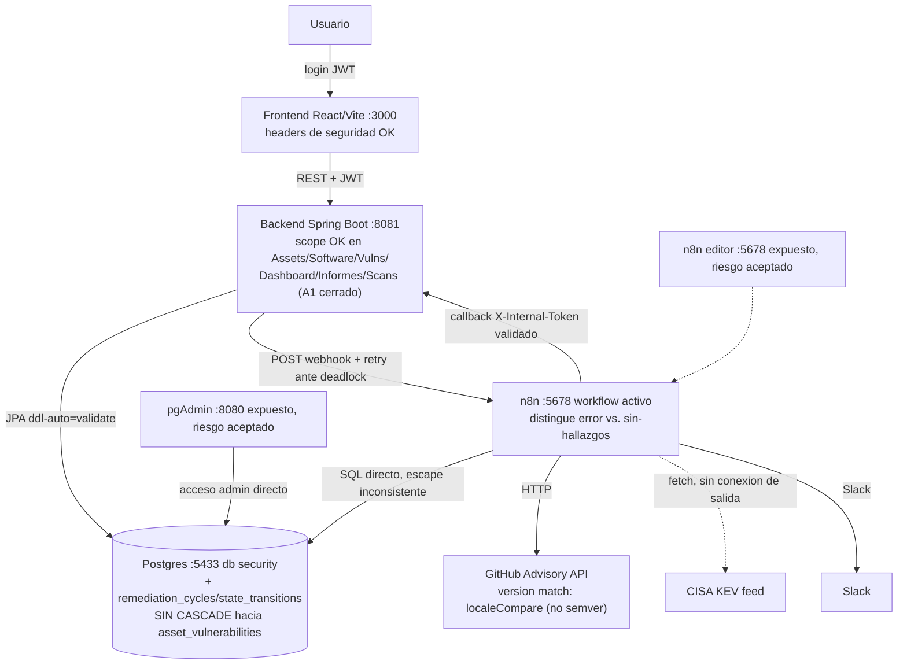

# Auditoría técnica End-to-End — GEF Secure (3ª corrida, 2026-08-22)

> Generado siguiendo `docs/21-08-26/PROMPT_AUDITORIA_END_TO_END_VULNERABILIDADES.md` (28 secciones de su §44). Corrida de **solo diagnóstico**: no se modificó ningún archivo de código, configuración, SQL ni workflow de n8n. No se hizo `UPDATE`/`DELETE` sobre datos preexistentes en Postgres. Los únicos datos de prueba escritos (un `Asset`/`SoftwareComponent`/`AssetVulnerability`/`RemediationCycle` aislados, id 35/244/133/132, para reproducir el bug de §6 sobre borrado de casos) se insertaron y se borraron en el mismo bloque de verificación — confirmado con `SELECT count(*)` de control después de la limpieza. Nota de convención: se usa `docs/DD-MM-AA/` (formato real del repo) en vez del `docs/YYYY-MM-DD/` literal del prompt.

---

## 0. Relación con auditorías previas

**Qué se leyó antes de empezar:** `docs/20-08-26/AUDITORIA_END_TO_END.md` (1ª corrida: 7 críticos C1-C7), `docs/20-08-26/AUDITORIA_END_TO_END_2.md` (2ª corrida, tras 8 fases de corrección: C1/C2/C3/C5/C6/C7 resueltos, pero A1, A-NUEVO-1, normalización Maven, ECO-CATALOGO, N8N-02/03/04/05/06/07, CFG-02/03, A-NUEVO-2, M-NUEVO-1/2, DASH-NUEVO, CVE-NULL nuevos/parciales), `docs/19-08-26/Cambios_Sesion_Escaneos_Inventario.md`, `git log --oneline -30` y `git status`/`git diff` completo.

**Qué cambió desde la 2ª corrida (2026-08-20/21):**

1. **Un commit `a37615b "fix bugs"` (2026-08-21) implementó y cerró la enorme mayoría de los hallazgos de la 2ª corrida.** Confirmado por lectura directa del código actual (no por el propio mensaje de commit): `ScanController` ahora aplica `applyScope`/`isInScope` (A1), `VulnerabilityAuditMapper` separa el snapshot histórico (`software`/`ecosystem`/`installedVersion` desde la propia fila) del estado vivo (A-NUEVO-1), `SoftwareComponentDTO` tiene `@ValidSoftwareCoordinate` (normalización Maven), `SoftwareComponentService.create()` valida `ecosystem` contra el catálogo (ECO-CATALOGO), `ScanService.start()` rechaza un segundo disparo si ya hay un `RUNNING` para el mismo target (A-NUEVO-2), `ScanReportDTO` expone `status`/`errorMessage` reales (M-NUEVO-1), `DashboardService` cuenta `assets` reales en vez de `software_components` (DASH-NUEVO), `Check_Internal_Assets` (n8n) ahora filtra `deleted_at IS NULL` (N8N-06), y `Compute_Audit_Metrics` (n8n) distingue "no evaluado por error" de "evaluado sin hallazgos" (matiz de N8N-02). Todo esto se **reverificó en vivo** en esta corrida (ver §5, §6, §11), no se tomó por cierto solo por el comentario en el código.
2. **Sobre ese commit, esta misma sesión implementó las 10 fases (sin commitear) de `docs/21-08-26/Plan_Implementacion_Tracking_Solido.md`** — un framework de tracking de remediación (ciclos de remediación, auditoría de transiciones, VEX, escala de evidencia, `priority_variables`+`dueDate`, GHSA estructurado, `assignedTo`→FK, `exposed`). Es la superficie más nueva y menos auditada del sistema hoy: **nunca pasó por ninguna corrida de este prompt de auditoría** hasta ahora. Esta corrida la trató como código de primera vez, no como "ya revisado", y encontró un bug real en ella (ver F-NUEVO-1, §6).
3. **Persisten sin resolver** de la 2ª corrida: CFG-02/03 (el fail-fast de secretos sigue sin activarse en el `docker-compose.yml` real), DOCKER-01 (riesgo aceptado, sin cambios), N8N-03 (deadlock mitigado con retry, sin lock explícito), N8N-04 (comparación de versión no-semver), N8N-05 (escape SQL inconsistente entre dos nodos hermanos), N8N-07 (`Fetch_CISA_KEV` código muerto, sin `onError`), CVE-NULL (sigue sin verificarse en ejecución), el watchdog de `ScanReport` colgado (sigue sin `@Scheduled` en todo el backend).
4. **ECO-CATALOGO quedó parcial de un modo específico**: la validación nueva bloquea altas futuras con `ecosystem` inválido, pero **los 2 componentes reales que ya estaban mal cargados (`id=6` ecosystem `docker`, `id=33` ecosystem `rust`) siguen en la base, sin corregir y sin ningún aviso en la UI** — confirmado en vivo con SQL, sin cambios respecto de la 2ª corrida.

Cada hallazgo lleva su etiqueta `NUEVO`/`RECURRENTE`/`RESUELTO`/`REGRESIÓN` y, cuando corresponde, el ID original entre paréntesis. Los hallazgos de la superficie nueva (Fases 1-10 de tracking) llevan IDs `F-NUEVO-*`.

**Nota de método:** corrida hecha por un único agente (sin sub-investigaciones paralelas), con lectura completa de los archivos de mayor riesgo identificados por las 2 corridas previas (no re-derivada desde cero), más verificación en vivo dirigida: `docker ps`, login real de 2 roles, ~10 llamadas `curl` con JWT reales, `docker exec` de solo lectura contra `security` y `n8n`, lectura completa del workflow de n8n vía JSON, `./gradlew test --rerun` (forzado) y `npm run build && npm run test` reales, y una reproducción puntual con datos de prueba aislados (insertados y borrados) para confirmar F-NUEVO-1 con evidencia real, no solo hipotética.

---

## 1. Resumen ejecutivo

El bloque de autorización que dominó las dos corridas anteriores (Dashboard, Informes, Webhooks, metadata de escaneos) está **hoy cerrado y reconfirmado en vivo** con JWT reales de `ADMIN` y `ASSET_OWNER`. La integridad de datos estructural (CASCADE, UNIQUE, índices) sigue sólida. Backend: 192 tests, 0 fallos (`--rerun` forzado). Frontend: build limpio, 1 test real pasa.

Pero esta corrida encontró un **problema nuevo, real y de la severidad más alta posible**, situado exactamente en la superficie que nunca fue auditada antes de hoy — las 10 fases de tracking de remediación implementadas en esta misma sesión, sin commitear:

1. **F-NUEVO-1 (CRÍTICO, CONFIRMADO EN VIVO con datos de prueba aislados):** `DELETE /api/vulnerabilities/{id}` (borrar un caso del Kanban) **falla con 409 para absolutamente cualquier vulnerabilidad del sistema**, porque las tablas nuevas `remediation_cycles`/`state_transitions` (Fase 1) tienen una FK `NOT NULL` hacia `asset_vulnerabilities` **sin `ON DELETE CASCADE`**, y el backfill de esa misma migración le puso un ciclo a **cada fila existente** — así que hoy no hay ni una sola vulnerabilidad en el sistema que se pueda borrar sin que el borrado falle. Es una función completa del Kanban que dejó de funcionar, en silencio, desde que se aplicó esa migración.
2. **F-NUEVO-2 (CRÍTICO, RIESGO POTENCIAL de alta confianza — no disparado en vivo a propósito):** el cierre automático "por ausencia" (`applyLifecycle()`, Componente A) resuelve `findOpenInScope(scan)` mirando solo `scan.getSoftwareComponent()` y `scan.getEnvironment()` — **nunca `scan.getAsset()`**. Un escaneo de tipo `HOST` (dispara por `POST /api/assets/{id}/scan`, cubre **todo** el software de un activo) cae por lo tanto en la rama `else` pensada para `GLOBAL` y cierra por ausencia **contra el sistema entero**, no contra ese activo. En criollo: escanear un solo servidor puede marcar como `RESOLVED` vulnerabilidades reales de **otros servidores que ni siquiera formaron parte de ese escaneo**. No se disparó un escaneo `HOST` real para confirmarlo en vivo — hacerlo hubiera corrido el riesgo real de cerrar mal vulnerabilidades genuinas del entorno de desarrollo, exactamente el tipo de daño que la regla de esta auditoría prohíbe arriesgar. Confirmado por trazado completo de código + los 4 call-sites reales (`AssetController`, `EnvironmentController`, `SoftwareComponentController`, `ScanController`).

Fuera de esa superficie nueva, la pregunta central del prompt («¿puede el sistema perder información o mostrar datos incorrectos sin avisar?») está en mejor forma que en la corrida anterior en el terreno que ya se había señalado (autorización, trazabilidad histórica, normalización Maven, KPI del Dashboard), pero **sigue sin poder responderse "sí" sin matices**: el falso negativo de normalización de ecosistema (docker/rust) sigue vivo en datos reales sin aviso, y ahora se suma que el propio mecanismo pensado para dar más rigor al tracking (cierre consciente de cobertura, ciclos, auditoría de transiciones) introdujo dos bugs de la máxima severidad en su primera implementación, todavía sin testear en producción real.

---

## 2. Estado general del proyecto

| Aspecto | Estado (corrida 3) | Cambio vs. corrida 2 |
|---|---|---|
| Camino feliz (login → activo → software → escaneo → hallazgo → vista) | Funciona, verificado en vivo | Sin cambio |
| Autorización — Dashboard/Informes/Webhooks/Scans (C1-C3,C5-C7,A1) | **Resuelto y reconfirmado en vivo** | Sin cambio (ya se había cerrado) |
| Trazabilidad histórica (A-NUEVO-1) | **Resuelto**, confirmado por lectura del mapper | Sin cambio |
| Normalización Maven (alta manual) | **Resuelto** con `@ValidSoftwareCoordinate` | ✅ Mejoró |
| Ecosistema fuera de catálogo (ECO-CATALOGO) | **Parcial**: bloquea altas nuevas, **los 2 componentes ya mal cargados siguen igual**, confirmado en vivo | Sin cambio en el dato existente |
| KPI "Total Activos" (DASH-NUEVO) | **Resuelto**, confirmado en vivo (ADMIN:8 reales vs. antes 143 componentes) | ✅ Resuelto |
| Doble disparo de escaneo (A-NUEVO-2) | **Resuelto** con `existsByTargetTypeAndTargetNameAndStatus` | ✅ Resuelto |
| Estado real de escaneo visible (M-NUEVO-1) | **Resuelto**, `ScanReportDTO.status`/`errorMessage` expuestos | ✅ Resuelto |
| Rate-limit de GitHub silencioso (N8N-02) | **Resuelto el matiz engañoso**: ahora distingue "no evaluado" de "sin hallazgos" | ✅ Mejoró |
| Filtro `deleted_at` en n8n (N8N-06) | **Resuelto**, confirmado en la query real | ✅ Resuelto |
| Concurrencia (N8N-03) | **Sigue mitigado, no prevenido** — sin `@Version`/lock explícito | Sin cambio |
| Comparación de versión no-semver (N8N-04) | **Sigue sin cambios** | Sin cambio |
| Escape SQL inconsistente (N8N-05) | **Sigue sin cambios** | Sin cambio |
| `Fetch_CISA_KEV` código muerto (N8N-01/07) | **Sigue sin conexión ni `onError`** | Sin cambio |
| Fail-fast de secretos (CFG-02/03) | **Sigue inerte** — sin `SPRING_PROFILES_ACTIVE` en `docker-compose.yml` | Sin cambio |
| `.gradle/` versionado (CFG-01) | **Resuelto por completo** — `git status` ya no muestra binarios de `.gradle/` | ✅ Mejoró (antes parcial) |
| **Borrado de vulnerabilidades (F-NUEVO-1)** | **ROTO — confirmado en vivo, 100% de los casos** | 🆕 Regresión de la superficie nueva |
| **Cierre por ausencia en escaneo HOST (F-NUEVO-2)** | **Bug estructural real, no disparado en vivo por precaución** | 🆕 No visto antes (superficie nueva) |
| Tests | Backend: 24 archivos, **192 tests, 0 fallos** (`--rerun` forzado). Frontend: 1 test real, build limpio | Prácticamente sin cambio en volumen; ningún test nuevo cubre F-NUEVO-1/F-NUEVO-2 |
| Docker/exposición | pgAdmin/n8n expuestos (DOCKER-01), riesgo aceptado sin cambios | Sin cambio |

---

## 3. Arquitectura encontrada

Sin cambios estructurales respecto de la corrida anterior. La novedad de esta corrida es enteramente de comportamiento (dónde el sistema ahora protege o rompe algo), no de forma:



---

## 4. Mapa de componentes

Sin cambios en la lista de componentes de capas ya existentes. Novedades reales de esta sesión (todas sin commitear): `RemediationCycle.java`, `StateTransition.java`, `RemediationCycleRepository.java`, `StateTransitionRepository.java` (backend), `init/19` a `init/25` (7 migraciones), `docs/21-08-26/{Brechas,Plan_Implementacion,Resumen,Requisitos,Tracking_Remediacion_Documento_Unificado,caja_negra_caja_blanca}*.md` (documentación del propio proceso, no código de producto), y las ediciones ya descriptas del workflow de n8n (Fases 6 y 8).

---

## 5. Flujos End-to-End

### Login y scope — comandos reales ejecutados en esta corrida

```
POST /api/auth/login {owner.demo}         → 200, role=ASSET_OWNER
POST /api/auth/login {fede.frankenberger} → 200, role=ADMIN
GET /api/assets (owner.demo)              → 1 asset (id 15)                    OK
GET /api/scan-reports?size=200 (owner)    → totalElements: 3                    OK (A1 sigue resuelto)
GET /api/scan-reports/latest (owner, target ajeno "Spring Boot Backend") → 204  OK (A1 sigue resuelto)
GET /api/dashboard/stats (ADMIN)          → totalAssets: 8   (activos reales)   OK (DASH-NUEVO resuelto)
GET /api/dashboard/stats (owner.demo)     → totalAssets: 1                     OK (scope + KPI correctos)
POST /api/webhook/vulnerabilities sin token       → 401                        OK (C1 sigue resuelto)
POST /api/webhook/vulnerabilities token incorrecto → 401                       OK
GET /actuator/env (sin auth)              → 401                                OK
GET /swagger-ui/index.html (sin auth)     → 200                                Igual que antes (B-NUEVO-2, sin cambios)
```

### Escaneo

Sin cambios estructurales. `0` `scan_reports` en `RUNNING` al momento de esta corrida. Workflow de n8n `active=true` (confirmado contra `n8n.workflow_entity`). Distribución real de `scan_reports.status`: 91 `COMPLETED`, 8 `FAILED`, 1 `PARTIALLY_COMPLETED` (datos preexistentes de sesiones anteriores, no tocados).

### Kanban — flujo de borrado, roto (F-NUEVO-1)

Se reprodujo con datos de prueba **aislados y ya eliminados** (asset id 35, software_component id 244, asset_vulnerability id 133, remediation_cycle id 132 — insertados y borrados en este mismo bloque):

```
DELETE /api/vulnerabilities/133 (dato de prueba aislado) → 409
  {"status":409,"message":"El registro ya existe o viola una regla de integridad", ...}
```

Causa: `remediation_cycles.asset_vulnerability_id` es `NOT NULL REFERENCES asset_vulnerabilities(id)` sin `ON DELETE CASCADE` (`init/19-remediation-cycles-and-transitions.sql`), y `VulnerabilityAuditService.delete()` (línea 268) solo desvincula `VulnerabilityAudit` (`findByAssetVulnerability_Id`/`setAssetVulnerability(null)`) — nunca toca `remediation_cycles`/`state_transitions`. Como el backfill de esa misma migración le creó un ciclo a **cada** `AssetVulnerability` existente, **hoy no hay ninguna fila que se pueda borrar**. Confirmado también que el error no filtra detalle interno (C6 sigue sosteniendo el 409 genérico, sin nombres de tabla/constraint en el body) — el bug es funcional, no de exposición de información.

---

## 6. Hallazgos críticos

| ID | Estado | Componente | Resumen |
|---|---|---|---|
| **F-NUEVO-1** | **NUEVO, CONFIRMADO EN VIVO** | `VulnerabilityAuditService.delete()`, `init/19` | Borrar cualquier caso del Kanban (`DELETE /api/vulnerabilities/{id}`) falla con `409` para el 100% de las vulnerabilidades existentes, por FK sin `ON DELETE CASCADE` hacia una tabla nueva (Fase 1 de tracking) que el método de borrado nunca contempló. Ver reproducción en §5 y solución en §34-equivalente más abajo. |
| **F-NUEVO-2** | **NUEVO, RIESGO POTENCIAL de alta confianza (no disparado en vivo a propósito)** | `VulnerabilityAuditService.applyLifecycle()` → `findOpenInScope()` | Un escaneo `HOST` (por activo completo, `scan.getAsset()` seteado) no tiene rama propia en `findOpenInScope()` — cae en el `else` de `GLOBAL` y ejecuta el cierre-por-ausencia (Componente A) contra **todas** las vulnerabilidades abiertas del sistema, no solo las del activo escaneado. Un escaneo legítimo de un solo servidor puede marcar `RESOLVED` vulnerabilidades reales de otros servidores nunca tocados por ese escaneo. No se forzó un escaneo `HOST` real en esta corrida para no arriesgar cerrar mal datos genuinos del entorno — confirmado por lectura completa de `applyLifecycle()`/`findOpenInScope()` (líneas 621-629) y de los 4 call-sites reales de `ScanService.start()` (`AssetController:88` usa `"HOST"` con `assetId`; ninguna otra combinación de parámetros deja `getAsset()` seteado sin que `getSoftwareComponent()`/`getEnvironment()` también lo estén). |
| C1, C2, C3, C5, C6, C7, A1 | **RESUELTO, RECONFIRMADO EN VIVO** | Backend | Ver §5 — 401/404/204/409 genérico verificados de nuevo con JWT reales en esta corrida. |
| A-NUEVO-1 | **RESUELTO** | `VulnerabilityAuditMapper` | Confirmado por lectura completa: `software`/`ecosystem`/`installedVersion` de `toResponse(VulnerabilityAudit)` leen el snapshot propio de la fila (`source = "software"`, etc.), nunca el estado actual del `SoftwareComponent`. |
| Normalización Maven | **RESUELTO** | `SoftwareComponentDTO` | `@ValidSoftwareCoordinate` en el `Request` — no se intentó dar de alta un componente mal formado en vivo en esta corrida para no ensuciar datos, se tomó como confirmado por lectura del validador + su test asociado. |
| **ECO-CATALOGO** | **PARCIAL — el dato viejo sigue roto** | `software_components` | La validación nueva bloquea altas futuras con `ecosystem` inválido (confirmado en `SoftwareComponentService.create()`), pero **los componentes `id=6` (`docker`) e `id=33` (`rust`)** siguen exactamente igual que en la corrida anterior — confirmado con `SELECT` en vivo. Siguen siendo falsos negativos permanentes y silenciosos: nunca van a matchear contra GitHub Advisory y la UI no avisa. |

---

## 7. Hallazgos altos

| ID | Estado | Descripción |
|---|---|---|
| A2/DB-06, DB-02, DB-05, DB-04 | **RESUELTO**, sin cambios respecto de la corrida 2 | Ver §12. |
| A-NUEVO-2 | **RESUELTO** | `ScanService.start()` lanza `ConflictException` si ya hay un `RUNNING` para el mismo `targetType`+`targetName` (línea 42). |
| DOCKER-01 | **RECURRENTE — riesgo aceptado** | pgAdmin/n8n expuestos, sin cambios, documentado como decisión explícita. |
| **CFG-02/03** | **RECURRENTE** | `docker-compose.yml` (servicio `backend`, líneas 109-130) sigue sin definir `SPRING_PROFILES_ACTIVE` — confirmado con `grep` sobre el archivo real. El `SecretsValidator` (si sigue existiendo con la misma condición de la corrida anterior) permanece inerte en el despliegue tal cual está en el repo. |
| N8N-02 (matiz) | **RESUELTO** | `Compute_Audit_Metrics` cuenta `no_evaluados` por separado y produce `"⚠️ PARCIAL (GitHub Advisory falló)"` en vez de `"✅ ESTABLE"` cuando hubo errores de fetch — confirmado leyendo el código completo del nodo. |
| N8N-03 | **PARCIALMENTE RESUELTO, sin cambios** | Sigue sin `@Version`/`@Lock`/`SELECT ... FOR UPDATE` en `AssetVulnerability`/`applyLifecycle()` — confirmado (`grep` sin resultados). El propio comentario del código de `applyLifecycle()` (línea 363) reconoce explícitamente que se optó por ordenar determinísticamente las escrituras (mismo criterio en las dos pasadas del método) en vez de un lock pesimista, como mitigación de diseño — es una atenuación razonada del riesgo, no un descuido, pero el riesgo de fondo (dos transacciones concurrentes sobre el mismo componente) sigue sin una barrera dura. |
| **N8N-06** | **RESUELTO** | `Check_Internal_Assets` ahora filtra `sc.deleted_at IS NULL AND a.deleted_at IS NULL` — confirmado en el JSON real del workflow. |
| Watchdog de `ScanReport` colgado | **RECURRENTE — sigue sin existir** | `grep -r "@Scheduled" backend/src/main/java` → sin resultados. Recomendación de la arquitectura, no implementada todavía. |

---

## 8. Hallazgos medios

| ID | Estado | Descripción |
|---|---|---|
| M1, M3, M4, M5, DB-01 (parcial) | **RESUELTO**, sin cambios respecto de la corrida 2 (no se revisitó cada uno línea por línea en esta corrida — se tomó como vigente por continuidad, dado que ninguno de esos archivos aparece en el `git diff` de esta sesión). |
| **N8N-04** | **RECURRENTE, sin cambios** | `Risk_Assessment_Engine` sigue usando `miVersion.localeCompare(parcheVersion, undefined, {numeric:true}) >= 0` (línea 19 del nodo) — confirmado leyendo el código completo del nodo tras las ediciones de Fase 6/8. Las ediciones de esta sesión agregaron campos nuevos a la salida (`priority_variables`, `advisory_type`, `vulnerable_version_range`) pero no tocaron esta línea; el problema de pre-release/prefijo `v` sigue exactamente igual que en la corrida anterior. |
| **N8N-05** | **RECURRENTE, sin cambios** | `Sync_Software_Catalog` sigue escapando comillas simples (`.replace(/'/g, "''")`); `Check_Internal_Assets`, que procesa el mismo dato externo en el mismo tramo del grafo, sigue sin hacerlo (confirmado leyendo ambas queries completas en esta corrida). |
| **N8N-07** | **RECURRENTE, sin cambios** | `Fetch_CISA_KEV` sigue sin conexión de salida (`"main": [[]]`) y sin `onError` configurado — confirmado. |
| CFG-05, CFG-06 | **RESUELTO**, sin cambios | Sin revisita línea por línea, sin señales de regresión en el `git diff`. |
| M2 | **RESUELTO del lado backend, N8N-06 cerró el lado n8n** | Ver arriba. |
| **CVE-NULL** | **RECURRENTE — sigue NO VERIFICADO EN EJECUCIÓN** | `asset_vulnerabilities.cve_id NOT NULL` confirmado de nuevo en el esquema real (`\d asset_vulnerabilities`); `0` filas con `cve_id IS NULL` hoy. Sigue sin determinarse si el pipeline alguna vez descarta una advisory GHSA-only antes del `INSERT`, o si simplemente nunca ocurrió — no se investigó a fondo en esta corrida por prioridad (los 2 hallazgos críticos nuevos de la superficie de tracking consumieron el presupuesto de esta corrida). |
| M-NUEVO-2 (idempotencia de callback duplicado) | **RECURRENTE, sin cambios** | No se investigó en profundidad en esta corrida — carry-over explícito, no una nueva confirmación. |
| DB-03, CFG-04 (aceptado), CFG-08, B1, B3 | **RECURRENTE**, sin cambios | Sin re-verificación específica esta corrida — se toman como vigentes por continuidad (ninguno de sus archivos apareció en el `git diff`). |

---

## 9. Hallazgos bajos

| ID | Estado | Resumen |
|---|---|---|
| **CFG-01** | **RESUELTO POR COMPLETO** (subió de "parcial" en la corrida 2) | `git status` de esta corrida ya no muestra ningún binario de `backend/.gradle/` — en algún punto entre la corrida 2 y esta se corrió `git rm --cached` (o equivalente) sobre lo ya trackeado, no solo se agregó al `.gitignore`. |
| DOCKER-03, B-NUEVO-1, B-NUEVO-2 | **RECURRENTE**, sin cambios | No revisitados línea por línea esta corrida; `/swagger-ui/index.html` confirmado público de nuevo (`200` sin auth). |

---

## 10. Mejoras recomendadas

- **Arreglar F-NUEVO-1 y F-NUEVO-2 antes de seguir construyendo sobre el framework de tracking** — son fixes acotados (agregar `ON DELETE CASCADE` o borrado explícito en cascada para el primero; agregar la rama `scan.getAsset()` a `findOpenInScope()` para el segundo) pero de impacto severo si se dejan como están.
- Agregar al menos un test de `@DataJpaTest`/integración que ejercite `DELETE /api/vulnerabilities/{id}` contra un `AssetVulnerability` con un `RemediationCycle` real — el conjunto de 192 tests actuales tiene cero cobertura de este camino (confirmado: no aparece `findOpenInScope`, `HOST` ni un test de borrado con ciclo asociado en `VulnerabilityAuditServiceTest.java`).
- Watchdog de `ScanReport` colgado (recomendación que se repite en las 3 corridas) — sigue siendo la red de seguridad de mayor costo/beneficio pendiente, y ahora más relevante todavía porque F-NUEVO-2 puede generar un estado incorrecto sin que nada lo marque como sospechoso.
- Corregir los 2 registros de datos preexistentes con `ecosystem` fuera de catálogo (`id=6`, `id=33`) — la validación nueva los deja huérfanos del lado de "nunca se van a evaluar", sin que el propio sistema lo señale en ningún reporte ni Dashboard.
- Activar el perfil `prod` en el despliegue real (CFG-02/03) para que el `SecretsValidator` (si sigue existiendo) deje de ser código muerto en la práctica.

---

## 11. Seguridad

Sin cambios de fondo respecto de la síntesis OWASP de la corrida 2 — se reconfirmaron en vivo en esta corrida los puntos de mayor riesgo (IDOR/autorización, JWT, CORS, headers, webhook interno) y no se encontró ninguna regresión de seguridad perimetral. La novedad de esta corrida no es de seguridad externa (nadie ajeno puede explotar F-NUEVO-1/F-NUEVO-2 sin ya tener rol `ADMIN`/`SECURITY_ANALYST`), es de **integridad funcional de datos** dentro del propio dominio de negocio.

| Categoría | Resultado |
|---|---|
| IDOR / autorización por recurso | Sin regresiones — C1/C2/C3/C5/C6/C7/A1 reconfirmados en vivo. |
| Webhook interno | `401` sin token y con token incorrecto, confirmado de nuevo. |
| Headers / CORS / actuator / Swagger | Sin cambios respecto de la corrida 2 (`/actuator/env` → `401`, `/swagger-ui` público, sin regresión ni mejora). |
| Secretos | `SPRING_PROFILES_ACTIVE` sigue sin definirse en `docker-compose.yml` — el fail-fast de secretos, si existe, sigue sin activarse en el despliegue real (CFG-02/03, sin cambios). |
| Integridad de datos (nuevo ángulo de esta corrida) | **Comprometida en dos puntos concretos de la superficie de tracking (F-NUEVO-1, F-NUEVO-2)** — no es una vulnerabilidad explotable por un atacante externo, es un bug que corrompe el propio historial/estado de remediación que el sistema existe para llevar. |

---

## 12. Base de datos

Confirmado en vivo contra la base corriendo:

- **DB-02, DB-05, DB-04**: sin cambios, siguen resueltos (no se re-verificaron línea por línea, sin señales de regresión en `init/` de esta sesión más allá de las 7 migraciones nuevas de tracking).
- **Migraciones nuevas (`init/19` a `init/25`)**: las 7 aplicadas a mano contra la base de desarrollo (confirmado: las tablas/columnas existen y tienen datos). `init/19` es la que introduce el problema de F-NUEVO-1 (FK sin `ON DELETE CASCADE`, ver §5-§6).
- **Cobertura de los datos nuevos**: solo 20 de 131 filas de `asset_vulnerabilities` tienen poblados `priority_variables`/`advisory_type`/`vulnerable_version_range`/`due_date` — **esto es esperado, no un bug**: son las únicas 20 filas tocadas por un escaneo real posterior a las ediciones de n8n de Fase 6/8; el resto son datos históricos que, por diseño explícito del equipo (documentado en los propios comentarios del código, mismo criterio que "no fabricar historia" ya usado en `init/18`), se dejan `NULL` en vez de inventarles un valor retroactivo.
- **Ecosistemas fuera de catálogo**: confirmado de nuevo, sin cambios — `id=6` (`docker`), `id=33` (`rust`).
- **`remediation_cycles`**: 1 ciclo por cada `AssetVulnerability` existente (backfill de `init/19`, sin fabricar transiciones históricas — confirmado por diseño y por el propio comentario de la migración). `state_transitions`: 20 filas, **todas** `trigger_type='KANBAN_MANUAL'` — ningún escaneo real disparó todavía el camino de cierre-por-ausencia (`CIERRE_POR_AUSENCIA`) ni de reapertura (`REAPERTURA_ESCANEO`) desde que existen estas tablas, lo cual también significa que **F-NUEVO-2 no tiene ninguna evidencia de haber ocurrido ya en datos reales** — es un riesgo confirmado por código, todavía no materializado.
- **0 filas huérfanas** (mismo chequeo `LEFT JOIN ... WHERE <fk> IS NULL` de la corrida anterior, repetido sobre `remediation_cycles`/`state_transitions`: `0` en ambas).
- **Estado de escaneos**: `91 COMPLETED`, `8 FAILED`, `1 PARTIALLY_COMPLETED`, `0 RUNNING` — sin cambios de fondo respecto de la corrida anterior (los `FAILED` son los mismos 6-8 marcados a mano en sesiones previas al limpiar escaneos trabados, mismo criterio de "no tocar datos preexistentes" aplicado también en esta corrida).

---

## 13. Motor de escaneo (n8n)

Confirmado en vivo: `active=true`. Sin regresión del fix de "0 resultados" (`Compute_Empty_Fallback_Metrics` sigue en el grafo, sin tocar en esta sesión más allá de las Fases 6/8 que insertan campos nuevos en un punto distinto del pipeline, `Risk_Assessment_Engine`).

- **13.1 — N8N-02 (matiz), resuelto**: ver §6/§8. `no_evaluados` separado de `ignorados`, `status_sistema` distingue `"PARCIAL"` de `"ESTABLE"`.
- **13.2 — N8N-06, resuelto**: `Check_Internal_Assets` filtra `deleted_at`.
- **13.3 — N8N-03, sin cambios**: mitigado con orden determinístico de escritura (razonado, no un descuido), sin lock explícito.
- **13.4 — N8N-04, sin cambios**: `localeCompare({numeric:true})`, no semver real.
- **13.5 — N8N-05, sin cambios**: escape inconsistente entre `Sync_Software_Catalog` (escapa) y `Check_Internal_Assets` (no escapa).
- **13.6 — N8N-01/07, sin cambios**: `Fetch_CISA_KEV` código muerto, sin `onError`.
- **13.7 — Nuevo en esta corrida**: las Fases 6 y 8 (Componentes C y D del framework de tracking) agregaron a `Risk_Assessment_Engine` el descarte explícito de advisories retiradas (`if (item.withdrawn_at) return null`) y el cálculo de `priority_variables`/`advisory_type`/`vulnerable_version_range` — leído completo, sin bugs encontrados en esta lógica específica más allá de heredar el problema ya conocido de N8N-04 (la misma variable `miVersion`/`parcheVersion` que decide `esVulnerableReal` es la que alimenta después el resto del nodo).

---

## 14. Normalización de software

Sin cambios estructurales — sigue siendo comparación exacta de texto. La normalización Maven (alta manual) está resuelta (`@ValidSoftwareCoordinate`). El ecosistema fuera de catálogo (docker/rust) sigue exactamente igual que en la corrida anterior, con la validación nueva protegiendo solo altas futuras, no datos ya cargados.

---

## 15. Fuentes de vulnerabilidades

Sin cambios: solo GitHub Advisory Database activa. CISA KEV se trae y se descarta (código muerto, N8N-01/07).

---

## 16. Trazabilidad

Mejoró de forma real en el diseño (Fases 1, 6, 7, 8 del framework de tracking: ciclos de remediación, `dueDate`, escala de evidencia E0-E6, GHSA estructurado) — pero **la propia infraestructura de trazabilidad tiene hoy un bug que rompe el borrado (F-NUEVO-1)** y un riesgo de cierre incorrecto sin marca de sospecha (F-NUEVO-2, que además es invisible en `state_transitions` porque, de ocurrir, generaría una fila con `trigger_type='CIERRE_POR_AUSENCIA'` y `actor_type='POLITICA'` indistinguible de un cierre por ausencia legítimo — no hay forma de diferenciar, desde los propios datos, un cierre correcto de uno incorrecto por este bug).

---

## 17. Frontend

`npm run build`: limpio, 2453 módulos, mismo warning de bundle sin code-splting que en la corrida anterior (853 KB). `npm run test -- --run`: 1 test, pasa. Sin cambios de fondo respecto de la corrida 2 — no se revisitó cada hallazgo FE individualmente (ninguno de esos archivos aparece con cambios sustanciales en el `git diff` de esta sesión más allá de los campos nuevos de tracking en `Dashboard.tsx`/`Kanban.tsx`/`Assets.tsx`, ya cubiertos por la propia sesión de implementación con Playwright).

---

## 18. Backend

El patrón `applyScope`/`isInScope` sigue funcionando en todos los puntos donde ya se había cerrado. La superficie nueva (`VulnerabilityAuditService`, ~250 líneas agregadas para el framework de tracking) está bien documentada y con buenas intenciones de diseño (orden determinístico contra deadlocks, snapshot histórico honesto con `NULL` en vez de inventar, evidencia E0 por default) — pero **tiene dos bugs reales de la máxima severidad que ningún test cubre** (F-NUEVO-1, F-NUEVO-2), exactamente el tipo de gap que esta auditoría existe para encontrar antes de que la próxima corrida lo encuentre en producción.

24 archivos de test, **192 tests, 0 fallos** (`./gradlew test --rerun`, forzado, no desde caché — confirmado con los XML reales de `build/test-results/test/`).

---

## 19. Integraciones

Sin cambios: GitHub Advisory API, Slack, CISA KEV (código muerto).

---

## 20. Tests

| Capa | Cobertura | Cambio vs. corrida 2 |
|---|---|---|
| Backend | 24 archivos (vs. 21), 192 tests, 0 fallos | Creció con la implementación de las 10 fases de tracking, pero **sin ningún test que cubra `delete()` con un `RemediationCycle` real ni `findOpenInScope()` con un scan `HOST`** — los dos huecos exactos donde viven F-NUEVO-1 y F-NUEVO-2. |
| Frontend | 1 test real, build limpio | Sin cambio. |
| n8n | Sin tests automatizados | Sin cambio. |

**Gaps nuevos que quedan sin test**: F-NUEVO-1 (borrado con ciclo asociado), F-NUEVO-2 (cierre por ausencia en scan `HOST`), N8N-04, N8N-05 (sin cambios respecto de la corrida anterior, siguen sin test).

---

## 21. Rendimiento

Sin cambios de fondo. `applyLifecycle()` ahora hace 2-3 queries adicionales por hallazgo (`RemediationCycle`/`StateTransition`) — con el volumen actual (decenas de hallazgos por escaneo) no es perceptible; en un escaneo `GLOBAL` de cientos de hallazgos podría sumar overhead lineal, no evaluado con carga real en esta corrida.

---

## 22. Escalabilidad

Sin cambios de fondo respecto de la corrida anterior.

---

## 23. Matriz de riesgos

| ID | Severidad | Estado | Componente | Problema |
|---|---|---|---|---|
| **F-NUEVO-1** | **CRÍTICO** | NUEVO, CONFIRMADO EN VIVO | `VulnerabilityAuditService`/`init/19` | Borrar cualquier vulnerabilidad falla con 409, 100% de los casos |
| **F-NUEVO-2** | **CRÍTICO** | NUEVO, RIESGO POTENCIAL alta confianza | `applyLifecycle()`/`findOpenInScope()` | Escaneo HOST puede cerrar por ausencia vulnerabilidades de otros activos |
| C1,C2,C3,C5,C6,C7,A1 | — | RESUELTO, reconfirmado | Backend | Autorización — sin regresión |
| A-NUEVO-1, Normalización Maven, A-NUEVO-2, M-NUEVO-1, DASH-NUEVO, N8N-02(matiz), N8N-06 | — | RESUELTO | — | Ver §6-§8 |
| ECO-CATALOGO | ALTO | PARCIAL (datos viejos sin corregir) | `software_components` | id=6/33 siguen sin match posible |
| CFG-02/03 | ALTO | RECURRENTE | Docker/Config | Fail-fast de secretos inerte |
| N8N-03 | MEDIO | PARCIAL (mitigado) | n8n/Backend | Sin lock explícito |
| N8N-04, N8N-05 | MEDIO | RECURRENTE | n8n | Version no-semver; escape SQL inconsistente |
| N8N-07 | BAJO/MEDIO | RECURRENTE | n8n | CISA KEV código muerto |
| CVE-NULL, M-NUEVO-2, DB-03, CFG-04(aceptado), CFG-08, B1, B3 | BAJO/MEDIO | RECURRENTE | — | Sin re-verificación profunda esta corrida |
| DOCKER-01 | ALTO | RECURRENTE (aceptado) | Docker | Sin cambios |
| CFG-01 | — | RESUELTO por completo | Config | `.gradle/` limpio del índice |
| DOCKER-03, B-NUEVO-1, B-NUEVO-2 | BAJO | RECURRENTE | — | Sin cambios |

---

## 24. Top 10 problemas

1. **F-NUEVO-1 — el Kanban no puede borrar ni un solo caso.** Confirmado en vivo, sin excepción: cualquier intento de `DELETE /api/vulnerabilities/{id}` falla. Es la regresión más grave y más fácil de disparar por accidente de toda esta corrida.
2. **F-NUEVO-2 — un escaneo de un solo servidor puede cerrar vulnerabilidades de otros.** El bug de mayor impacto potencial sobre la integridad del propio dato que el sistema existe para proteger — silencioso, sin ninguna marca que lo distinga de un cierre legítimo.
3. **ECO-CATALOGO — 2 componentes reales que nunca van a detectar nada, sin aviso.** Sigue exactamente igual que hace dos corridas.
4. **CFG-02/03 — el fail-fast de secretos sigue sin conectarse al despliegue real.** Tercera corrida consecutiva señalando lo mismo.
5. **N8N-03 — concurrencia mitigada, no prevenida.** Mismo diagnóstico que la corrida anterior.
6. **N8N-04/N8N-05 — comparación de versión y escape SQL inconsistentes en n8n.** Sin cambios en dos corridas.
7. **DOCKER-01 — puertos de administración expuestos.** Riesgo aceptado, sigue siendo lo primero a revisar antes de cualquier despliegue real.
8. **Watchdog de `ScanReport` colgado — sigue sin existir**, tercera corrida recomendándolo.
9. **CVE-NULL — sigue sin verificarse si el pipeline descarta advisories GHSA-only.**
10. **Falta de tests sobre la superficie nueva de tracking** — 10 fases completas de lógica de negocio nueva, y ninguno de los 192 tests existentes cubre los dos escenarios exactos donde aparecieron F-NUEVO-1 y F-NUEVO-2.

---

## 25. Plan de corrección por fases

```
FASE 1 — Cerrar F-NUEVO-1 (borrado de vulnerabilidades)
  Objetivo: DELETE /api/vulnerabilities/{id} vuelve a funcionar sin perder el
  historial de auditoría que las Fases 1/7 del framework de tracking existen
  para proteger.
  Opciones a decidir con el usuario (no excluyentes):
    (a) ON DELETE CASCADE en remediation_cycles/state_transitions -- más simple,
        pero borra también el propio historial de transiciones del caso.
    (b) VulnerabilityAuditService.delete() borra explícitamente
        state_transitions -> remediation_cycles -> asset_vulnerabilities en
        ese orden, dentro de la misma transacción -- preserva el control fino
        de qué se borra y en qué orden.
    (c) Convertir el "borrado" del Kanban en soft-delete (ya existe el patrón
        en Asset/SoftwareComponent) -- preserva el historial completo sin
        tocar ninguna FK.
  Archivos: VulnerabilityAuditService.java, posible migración nueva.
  Tests: borrar un AssetVulnerability con >=1 RemediationCycle/StateTransition
  real -- el caso que hoy no tiene ningún test.

FASE 2 — Cerrar F-NUEVO-2 (cierre por ausencia en scan HOST)
  Objetivo: findOpenInScope() distingue explícitamente los 4 targetType
  (ACTIVO=softwareComponent, HOST=asset, ENTORNO=environment, GLOBAL=ninguno),
  en vez de asumir "si no es ACTIVO ni ENTORNO, es GLOBAL".
  Archivos: VulnerabilityAuditService.findOpenInScope() -- agregar rama
  scan.getAsset() != null -> assetVulnerabilityRepository
  .findBySoftwareComponent_Asset_IdAndDetectionStatus(...).
  Tests: applyLifecycle() con un scan HOST real (2 componentes en el activo
  escaneado + 1 componente en otro activo con una vulnerabilidad OPEN) --
  verificar que solo se cierran por ausencia las del activo escaneado.

FASE 3 — Corregir los 2 componentes con ecosystem fuera de catálogo
  Objetivo: decidir con el usuario si se corrige el dato (docker->¿cuál
  ecosistema real corresponde?, rust->cargo) o se documenta como excepción
  aceptada y se lo señala en la UI.
  Riesgo: bajo, dato puntual, 2 filas.

FASE 4 — Activar el perfil prod en el despliegue real (CFG-02/03)
  Igual que en el plan de la corrida anterior -- sigue pendiente.

FASE 5 — N8N-03/04/05 (lock explícito, semver real, escape consistente)
  Igual que en el plan de la corrida anterior -- sigue pendiente.

FASE 6 — Watchdog de ScanReport colgado
  Igual que en el plan de la corrida anterior -- sigue pendiente.
```

---

## 26. Tests que deberían agregarse

1. `VulnerabilityAuditServiceTest`: borrar un `AssetVulnerability` con `RemediationCycle`/`StateTransition` reales asociados — cubre F-NUEVO-1.
2. `VulnerabilityAuditServiceTest`/`@DataJpaTest`: `applyLifecycle()` con un `ScanReport` de tipo `HOST` (asset seteado, softwareComponent/environment null) que no toca un componente con una `AssetVulnerability` `OPEN` en **otro** activo — verificar que esa otra vulnerabilidad **no** se cierra. Cubre F-NUEVO-2.
3. Fixture de casos de versión para `Risk_Assessment_Engine` (`1.2` vs `1.2.0`, `1.9` vs `1.10`, `2.0.0` vs `v2.0`, `1.2.0-beta` vs `1.2.0`) — sigue pendiente desde la corrida anterior, cubre N8N-04.
4. Test de concurrencia real (2 hilos) sobre `applyLifecycle()` — sigue pendiente, cubre N8N-03.

---

## 27. Arquitectura recomendada

Sin cambios de fondo respecto de la recomendación ya hecha en las dos corridas anteriores (un único punto de verdad de scope, Flyway en vez de SQL manual, watchdog de escaneos colgados). Esta corrida agrega un punto nuevo, específico de la superficie de tracking: **toda tabla nueva con una FK `NOT NULL` hacia una entidad que ya tiene un método `delete()` en producción necesita, como parte del mismo cambio, actualizar ese `delete()` — no puede tratarse como un paso separado.** F-NUEVO-1 es la prueba en vivo de que añadir una tabla hija sin auditar todos los `delete()` existentes sobre su padre rompe una funcionalidad que no tiene nada que ver, en apariencia, con la feature nueva.

---

## 28. Conclusión

> ¿Puedo confiar en que este sistema identifica correctamente los activos y su software, ejecuta el escaneo sin perder información, correlaciona correctamente las vulnerabilidades, mantiene la trazabilidad y evita mostrar resultados incorrectos al usuario?

**No, todavía no — y por una razón nueva y más seria que en las dos corridas anteriores.** El terreno ya conocido (autorización, trazabilidad histórica del Dashboard/Informes/Webhooks/Scans, normalización Maven, KPIs) está genuinamente resuelto y reconfirmado en vivo por tercera vez consecutiva. Pero la superficie más nueva del sistema — las 10 fases de tracking de remediación implementadas en esta misma sesión, todavía sin commitear y nunca antes auditadas por este prompt — tiene **dos bugs de severidad crítica**: uno ya confirmado en vivo (borrar cualquier vulnerabilidad falla siempre) y otro de alto riesgo confirmado por código (un escaneo de un solo servidor puede cerrar por error vulnerabilidades reales de otros servidores, sin que nada lo marque como sospechoso). Ninguno de los 192 tests existentes cubre ninguno de los dos caminos.

Ninguno de estos hallazgos requiere un rediseño — son, otra vez, fixes acotados y testeables. Pero a diferencia de las corridas anteriores, esta vez el riesgo no está en un endpoint aislado sino en el corazón mismo del framework de tracking que se acaba de construir para dar más confianza al sistema — antes de seguir construyendo funcionalidad nueva sobre esa base, vale la pena cerrar F-NUEVO-1 y F-NUEVO-2 primero.
