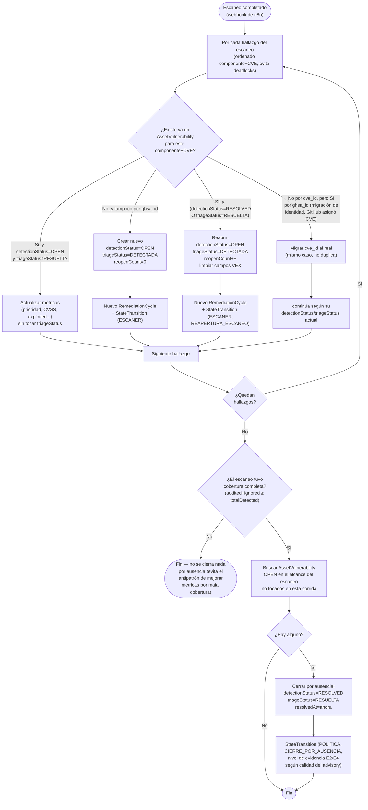

# Actividad — ciclo de vida completo de una vulnerabilidad por escaneo

Diagrama de actividad (aproximado con `flowchart`, Mermaid no tiene un tipo "activity"
nativo) del proceso real que corre `VulnerabilityAuditService.applyLifecycle()` por
cada escaneo — la decisión de tres ramas (nuevo/persiste/reabre) más el cierre
automático por ausencia al final. Es el proceso de negocio más complejo del sistema;
complementa al [diagrama de estados](estados-vulnerabilidad.md) mostrando el flujo de
decisión, no solo los estados posibles.

**Notas fieles al código real** (`VulnerabilityAuditService.applyLifecycle()`,
`backend/src/main/java/com/gef/gefsecureapp/service/VulnerabilityAuditService.java`):

- La rama de migración de identidad (`ghsa_id` estable, `cve_id` recién asignado) es un
  fix del 24-08-26 — antes de eso, una advisory que pasaba de "solo GHSA" a tener CVE
  real generaba un `AssetVulnerability` duplicado.
- El cierre por ausencia respeta el alcance real del escaneo (componente/activo/entorno/
  global) — un escaneo de un solo activo nunca cierra por ausencia vulnerabilidades de
  otros activos (ver `findOpenInScope()`).
- Ninguna de estas transiciones automáticas pasa por la máquina de estados manual
  (`TRANSICIONES_PERMITIDAS`, que solo rige `updateStatus()` desde el Kanban) — es
  intencional, ver el comentario de clase de `AssetVulnerability`.
