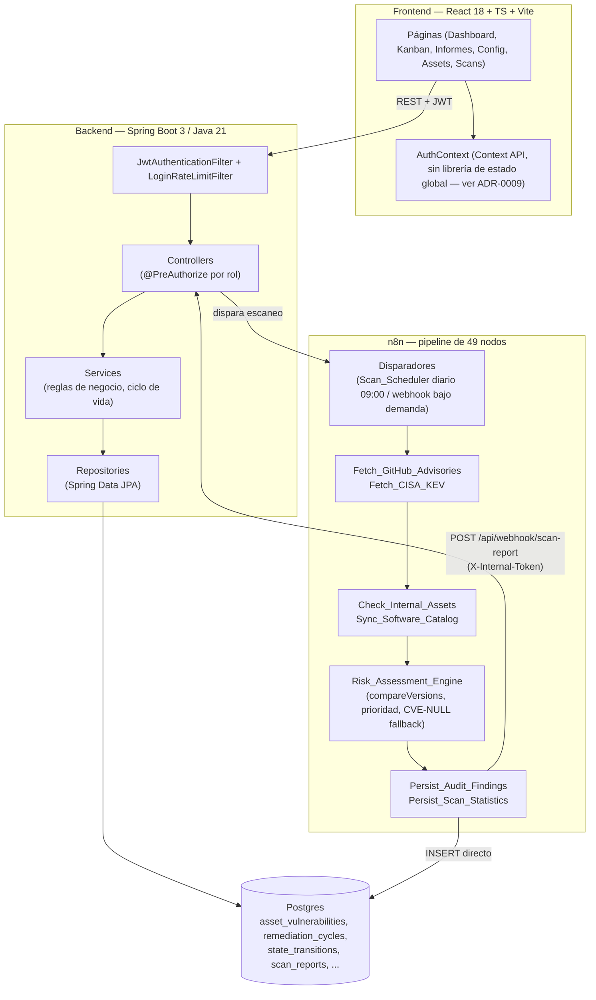

# Arquitectura del sistema (vista por capas)

Complementa a [contexto-componentes.md](contexto-componentes.md) (que muestra los 5
servicios Docker y las integraciones externas) con una vista interna: las capas reales
del backend y las etapas reales del pipeline de n8n, basada en los paquetes
`controller/`, `service/`, `repository/` de `backend/src/main/java/com/gef/gefsecureapp/`
y en los nodos del workflow `workflows/Pipeline de Gestión Automatizada de
Vulnerabilidades (VMP).json`.

**Notas fieles al código real**:
- El pipeline de n8n escribe hallazgos **directamente** en Postgres (`Persist_Audit_Findings`),
  no a través del backend — el backend recién se entera al recibir el webhook de cierre
  (`Persist_Scan_Statistics`), que dispara `VulnerabilityAuditService.applyLifecycle()`.
- `Risk_Assessment_Engine` es el nodo más crítico del pipeline (única lógica de negocio real
  embebida en n8n) — es también el único con tests automatizados propios, ver
  `workflows/tests/`.
- No hay una capa de mensajería/colas entre backend y n8n — la comunicación es HTTP directo
  (webhook de ida, webhook de cierre), documentado y aceptado en [ADR-0003](../../adr/0003-n8n-como-motor-de-scoring-externo.md).
