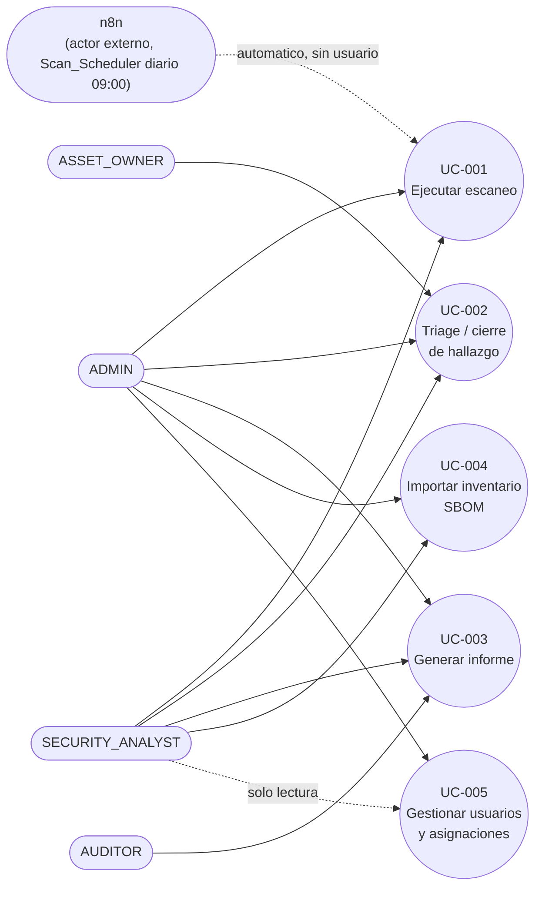

# Diagrama de casos de uso

Mermaid no tiene un tipo de diagrama UML "use case" nativo — se aproxima con un
`flowchart` (actores a la izquierda, casos de uso como nodos redondeados a la derecha),
convención común para versionar este tipo de diagrama en Markdown. Los roles y
asociaciones están tomados directo de las anotaciones `@PreAuthorize` reales de cada
controller — no son una suposición de "quién debería poder hacer qué".

**RBAC real por caso de uso** (verificado en los controllers citados en cada
[UC](../../use-cases/), no inferido):

| Caso de uso | ADMIN | SECURITY_ANALYST | ASSET_OWNER | AUDITOR |
|---|---|---|---|---|
| [UC-001 — Ejecutar escaneo](../../use-cases/UC-001-ejecutar-escaneo.md) | ✓ | ✓ | — | — |
| [UC-002 — Triage/cierre de hallazgo](../../use-cases/UC-002-triage-cierre-hallazgo.md) | ✓ | ✓ | ✓ (solo sus activos asignados) | — |
| [UC-003 — Generar informe](../../use-cases/UC-003-generar-informe.md) | ✓ | ✓ | — | ✓ |
| [UC-004 — Importar inventario SBOM](../../use-cases/UC-004-importar-inventario-sbom.md) | ✓ | ✓ | — | — |
| [UC-005 — Gestionar usuarios/asignaciones](../../use-cases/UC-005-gestionar-usuarios-asignaciones.md) | ✓ (mutaciones) | lectura únicamente | — | — |

`n8n` dispara UC-001 automáticamente una vez por día (`Scan_Scheduler`, ver
[04-n8n-pipeline.md](../04-n8n-pipeline.md)) sin que ningún usuario lo inicie — se
representa como actor externo, no como un rol del sistema.
