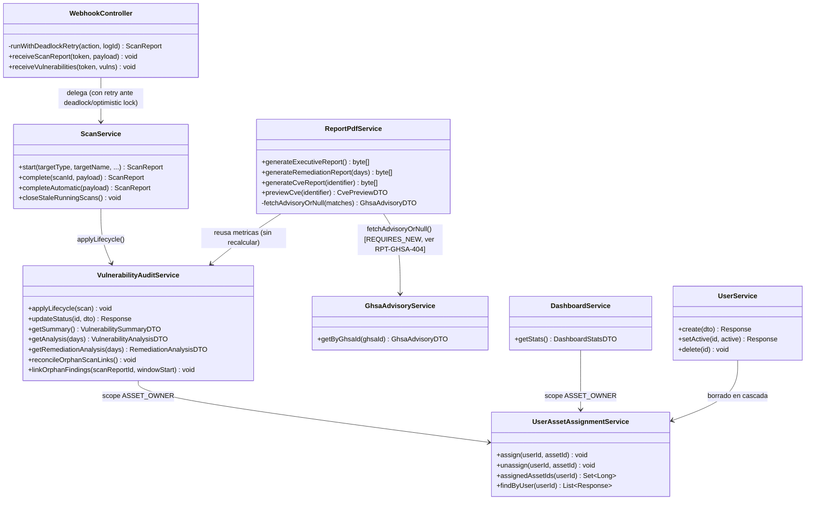

# Diagrama de clases — capa de servicios del backend

No es un diagrama de las entidades JPA (eso ya lo cubre el [ERD](erd.md) sin
redundancia) — muestra las clases `@Service`/`@Controller` reales de
`backend/src/main/java/com/gef/gefsecureapp/` con más lógica de negocio, y cómo se
llaman entre sí. Acotado a las clases centrales del dominio de escaneo/vulnerabilidades
(el resto de los catálogos — `EnvironmentController`, `EcosystemController`,
`AssetTypeController` — son CRUDs simples sin lógica propia que aporte valor en este
diagrama).

**Notas fieles al código real**:
- `ReportPdfService --> GhsaAdvisoryService` es la relación que causó el bug RPT-GHSA-404
  (`UnexpectedRollbackException`): `getByGhsaId()` corría con `propagation = REQUIRED`
  (compartía la transacción de `ReportPdfService`) hasta el fix del 24-08-26, que la
  cambió a `REQUIRES_NEW` — ver [ADR](../../adr/README.md) y
  `docs/bitacora/24-08-26/AUDITORIA_SECCIONES_NUEVAS.md`.
- `VulnerabilityAuditService` y `DashboardService` no dependen una de la otra — ambas
  dependen de `UserAssetAssignmentService` de forma independiente para resolver el scope
  de `ASSET_OWNER`, sin una clase intermedia compartida.
