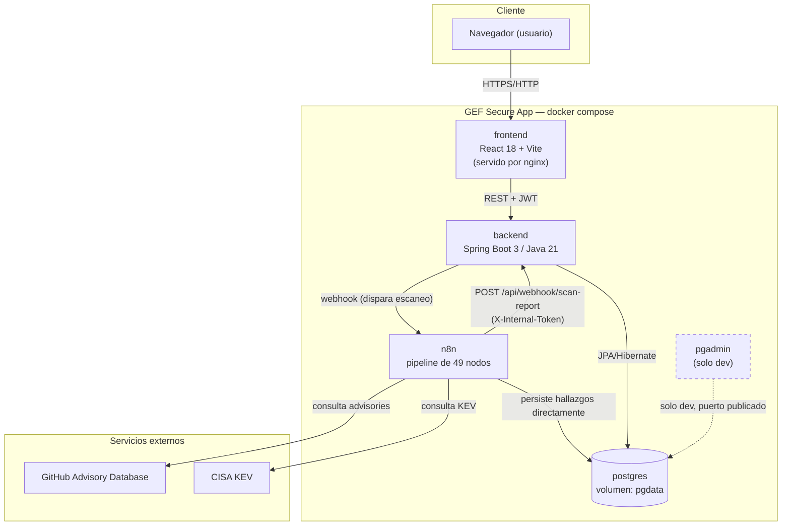

# Diagrama de contexto y componentes

Los 5 servicios definidos en `docker-compose.yml` (backend, frontend, n8n, postgres,
pgadmin) y sus integraciones externas reales.

**Notas fieles al código real**:
- n8n escribe hallazgos **directamente** en Postgres (no solo vía el backend) — el
  backend se entera por el webhook de cierre, no por ser el único escritor.
- En `docker-compose.prod.yml`, `pgadmin` y `n8n` no publican puertos al host — solo
  son alcanzables dentro de la red interna `gef_net` (ver
  [`docs/operations/deployment.md`](../../operations/deployment.md)).
