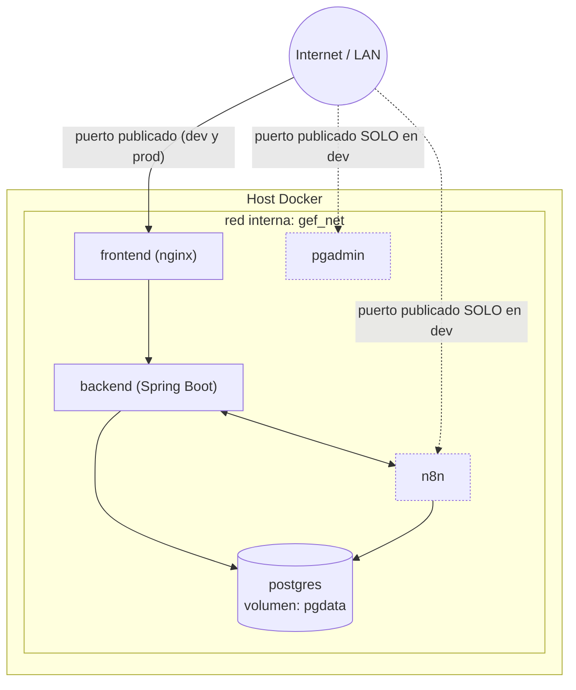

# Diagrama de despliegue — dev vs. prod

Topología real de contenedores según `docker-compose.yml` (desarrollo) y
`docker-compose.prod.yml` (producción, probado en ejecución pero sin despliegue
productivo real activo — ver [`docs/operations/deployment.md`](../../operations/deployment.md)).

**Diferencias clave dev → prod** (ver tabla completa en
[`docs/operations/deployment.md`](../../operations/deployment.md)):
- `prod`: `SPRING_PROFILES_ACTIVE=prod` activa `SecretsValidator` fail-fast y
  deshabilita Swagger; `n8n`/`pgadmin` **no** publican puertos (solo alcanzables
  dentro de `gef_net`, ej. por túnel SSH/VPN).
- `dev`: Swagger habilitado, `n8n`/`pgadmin` con puertos publicados al host para
  administración directa, accesos rápidos de demo login habilitados en el frontend.
- Ninguno de los dos compose termina TLS — eso queda para un reverse proxy real
  delante del stack en un despliegue productivo futuro (no cubierto por este repo).
