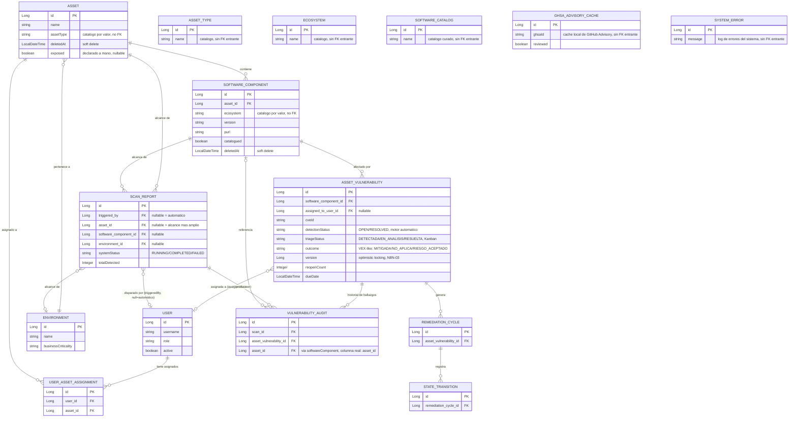

# ERD — Modelo de datos

Generado a partir de las 15 entidades `@Entity` reales en
`backend/src/main/java/com/gef/gefsecureapp/model/`. `AssetType`, `Ecosystem` y
`SoftwareCatalog` son catálogos de referencia consultados por valor (`asset.assetType`
y `softwareComponent.ecosystem` son columnas `String`, **no** claves foráneas) — se
muestran sin relación dibujada a propósito, para no inventar una FK que no existe en
el esquema real.

