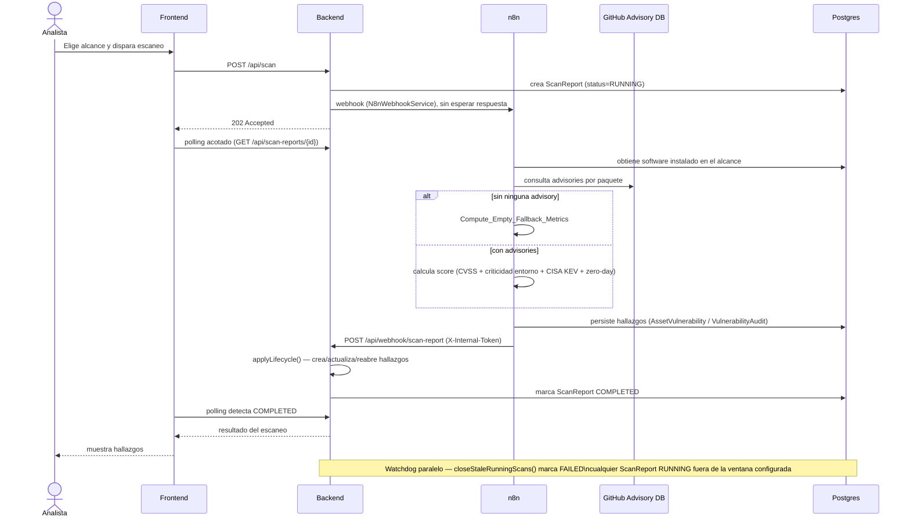

# Secuencia — Ejecución de un escaneo (UC-001)

```mermaid
sequenceDiagram
    actor Analista
    participant FE as Frontend
    participant BE as Backend
    participant N8N as n8n
    participant GHSA as GitHub Advisory DB
    participant DB as Postgres

    Analista->>FE: Elige alcance y dispara escaneo
    FE->>BE: POST /api/scan
    BE->>DB: crea ScanReport (status=RUNNING)
    BE->>N8N: webhook (N8nWebhookService), sin esperar respuesta
    BE-->>FE: 202 Accepted
    FE->>BE: polling acotado (GET /api/scan-reports/{id})

    N8N->>DB: obtiene software instalado en el alcance
    N8N->>GHSA: consulta advisories por paquete
    alt sin ninguna advisory
        N8N->>N8N: Compute_Empty_Fallback_Metrics
    else con advisories
        N8N->>N8N: calcula score (CVSS + criticidad entorno + CISA KEV + zero-day)
    end
    N8N->>DB: persiste hallazgos (AssetVulnerability / VulnerabilityAudit)
    N8N->>BE: POST /api/webhook/scan-report (X-Internal-Token)
    BE->>BE: applyLifecycle() — crea/actualiza/reabre hallazgos
    BE->>DB: marca ScanReport COMPLETED

    FE->>BE: polling detecta COMPLETED
    BE-->>FE: resultado del escaneo
    FE-->>Analista: muestra hallazgos

    Note over BE,DB: Watchdog paralelo — closeStaleRunningScans() marca FAILED\ncualquier ScanReport RUNNING fuera de la ventana configurada
```
