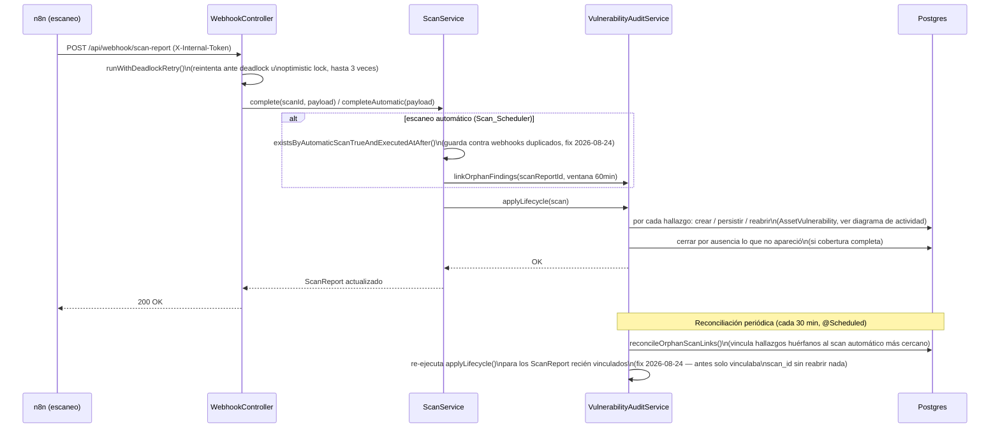

# Secuencia — reapertura automática y cierre por ausencia

[secuencia-triage.md](secuencia-triage.md) cubre el camino **manual** (un analista
cerrando un caso desde el Kanban). Esta secuencia cubre el camino **automático**: qué
pasa cuando un escaneo posterior vuelve a detectar (o deja de detectar) algo que ya
existía — el corazón real de "remediación" en este sistema, y la parte que tuvo más
bugs encontrados y corregidos en las auditorías del 24-08-26.

**Notas fieles al código real**:
- La guarda de idempotencia (`existsByAutomaticScanTrueAndExecutedAtAfter`) es el fix
  más crítico de la sesión: sin ella, un webhook automático duplicado podía auto-resolver
  por ausencia el 100% del inventario abierto de la organización (`ScanReport` sin
  alcance → `findOpenInScope()` cae en "todas las `OPEN`") — ver
  `docs/bitacora/24-08-26/plan_fix_bucle_reapertura_vulnerabilidades.md`.
- `reconcileOrphanScanLinks()` corre cada 30 minutos (`@Scheduled`) para hallazgos que
  llegaron con `scan_id` nulo y no se vincularon dentro de la ventana reactiva de 60 min
  — antes del fix, esta reconciliación tardía nunca volvía a evaluar el ciclo de vida,
  así que un caso que debía reabrirse podía quedar "oculto" como resuelto indefinidamente.
