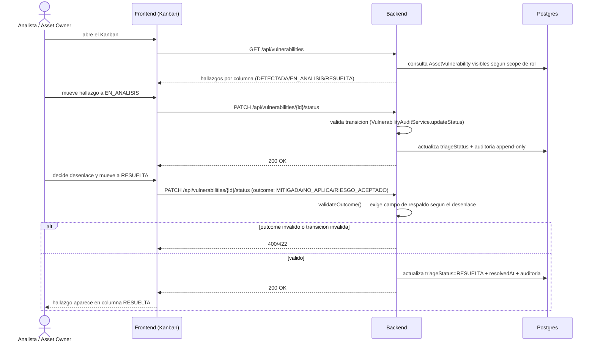

# Secuencia — Triage y cierre de un hallazgo (UC-002)

```mermaid
sequenceDiagram
    actor Analista as Analista / Asset Owner
    participant FE as Frontend (Kanban)
    participant BE as Backend
    participant DB as Postgres

    Analista->>FE: abre el Kanban
    FE->>BE: GET /api/vulnerabilities
    BE->>DB: consulta AssetVulnerability visibles segun scope de rol
    BE-->>FE: hallazgos por columna (DETECTADA/EN_ANALISIS/RESUELTA)

    Analista->>FE: mueve hallazgo a EN_ANALISIS
    FE->>BE: PATCH /api/vulnerabilities/{id}/status
    BE->>BE: valida transicion (VulnerabilityAuditService.updateStatus)
    BE->>DB: actualiza triageStatus + auditoria append-only
    BE-->>FE: 200 OK

    Analista->>FE: decide desenlace y mueve a RESUELTA
    FE->>BE: PATCH /api/vulnerabilities/{id}/status (outcome: MITIGADA/NO_APLICA/RIESGO_ACEPTADO)
    BE->>BE: validateOutcome() — exige campo de respaldo segun el desenlace
    alt outcome invalido o transicion invalida
        BE-->>FE: 400/422
    else valido
        BE->>DB: actualiza triageStatus=RESUELTA + resolvedAt + auditoria
        BE-->>FE: 200 OK
        FE-->>Analista: hallazgo aparece en columna RESUELTA
    end
```
