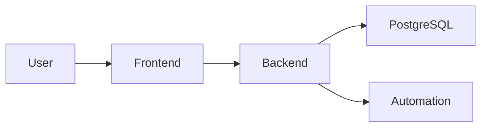

# Guía completa para crear un README moderno de un proyecto de software

> Plantilla y guía práctica para construir un `README.md` moderno,
> profesional y útil para proyectos web, backend, frontend, APIs,
> mobile, SaaS, Docker, automatizaciones, proyectos académicos y
> proyectos de portfolio.

# 1. Objetivo del README

El `README.md` es la puerta de entrada al proyecto.

Una persona que llega al repositorio debería poder entender rápidamente:

-   Qué es el proyecto.
-   Qué problema resuelve.
-   Para quién está pensado.
-   Qué funcionalidades ofrece.
-   Qué tecnologías utiliza.
-   Cómo ejecutarlo.
-   Cómo configurarlo.
-   Cómo probarlo.
-   Dónde encontrar la documentación técnica completa.
-   Cuál es el estado actual del proyecto.

El README **no debería reemplazar toda la documentación técnica**.

Su función principal es presentar el proyecto y permitir que un
desarrollador pueda empezar a utilizarlo o ejecutarlo rápidamente.

------------------------------------------------------------------------

# 2. Orden recomendado de un README moderno

Una estructura profesional puede seguir este orden:

``` text
1. Nombre y presentación
2. Badges
3. Descripción
4. Demo / producción
5. Capturas o preview
6. Características principales
7. Arquitectura resumida
8. Stack tecnológico
9. Estructura del proyecto
10. Requisitos previos
11. Instalación
12. Configuración
13. Ejecución
14. Docker
15. Uso
16. API
17. Testing
18. Seguridad
19. Documentación
20. Deployment
21. Roadmap
22. Contribución
23. Versionado
24. Licencia
25. Autores / mantenedores
26. Estado del proyecto
```

No todos los proyectos necesitan todas las secciones.

------------------------------------------------------------------------

# 3. Encabezado del proyecto

El comienzo debe permitir identificar inmediatamente el proyecto.

Ejemplo:

``` md
# GEF Secure

Sistema para la gestión, análisis y notificación de vulnerabilidades de seguridad asociadas a activos y software.
```

Puede incluir un logo:

``` md
<p align="center">
  
</p>
```

Evitar encabezados excesivamente grandes cargados de imágenes, GIFs o
elementos que dificulten encontrar la información.

------------------------------------------------------------------------

# 4. Descripción corta

Después del título debería existir una explicación de uno o dos
párrafos.

Debe responder:

-   ¿Qué hace?
-   ¿Qué problema resuelve?
-   ¿Cuál es su objetivo?
-   ¿Quién lo utiliza?

Ejemplo:

``` md
GEF Secure es una plataforma orientada a la gestión y seguimiento de vulnerabilidades de software.

Permite registrar activos tecnológicos, identificar el software asociado, analizar vulnerabilidades conocidas y generar notificaciones para facilitar su seguimiento y remediación.
```

Una persona debería entender el propósito del proyecto sin necesidad de
leer el código.

------------------------------------------------------------------------

# 5. Badges

Los badges permiten mostrar información importante rápidamente.

Ejemplos:

``` md


```

Badges útiles:

-   Build.
-   Tests.
-   Coverage.
-   Release.
-   Versión.
-   Licencia.
-   Docker image.
-   Estado del deployment.
-   Calidad del código.
-   Seguridad.

## Recomendación

Utilizar solamente badges que aporten información.

Evitar colocar 15 o 20 badges simplemente por estética.

------------------------------------------------------------------------

# 6. Estado del proyecto

Es conveniente indicar claramente el estado.

Ejemplo:

``` md
## Estado

🟢 En desarrollo activo
```

O:

``` text
Estado: Beta
Versión: 1.4.0
```

Estados posibles:

-   Proof of Concept.
-   Prototype.
-   MVP.
-   Alpha.
-   Beta.
-   Stable.
-   Production.
-   Maintenance.
-   Archived.

------------------------------------------------------------------------

# 7. Demo o aplicación desplegada

Si el proyecto está publicado:

``` md
## Demo

Aplicación:
https://example.com

API:
https://api.example.com
```

También puede indicarse:

``` md
> La instancia pública es únicamente demostrativa y puede reiniciarse periódicamente.
```

Nunca publicar credenciales administrativas reales.

Si existe un usuario demo, utilizar una cuenta creada específicamente
para demostraciones.

------------------------------------------------------------------------

# 8. Screenshots / Preview

Para proyectos con interfaz gráfica es recomendable mostrar el producto.

Ejemplo:

``` md
## Preview


```

Puede incluir:

-   Dashboard.
-   Login.
-   Vista principal.
-   Resultados.
-   Flujo importante.

No saturar el README con demasiadas imágenes.

Para muchas capturas:

``` text
docs/screenshots/
```

y enlazar una galería o documentación adicional.

------------------------------------------------------------------------

# 9. Características principales

Mostrar rápidamente las funcionalidades importantes.

Ejemplo:

``` md
## Características

- Gestión de usuarios.
- Gestión de activos.
- Inventario de software.
- Escaneo de vulnerabilidades.
- Normalización de productos.
- Seguimiento de vulnerabilidades.
- Notificaciones automáticas.
- Historial de escaneos.
- Auditoría de operaciones.
- Roles y permisos.
```

Priorizar funcionalidades reales.

No incluir funcionalidades futuras como si ya estuvieran implementadas.

------------------------------------------------------------------------

# 10. Arquitectura resumida

El README debería mostrar una visión general, no toda la documentación
arquitectónica.

Ejemplo:

``` text
Browser
   |
   v
Frontend
   |
   v
Backend API
   |
   +------ PostgreSQL
   |
   +------ n8n
   |
   +------ External APIs
```

Luego enlazar:

``` md
Para una descripción completa de la arquitectura consultar:

[Documentación de arquitectura](docs/architecture/README.md)
```

------------------------------------------------------------------------

# 11. Stack tecnológico

Mostrar las tecnologías principales.

Ejemplo:

``` md
## Stack

### Frontend
- React
- TypeScript
- Vite

### Backend
- Java 21
- Spring Boot

### Base de datos
- PostgreSQL

### Automatización
- n8n

### Infraestructura
- Docker
- Docker Compose
- Nginx
```

También puede utilizarse una tabla:

  Área             Tecnología
  ---------------- -------------
  Frontend         React
  Backend          Spring Boot
  Database         PostgreSQL
  Automation       n8n
  Infrastructure   Docker

Evitar listar cada dependencia interna del proyecto.

------------------------------------------------------------------------

# 12. Estructura del proyecto

Mostrar solamente carpetas importantes.

Ejemplo:

``` text
project/
├── frontend/
├── backend/
├── automation/
├── database/
├── docker/
├── docs/
├── tests/
├── scripts/
├── docker-compose.yml
└── README.md
```

Explicar cuando sea necesario:

``` md
- `frontend/`: interfaz web.
- `backend/`: API y lógica de negocio.
- `automation/`: workflows y automatizaciones.
- `docs/`: documentación técnica.
- `tests/`: pruebas automatizadas.
```

No copiar cientos de archivos del repositorio.

------------------------------------------------------------------------

# 13. Requisitos previos

Antes de explicar la instalación, indicar qué necesita el desarrollador.

Ejemplo:

``` md
## Requisitos

- Git
- Docker >= 27
- Docker Compose >= 2
```

Si el proyecto no utiliza Docker:

``` text
Java 21
Node.js 22
PostgreSQL 16
```

Cuando sea importante, especificar versiones mínimas.

------------------------------------------------------------------------

# 14. Instalación

Debe ser reproducible.

Ejemplo:

``` bash
git clone <repository-url>
cd project
```

Luego:

``` bash
cp .env.example .env
```

Instalación tradicional:

``` bash
npm install
```

o:

``` bash
./mvnw clean install
```

El objetivo es que un desarrollador nuevo pueda levantar el proyecto
siguiendo solamente estas instrucciones.

------------------------------------------------------------------------

# 15. Configuración

Explicar cómo configurar el sistema.

Nunca colocar secretos reales.

Ejemplo:

``` bash
cp .env.example .env
```

Variables:

  Variable       Obligatoria   Descripción
  -------------- ------------- ---------------------
  DATABASE_URL   Sí            Conexión PostgreSQL
  JWT_SECRET     Sí            Firma de tokens
  API_PORT       No            Puerto del backend
  LOG_LEVEL      No            Nivel de logging

Para configuraciones extensas:

``` md
Ver [Configuration Guide](docs/configuration.md).
```

------------------------------------------------------------------------

# 16. Ejecución local

Explicar claramente cómo iniciar el sistema.

Ejemplo:

``` bash
docker compose up -d
```

Verificar:

``` bash
docker compose ps
```

Detener:

``` bash
docker compose down
```

Si hay varios componentes:

``` text
Frontend: http://localhost:3000
Backend:  http://localhost:8080
Swagger:  http://localhost:8080/swagger-ui
```

------------------------------------------------------------------------

# 17. Docker

Si Docker es una parte importante del proyecto, debería tener una
sección propia.

Ejemplo:

``` md
## Docker

El entorno completo puede ejecutarse utilizando Docker Compose.

Servicios:

- frontend
- backend
- postgres
- n8n
```

Comandos:

``` bash
docker compose build
docker compose up -d
docker compose logs -f
docker compose down
```

Explicar si existen:

-   Profiles.
-   Volúmenes.
-   Networks.
-   Health checks.
-   Overrides para desarrollo.

La documentación avanzada puede quedar en `/docs`.

------------------------------------------------------------------------

# 18. Uso

Mostrar uno o dos ejemplos reales.

Para una API:

``` bash
curl http://localhost:8080/api/v1/assets
```

Para CLI:

``` bash
app scan --target example
```

Para una aplicación:

``` text
1. Crear una cuenta.
2. Registrar un activo.
3. Agregar software.
4. Ejecutar un análisis.
5. Revisar vulnerabilidades.
```

------------------------------------------------------------------------

# 19. API

Si existe una API, incluir información básica.

Ejemplo:

``` md
## API

Base URL:

`/api/v1`

Principales recursos:

- `/auth`
- `/users`
- `/assets`
- `/software`
- `/scans`
- `/vulnerabilities`
```

Si existe OpenAPI:

``` md
La especificación completa está disponible mediante Swagger/OpenAPI.
```

No documentar decenas de endpoints manualmente en el README cuando ya
existe documentación automática.

------------------------------------------------------------------------

# 20. Autenticación

Explicar brevemente el mecanismo.

Ejemplo:

``` md
## Autenticación

La API utiliza JWT.

El flujo utiliza:

- Access Token.
- Refresh Token.
- Roles y permisos.
```

Detalles sensibles o internos deberían permanecer en documentación
específica.

------------------------------------------------------------------------

# 21. Testing

Una sección moderna debería explicar cómo verificar el proyecto.

Ejemplo:

``` bash
npm test
```

o:

``` bash
./mvnw test
```

Con Docker:

``` bash
docker compose run --rm backend pytest
```

Puede indicar:

``` text
Unit Tests
Integration Tests
E2E Tests
```

Si existe cobertura:

``` text
Coverage actual: 87%
```

Preferiblemente obtener el valor automáticamente mediante un
badge/pipeline para evitar datos desactualizados.

------------------------------------------------------------------------

# 22. Calidad de código

Cuando corresponda:

``` bash
npm run lint
npm run format
```

o:

``` bash
./mvnw check
```

Puede mencionar:

-   Linter.
-   Formatter.
-   Static analysis.
-   Pre-commit hooks.

------------------------------------------------------------------------

# 23. Seguridad

Todo proyecto profesional debería indicar cómo reportar
vulnerabilidades.

Ejemplo:

``` md
## Seguridad

No reportes vulnerabilidades mediante issues públicos.

Consulta [SECURITY.md](SECURITY.md) para conocer el procedimiento de reporte.
```

No describir configuraciones internas que puedan facilitar ataques
innecesariamente.

Un archivo recomendado:

``` text
SECURITY.md
```

------------------------------------------------------------------------

# 24. Documentación técnica

Enlazar la documentación extendida.

Ejemplo:

``` md
## Documentación

La documentación técnica completa se encuentra en [`docs/`](docs/).

Incluye:

- Arquitectura.
- API.
- Base de datos.
- Seguridad.
- Deployment.
- Testing.
- ADR.
- Runbooks.
```

El README funciona como índice, no como reemplazo de `/docs`.

------------------------------------------------------------------------

# 25. Deployment

Explicar solamente la estrategia general.

Ejemplo:

``` text
GitHub
   |
   v
CI/CD
   |
   v
Docker Registry
   |
   v
Production Server
```

Para instrucciones detalladas:

``` md
Consultar [Deployment Guide](docs/deployment/production.md).
```

No incluir: - Passwords. - Tokens. - SSH private keys. - Secrets. -
Credenciales de producción.

------------------------------------------------------------------------

# 26. CI/CD

Si existe pipeline:

``` md
## CI/CD

Cada Pull Request ejecuta:

1. Lint.
2. Tests.
3. Security checks.
4. Build.

Los cambios integrados en `main` pueden generar el despliegue correspondiente.
```

Puede mostrarse un badge del pipeline.

------------------------------------------------------------------------

# 27. Roadmap

Mostrar evolución futura sin confundirla con funcionalidades actuales.

Ejemplo:

``` md
## Roadmap

- [x] Gestión de activos.
- [x] Escaneo manual.
- [x] Historial de escaneos.
- [ ] Agentes remotos.
- [ ] Escaneo programado.
- [ ] Dashboard avanzado.
```

Para roadmaps grandes utilizar Issues, Projects o documentación
separada.

------------------------------------------------------------------------

# 28. Known Issues / Limitaciones

Es una buena práctica indicar limitaciones importantes.

Ejemplo:

``` md
## Limitaciones conocidas

- El escaneo remoto todavía no está disponible.
- Algunos proveedores externos poseen rate limits.
- La versión actual está optimizada para despliegues single-node.
```

Esto aumenta la transparencia del proyecto.

------------------------------------------------------------------------

# 29. Contribución

Para proyectos colaborativos:

``` md
## Contribuir

Las contribuciones son bienvenidas.

Consulta [CONTRIBUTING.md](CONTRIBUTING.md).
```

El archivo puede explicar: - Branches. - Commits. - Pull Requests. -
Tests. - Code style. - Review.

------------------------------------------------------------------------

# 30. Convención de commits

Si aporta valor:

``` text
feat:
fix:
docs:
test:
refactor:
chore:
```

Ejemplo:

``` bash
git commit -m "feat: add vulnerability scanner"
```

No es obligatorio explicarlo en README si ya existe `CONTRIBUTING.md`.

------------------------------------------------------------------------

# 31. Versionado

Ejemplo:

``` md
## Versionado

El proyecto utiliza Semantic Versioning.

`MAJOR.MINOR.PATCH`
```

Ejemplo:

``` text
v2.3.1
```

Enlazar:

``` md
Consultar [CHANGELOG.md](CHANGELOG.md).
```

------------------------------------------------------------------------

# 32. Changelog

Mantener:

``` text
CHANGELOG.md
```

El README puede enlazarlo:

``` md
Los cambios entre versiones se encuentran documentados en [CHANGELOG.md](CHANGELOG.md).
```

No copiar todo el historial dentro del README.

------------------------------------------------------------------------

# 33. Licencia

Ejemplo:

``` md
## Licencia

Este proyecto se distribuye bajo la licencia MIT.

Consulta [LICENSE](LICENSE).
```

En proyectos privados:

``` text
Copyright © 2026.
All rights reserved.
```

según corresponda.

------------------------------------------------------------------------

# 34. Autores y mantenedores

Ejemplo:

``` md
## Autor

Desarrollado por Nombre Apellido.
```

En equipos:

``` md
## Maintainers

- Backend Team
- Frontend Team
- Security Team
```

Puede enlazarse `CODEOWNERS` cuando exista.

------------------------------------------------------------------------

# 35. Agradecimientos

Opcional.

Puede utilizarse para: - Proyectos que inspiraron la solución. -
Librerías relevantes. - Instituciones. - Colaboradores.

No es obligatorio.

------------------------------------------------------------------------

# 36. Secciones adicionales según el proyecto

## Backend / API

Agregar: - Swagger/OpenAPI. - Migraciones. - Seeds. - Autenticación.

## Frontend

Agregar: - Navegadores soportados. - Variables públicas. - Build. -
Preview.

## Mobile

Agregar: - Android/iOS soportados. - SDK. - Emuladores. - Build. -
Signing sin exponer secretos.

## Machine Learning

Agregar: - Dataset. - Modelo. - Métricas. - Reproducibilidad. -
Hardware.

## Cybersecurity

Agregar: - Threat model. - Fuentes de vulnerabilidades. - SBOM. -
Alcance de escaneo. - Consideraciones legales.

## CLI

Agregar: - Instalación. - Sintaxis. - Comandos. - Flags. - Ejemplos.

## Librería

Agregar: - Instalación. - Quick Start. - API pública. -
Compatibilidad. - Ejemplos.

------------------------------------------------------------------------

# 37. Elementos visuales modernos

Se pueden utilizar:

### Logo

``` html
<p align="center">
  
</p>
```

### Badges

``` md


```

### Capturas

``` md

```

### Diagramas Mermaid

GitHub permite diagramas Mermaid.

Ejemplo:



Son útiles porque el diagrama permanece versionado como texto.

------------------------------------------------------------------------

# 38. Tabla de contenidos

Para README largos:

``` md
## Contenido

- [Características](#características)
- [Arquitectura](#arquitectura)
- [Stack](#stack)
- [Instalación](#instalación)
- [Configuración](#configuración)
- [Testing](#testing)
- [Documentación](#documentación)
```

No es necesaria en README pequeños.

------------------------------------------------------------------------

# 39. Quick Start

Una sección muy recomendable.

Ejemplo:

``` md
## Quick Start

```bash
git clone <repository>
cd project
cp .env.example .env
docker compose up -d
```

Luego:

`http://localhost:3000`


    El Quick Start debería permitir probar el proyecto con el mínimo número posible de pasos.

    ---

    # 40. Qué NO debería aparecer en un README

    Nunca incluir:

    - Passwords reales.
    - API keys.
    - Tokens.
    - JWT secrets.
    - Credenciales de DB.
    - Private keys.
    - Datos personales.
    - Información interna sensible.
    - `.env` real.

    Evitar también:
    - Explicaciones extremadamente largas.
    - Código interno irrelevante.
    - Árbol completo de miles de archivos.
    - Historial completo de commits.
    - Documentación duplicada.
    - Funcionalidades inexistentes presentadas como terminadas.
    - Badges decorativos sin valor.
    - Capturas desactualizadas.

    ---

    # 41. Características de un README profesional

    Un README moderno debería ser:

    ### Claro
    El propósito del proyecto se entiende rápidamente.

    ### Escaneable
    Títulos, tablas y bloques permiten encontrar información sin leer todo.

    ### Reproducible
    Las instrucciones realmente permiten levantar el proyecto.

    ### Actualizado
    Los comandos, versiones y URLs funcionan.

    ### Seguro
    No expone secretos.

    ### Conciso
    Los detalles profundos están en `/docs`.

    ### Orientado al usuario y al desarrollador
    Explica tanto qué hace el producto como cómo ejecutarlo.

    ---

    # 42. Plantilla completa

    ```md
    # Nombre del Proyecto

    Descripción corta y clara.

    
    
    

    ## Estado

    🟢 En desarrollo activo

    ## Demo

    Aplicación: ...

    ## Preview

    

    ## Características

    - Funcionalidad 1
    - Funcionalidad 2
    - Funcionalidad 3

    ## Arquitectura

    ```mermaid
    flowchart LR
        User --> Frontend
        Frontend --> Backend
        Backend --> Database

Más información en [`docs/architecture/`](docs/architecture/).

## Stack

  Área             Tecnología
  ---------------- ------------
  Frontend         ...
  Backend          ...
  Database         ...
  Infrastructure   ...

## Estructura

``` text
project/
├── frontend/
├── backend/
├── docs/
├── tests/
└── README.md
```

## Requisitos

-   Git
-   Docker
-   Docker Compose

## Quick Start

``` bash
git clone <repository>
cd project
cp .env.example .env
docker compose up -d
```

## Configuración

  Variable       Obligatoria   Descripción
  -------------- ------------- ---------------
  DATABASE_URL   Sí            Base de datos
  JWT_SECRET     Sí            JWT

## Ejecución

``` bash
docker compose up -d
```

## Testing

``` bash
<test-command>
```

## API

Documentación OpenAPI/Swagger disponible en ...

## Seguridad

Consulta [`SECURITY.md`](SECURITY.md).

## Documentación

La documentación completa se encuentra en [`docs/`](docs/).

## Roadmap

-   [x] Función A
-   [ ] Función B

## Contribuir

Consulta [`CONTRIBUTING.md`](CONTRIBUTING.md).

## Versionado

Semantic Versioning.

Consulta [`CHANGELOG.md`](CHANGELOG.md).

## Licencia

Consulta [`LICENSE`](LICENSE).

## Autor

Nombre / Equipo.


    ---

    # 43. Estructura recomendada alrededor del README

    ```text
    project/
    ├── README.md
    ├── LICENSE
    ├── CHANGELOG.md
    ├── CONTRIBUTING.md
    ├── SECURITY.md
    ├── CODEOWNERS
    ├── .env.example
    ├── docs/
    │   ├── architecture/
    │   ├── api/
    │   ├── database/
    │   ├── deployment/
    │   ├── security/
    │   └── images/
    └── ...

------------------------------------------------------------------------

# 44. README vs documentación técnica

## README

Debe responder:

``` text
¿Qué es?
¿Qué hace?
¿Cómo lo pruebo?
¿Cómo lo ejecuto?
¿Dónde encuentro más información?
```

## Documentación técnica

Debe responder:

``` text
¿Cómo está diseñado?
¿Por qué está diseñado así?
¿Cómo funciona internamente?
¿Cómo se despliega?
¿Cómo se opera?
¿Cómo se mantiene?
¿Cómo se recupera ante fallos?
```

Por lo tanto:

``` text
README = puerta de entrada
/docs   = documentación profunda
```

------------------------------------------------------------------------

# 45. Checklist final de README moderno

-   [ ] Nombre claro.
-   [ ] Descripción corta.
-   [ ] Estado del proyecto.
-   [ ] Badges útiles.
-   [ ] Demo si existe.
-   [ ] Screenshots si aportan valor.
-   [ ] Funcionalidades principales.
-   [ ] Arquitectura resumida.
-   [ ] Stack tecnológico.
-   [ ] Estructura principal del repositorio.
-   [ ] Requisitos previos.
-   [ ] Quick Start.
-   [ ] Instalación reproducible.
-   [ ] Configuración.
-   [ ] `.env.example`.
-   [ ] Ejecución local.
-   [ ] Docker documentado si se utiliza.
-   [ ] Ejemplo de uso.
-   [ ] API enlazada/documentada.
-   [ ] Testing.
-   [ ] Seguridad.
-   [ ] Documentación técnica enlazada.
-   [ ] Deployment resumido cuando corresponda.
-   [ ] Roadmap separado de funciones terminadas.
-   [ ] Limitaciones conocidas importantes.
-   [ ] Contributing cuando corresponda.
-   [ ] Versionado.
-   [ ] Changelog.
-   [ ] Licencia.
-   [ ] Autor/mantenedores.
-   [ ] Ningún secreto expuesto.
-   [ ] Comandos verificados.
-   [ ] URLs funcionando.
-   [ ] Capturas actualizadas.
-   [ ] README consistente con la versión actual.

------------------------------------------------------------------------

# 46. Regla principal

Un buen README debería permitir que una persona que nunca vio el
proyecto pueda, en pocos minutos:

1.  Entender qué problema resuelve.
2.  Identificar sus funcionalidades.
3.  Comprender su arquitectura a alto nivel.
4.  Saber qué tecnologías utiliza.
5.  Clonar el repositorio.
6.  Configurar el entorno.
7.  Ejecutar el proyecto.
8.  Ejecutar los tests.
9.  Encontrar la documentación avanzada.

Si para realizar estas tareas necesita preguntarle al autor del
proyecto, probablemente falte información en el README o en la
documentación enlazada.

------------------------------------------------------------------------

# 47. Mantenimiento del README

El README debe tratarse como parte del producto.

Debería revisarse cuando:

-   Se agrega una funcionalidad principal.
-   Cambia el stack.
-   Cambia la instalación.
-   Cambian variables obligatorias.
-   Cambian comandos.
-   Cambia el deployment.
-   Se publica una nueva demo.
-   Cambia la estructura principal.
-   Cambia el estado del proyecto.
-   Se publica una nueva versión.

Un README técnicamente excelente pero desactualizado puede ser peor que
uno corto y correcto.
