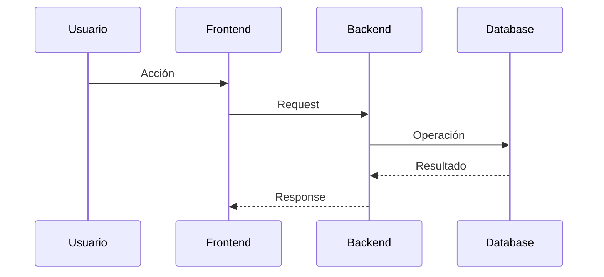

# Prompt — Auditoría y actualización integral de la documentación del proyecto

## Rol

Actuá como un **Software Architect / Technical Writer / Senior Software Engineer** con experiencia en documentación de proyectos de software profesionales.

Tu objetivo es **auditar el estado actual de la documentación de este proyecto y mejorarla**, tomando como fuente de verdad el repositorio y su implementación actual.

No asumas que la documentación existente es correcta, completa o está actualizada.

---

## Objetivo principal

Analizá el proyecto completo y determiná:

1. Qué documentación existe actualmente.
2. Qué documentación está actualizada.
3. Qué documentación está incompleta.
4. Qué documentación está desactualizada respecto del código.
5. Qué documentación está duplicada o fragmentada innecesariamente.
6. Qué documentación importante falta.
7. Qué diagramas, casos de uso, historias de usuario, requisitos o decisiones arquitectónicas deberían documentarse.
8. Cómo debería reorganizarse `/docs` para que sea clara, mantenible y profesional.
9. Qué documentación puede generarse con evidencia suficiente a partir del proyecto actual.
10. Qué información no puede determinarse con seguridad y requiere validación humana.

Después del análisis, **actualizá, reorganizá o creá la documentación necesaria**.

---

# 1. Regla principal: analizar antes de modificar

**NO empieces creando archivos inmediatamente.**

Primero realizá una auditoría del repositorio completo.

Revisá, según corresponda:

- README.
- carpeta `/docs`.
- documentación existente.
- frontend.
- backend.
- modelos y entidades.
- base de datos y migraciones.
- endpoints/API.
- autenticación y autorización.
- roles y permisos.
- Docker / Docker Compose.
- variables de entorno y `.env.example`.
- automatizaciones.
- workflows.
- integraciones externas.
- tests.
- scripts.
- seeds.
- configuración.
- CI/CD si existe.
- infraestructura/deployment.
- comentarios relevantes del código.
- archivos de configuración.

La **implementación actual debe considerarse la principal fuente de verdad** cuando contradiga documentación antigua, salvo que exista evidencia clara de que el código también está incompleto o en transición.

---

# 2. No inventar información

No inventes:

- funcionalidades;
- endpoints;
- entidades;
- roles;
- permisos;
- integraciones;
- procesos;
- decisiones arquitectónicas;
- reglas de negocio;
- infraestructura;
- flujos;
- estados;
- requisitos;
- comandos;
- variables de entorno.

Todo lo documentado debe poder justificarse mediante evidencia del repositorio.

Cuando no sea posible determinar algo con seguridad:

- marcá la sección como pendiente de validación;
- explicá qué información falta;
- indicá dónde debería confirmarse;
- no completes el vacío mediante suposiciones.

---

# 3. Auditar la documentación existente

Antes de modificar archivos, generá internamente un inventario de la documentación existente y clasificá cada elemento como:

- Correcto y actualizado.
- Correcto pero incompleto.
- Desactualizado.
- Duplicado.
- Mal ubicado.
- Obsoleto.
- Candidato a fusionarse con otro documento.
- Requiere validación humana.

No reemplaces documentación válida solamente para imponer una estructura nueva.

Priorizá **mejorar y reorganizar lo existente** antes que generar documentación redundante.

---

# 4. Estructura documental objetivo

No es obligatorio copiar exactamente esta estructura. Utilizala como referencia y adaptala al proyecto real.

```text
README.md
LICENSE
CONTRIBUTING.md             # si corresponde
CHANGELOG.md                # si corresponde

docs/
│
├── README.md
│
├── product/
│   ├── vision.md
│   ├── scope.md
│   ├── functional-requirements.md
│   ├── non-functional-requirements.md
│   ├── user-stories/
│   └── use-cases/
│
├── architecture/
│   ├── overview.md
│   ├── components.md
│   ├── data-model.md
│   └── diagrams/
│
├── security/
│   ├── authentication.md
│   ├── authorization.md
│   └── roles-permissions.md
│
├── integrations/
│
├── operations/
│   ├── installation.md
│   ├── configuration.md
│   ├── deployment.md
│   ├── backup.md
│   └── troubleshooting.md
│
├── development/
│   ├── backend.md
│   ├── frontend.md
│   ├── api.md
│   └── testing.md
│
└── adr/
```

Creá solamente carpetas y archivos que aporten valor al proyecto actual.

Evitá generar archivos vacíos o documentación de relleno.

---

# 5. Documentación de producto y análisis

Evaluá si están documentados correctamente:

## Visión

- problema que resuelve el sistema;
- usuarios principales;
- propuesta de valor;
- objetivos principales.

## Alcance

Diferenciá cuando sea posible:

- funcionalidades incluidas;
- funcionalidades fuera de alcance;
- limitaciones conocidas.

No inventes roadmap futuro si no existe evidencia.

## Requisitos funcionales

Identificá requisitos a partir del comportamiento real del sistema.

Cada requisito debería ser claro, verificable y trazable hacia una funcionalidad existente.

## Requisitos no funcionales

Analizá solamente los que puedan justificarse, por ejemplo:

- seguridad;
- disponibilidad;
- rendimiento;
- mantenibilidad;
- observabilidad;
- escalabilidad;
- compatibilidad;
- privacidad;
- recuperación ante fallos.

No inventes SLA, métricas o compromisos inexistentes.

---

# 6. Historias de usuario

Analizá las funcionalidades existentes e identificá las historias de usuario principales.

Formato recomendado:

```text
HU-XXX — Nombre

Como [actor]
quiero [acción]
para [objetivo].

Criterios de aceptación:
- ...
- ...
```

Las historias deben representar funcionalidades reales.

No generes decenas de historias triviales únicamente para aumentar la documentación.

Agrupalas por dominio o módulo cuando sea conveniente.

---

# 7. Casos de uso

Documentá los casos de uso importantes del sistema.

Formato sugerido:

```text
UC-XXX — Nombre

Actor principal:

Actores secundarios:

Precondiciones:

Flujo principal:
1.
2.
3.

Flujos alternativos:

Excepciones:

Postcondiciones:
```

Priorizá procesos relevantes del negocio y no cada interacción mínima de interfaz.

---

# 8. Diagramas

Analizá qué diagramas realmente ayudan a entender el proyecto.

Priorizá, cuando correspondan:

- diagrama de contexto;
- diagrama de componentes;
- diagrama de casos de uso;
- diagrama entidad-relación (ERD/DER);
- diagramas de secuencia de procesos críticos;
- diagrama de despliegue;
- diagrama de clases solamente cuando aporte valor.

No es necesario utilizar todos los tipos de UML.

Preferí diagramas simples y mantenibles.

Cuando sea posible, utilizá **Mermaid** dentro de Markdown para que los diagramas puedan versionarse junto con el código.

Ejemplo:



Los diagramas deben representar la arquitectura real detectada.

---

# 9. Arquitectura

Documentá la arquitectura actual del sistema.

Incluí cuando corresponda:

- visión general;
- componentes principales;
- responsabilidades;
- comunicación entre componentes;
- dependencias;
- servicios externos;
- persistencia;
- flujos principales;
- límites entre módulos;
- estructura del repositorio.

El objetivo es que un desarrollador nuevo pueda comprender rápidamente cómo funciona el sistema.

---

# 10. Modelo de datos

Analizá modelos, entidades, migraciones y relaciones reales.

Documentá:

- entidades principales;
- relaciones;
- claves importantes;
- cardinalidades;
- restricciones relevantes;
- estados importantes;
- propósito de cada entidad principal.

Generá un DER/ERD cuando sea útil.

No documentes tablas o campos inexistentes.

---

# 11. Backend y API

Si existe backend, documentá:

- stack tecnológico;
- arquitectura interna;
- estructura de carpetas;
- responsabilidades por capa;
- API;
- autenticación;
- autorización;
- validaciones;
- manejo de errores;
- servicios;
- persistencia;
- procesos asíncronos si existen.

Si existe OpenAPI/Swagger, documentá cómo acceder y utilizarlo en lugar de duplicar innecesariamente cada endpoint.

---

# 12. Frontend

Si existe frontend, documentá:

- stack;
- estructura;
- rutas principales;
- módulos funcionales;
- comunicación con backend;
- autenticación;
- estado global si existe;
- manejo de errores;
- configuración relevante.

No documentes cada componente visual trivial.

---

# 13. Seguridad

Realizá especial atención a:

- autenticación;
- autorización;
- roles;
- permisos;
- protección de endpoints;
- manejo de secretos;
- variables sensibles;
- separación de datos;
- auditoría;
- sesiones/tokens;
- controles de acceso.

Si existen roles, generá una matriz de permisos basada exclusivamente en la implementación real.

Ejemplo conceptual:

| Acción | Rol A | Rol B | Rol C |
|---|---|---|---|
| Ver recurso | ✓ | ✓ | ✓ |
| Crear recurso | ✓ | ✓ | — |
| Administrar usuarios | ✓ | — | — |

No utilices este ejemplo como fuente de permisos reales.

---

# 14. Integraciones

Detectá todas las integraciones externas.

Para cada integración relevante documentá:

- propósito;
- componente responsable;
- flujo de comunicación;
- configuración;
- autenticación si corresponde;
- errores posibles;
- comportamiento ante indisponibilidad;
- datos enviados/recibidos a nivel conceptual.

No expongas secretos ni credenciales reales.

---

# 15. Automatizaciones y procesos programados

Si el proyecto posee schedulers, cron jobs, workers, workflows o herramientas de automatización, documentá:

- qué proceso ejecutan;
- cuándo se ejecutan;
- quién los inicia;
- dependencias;
- flujo;
- errores;
- reintentos;
- persistencia de resultados;
- observabilidad.

Generá diagramas de secuencia para procesos críticos cuando aporten claridad.

---

# 16. Instalación y configuración

Verificá que exista documentación reproducible para levantar el proyecto desde cero.

Debe contemplar cuando corresponda:

- requisitos previos;
- clonación;
- dependencias;
- variables de entorno;
- base de datos;
- Docker;
- migraciones;
- seeds;
- servicios externos;
- comandos de inicio;
- comprobación de funcionamiento.

**Probá conceptualmente los comandos contra los archivos reales del repositorio antes de documentarlos.**

No inventes comandos genéricos si el proyecto utiliza otros.

---

# 17. Deployment y operación

Si existe información suficiente, documentá:

- arquitectura de producción;
- proceso de deployment;
- servicios involucrados;
- dominios/subdominios conceptualmente;
- reverse proxy;
- HTTPS;
- persistencia;
- logs;
- backups;
- restauración;
- actualización de versiones;
- reinicio de servicios;
- health checks.

Si todavía no existe deployment real, indicá claramente que la sección describe solamente el estado implementado o preparado actualmente.

---

# 18. Testing

Analizá el sistema de pruebas real.

Documentá:

- tipos de tests existentes;
- frameworks;
- ubicación;
- cómo ejecutarlos;
- cobertura si existe información confiable;
- dependencias necesarias;
- tests de integración/E2E si existen.

No declares que una funcionalidad está cubierta por tests sin comprobarlo.

---

# 19. Troubleshooting

Creá o actualizá una guía basada en problemas razonablemente identificables en el proyecto.

Para cada problema importante:

```text
Problema
↓
Síntomas
↓
Causas posibles
↓
Cómo diagnosticar
↓
Solución
```

No inventes errores históricos que no puedan justificarse.

---

# 20. Architecture Decision Records (ADR)

Revisá si existen decisiones arquitectónicas importantes que merezcan quedar registradas.

Ejemplos de categorías:

- elección de framework;
- base de datos;
- estrategia de autenticación;
- contenedores;
- automatizaciones;
- integraciones externas;
- estrategia de deployment;
- arquitectura multitenant;
- estrategia de matching/normalización;
- decisiones de seguridad.

Formato sugerido:

```text
# ADR-XXX — Decisión

Estado: Aceptado / Propuesto / Reemplazado

## Contexto

## Alternativas consideradas

## Decisión

## Justificación

## Consecuencias

## Riesgos
```

### Importante

No inventes retrospectivamente alternativas o razones que no puedan inferirse razonablemente.

Si se conoce la decisión técnica pero no el motivo histórico, documentá el estado actual y marcá la justificación como pendiente de validación.

---

# 21. README principal

Revisá el `README.md` raíz por separado.

Debe funcionar como **puerta de entrada al proyecto**, no como reemplazo de toda la documentación.

Evaluá que incluya cuando corresponda:

- nombre;
- descripción;
- problema que resuelve;
- funcionalidades principales;
- arquitectura resumida;
- stack;
- instalación rápida;
- configuración básica;
- ejecución;
- screenshots/demo si existen;
- estado del proyecto;
- enlaces a documentación;
- licencia;
- autores/contribución si corresponde.

Evitá duplicar en el README documentación extensa que debería vivir en `/docs`.

---

# 22. Índice de documentación

Creá o actualizá:

```text
docs/README.md
```

Este archivo debe servir como índice navegable de toda la documentación.

Ejemplo conceptual:

```text
# Documentación

## Producto
- Visión
- Alcance
- Requisitos
- Historias de usuario
- Casos de uso

## Arquitectura
- Overview
- Componentes
- Modelo de datos
- Diagramas

## Desarrollo
- Backend
- Frontend
- API
- Testing

## Operaciones
- Instalación
- Configuración
- Deployment
- Troubleshooting
```

Adaptalo al contenido real.

---

# 23. Trazabilidad documental

Cuando sea viable, buscá mantener relación entre:

```text
Necesidad / requisito
        ↓
Historia de usuario
        ↓
Caso de uso
        ↓
Funcionalidad
        ↓
Componente / API
        ↓
Test
```

No hace falta construir una matriz enorme si no aporta valor.

El objetivo es poder demostrar que la documentación corresponde al software implementado.

---

# 24. Calidad de la documentación

Toda documentación creada o modificada debe cumplir con:

- lenguaje técnico claro;
- estructura consistente;
- Markdown válido;
- títulos descriptivos;
- navegación sencilla;
- enlaces relativos correctos;
- diagramas legibles;
- ausencia de contradicciones;
- ausencia de contenido inventado;
- evitar duplicación;
- fácil mantenimiento;
- coherencia con el código actual.

Priorizá calidad sobre cantidad.

---

# 25. Qué NO hacer

No:

- documentes cada archivo del repositorio;
- documentes cada función;
- generes UML innecesario;
- generes cientos de historias de usuario;
- dupliques Swagger/OpenAPI manualmente;
- crees documentación genérica sin relación con el proyecto;
- inventes decisiones históricas;
- agregues funcionalidades al proyecto solamente porque aparezcan en este prompt;
- modifiques lógica funcional salvo que sea estrictamente necesario para corregir enlaces/configuración documental y puedas justificarlo;
- elimines documentación existente sin comprobar primero si contiene información útil;
- expongas secretos, tokens, passwords o credenciales.

---

# 26. Proceso de trabajo esperado

Trabajá en las siguientes fases.

## Fase 1 — Descubrimiento

Analizá el repositorio completo y comprendé:

- propósito;
- arquitectura;
- módulos;
- funcionalidades;
- actores;
- infraestructura;
- integraciones;
- documentación existente.

## Fase 2 — Auditoría documental

Compará documentación contra implementación.

Identificá:

- faltantes;
- inconsistencias;
- duplicaciones;
- documentos obsoletos;
- oportunidades de reorganización.

## Fase 3 — Plan

Definí qué archivos:

- conservar;
- actualizar;
- mover;
- fusionar;
- eliminar;
- crear.

## Fase 4 — Implementación

Aplicá las mejoras documentales.

## Fase 5 — Verificación

Revisá:

- enlaces Markdown;
- referencias entre documentos;
- diagramas;
- comandos;
- nombres de archivos;
- estructura;
- consistencia con el código.

## Fase 6 — Informe final

Al finalizar, mostrame un resumen claro de lo realizado.

---

# 27. Informe final obligatorio

Entregá un informe con esta estructura:

```text
# Auditoría de documentación

## Estado inicial
Resumen del estado encontrado.

## Problemas detectados
- ...

## Documentación actualizada
- archivo → cambios realizados

## Documentación nueva
- archivo → motivo

## Documentación reorganizada
- origen → destino → motivo

## Documentación eliminada/fusionada
- archivo → motivo

## Diagramas agregados/actualizados
- ...

## Historias de usuario / casos de uso
- ...

## ADR creados
- ...

## Pendientes de validación humana
- ...

## Estructura final
Mostrar árbol final de `/docs`.

## Evaluación final
Explicar brevemente si la documentación resultante permite:
- entender el producto;
- entender la arquitectura;
- levantar el proyecto;
- desarrollar nuevas funcionalidades;
- operar/desplegar el sistema;
- comprender las decisiones técnicas principales.
```

---

# Criterio final

La documentación resultante debe parecer la documentación de un **proyecto de software profesional mantenido activamente**, no documentación creada únicamente para cumplir una entrega académica.

Al mismo tiempo, debe permitir utilizarla como respaldo técnico de una tesis, proyecto final, portfolio o revisión técnica.

La prioridad es:

> **documentar correctamente lo que realmente existe, organizarlo bien y detectar lo que falta; no generar documentación por generar.**

Antes de finalizar, realizá una última comparación entre la documentación modificada y el repositorio para detectar contradicciones evidentes.
