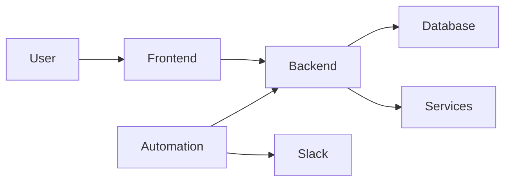

# Prompt — Rediseño profesional del README

## Objetivo

Quiero que realices una **auditoría completa y posterior rediseño del `README.md` de este proyecto**.

El objetivo es transformar el README actual en un README **moderno, profesional y visualmente atractivo**, similar al que tendría un producto real de ciberseguridad open source o comercial.

No quiero simplemente mejorar la redacción del README existente. Primero debes **analizar el proyecto completo** para entender realmente qué hace y luego determinar cuál es la mejor manera de presentarlo.

---

## 1. Analiza el proyecto antes de modificar el README

Antes de escribir cualquier contenido:

1. Revisa el `README.md` actual.
2. Analiza la estructura completa del repositorio.
3. Identifica las tecnologías utilizadas realmente.
4. Analiza el frontend.
5. Analiza el backend.
6. Analiza la base de datos.
7. Analiza los archivos de Docker y Docker Compose.
8. Analiza la integración con n8n.
9. Analiza las integraciones externas existentes.
10. Identifica cómo funciona el sistema de escaneos.
11. Identifica cómo se gestionan activos, software y vulnerabilidades.
12. Identifica cómo funciona el sistema de notificaciones.
13. Identifica autenticación, usuarios, roles y permisos si existen.
14. Identifica tests y herramientas de calidad existentes.
15. Revisa la documentación adicional existente en el repositorio.
16. Revisa las variables de entorno y configuración necesarias, sin exponer secretos.
17. Revisa la carpeta `assets`.

La información del README debe surgir del **estado real del repositorio**.

### Regla fundamental

**No inventes funcionalidades, tecnologías, estadísticas, comandos, endpoints, integraciones ni características que no existan actualmente.**

Si una funcionalidad parece estar incompleta o en desarrollo, debe quedar claramente diferenciada de las funcionalidades implementadas.

---

## 2. Identidad visual

El proyecto ya posee recursos gráficos.

Revisa especialmente:

```text
/assets
```

Dentro de esta carpeta existen **logos e identidad visual del proyecto**.

Identifica cuál es el logo principal más apropiado y utilízalo en la cabecera del README mediante una ruta relativa.

Por ejemplo:

```html
<p align="center">
  
</p>
```

No inventes un logo nuevo.

No modifiques los logos existentes.

Elegí el recurso que mejor funcione sobre el fondo habitual de GitHub y asegúrate de que su tamaño no sea excesivo.

---

## 3. Enfoque del README

El README NO debe sentirse como:

- una entrega universitaria;
- una tesis escrita;
- documentación técnica extensa;
- una lista interminable de tecnologías;
- documentación generada automáticamente.

Debe sentirse como la página principal de un **producto moderno de ciberseguridad**.

Una persona que ingrese al repositorio debería poder entender rápidamente:

- ¿Qué es este proyecto?
- ¿Qué problema resuelve?
- ¿Cómo funciona?
- ¿Qué puede hacer?
- ¿Cómo está construido?
- ¿Cómo puedo ejecutarlo?

La documentación técnica profunda debe quedar separada del README cuando corresponda.

---

## 4. Repositorios de referencia

Analiza conceptualmente la estructura y presentación de READMEs profesionales como:

### Trivy

https://github.com/aquasecurity/trivy

Tomarlo principalmente como referencia por tratarse de una herramienta moderna relacionada con seguridad y análisis de vulnerabilidades.

Prestar atención a:

- presentación inicial;
- logo;
- badges;
- descripción corta;
- explicación de capacidades;
- jerarquía de información;
- Quick Start;
- separación entre README y documentación.

### Syft

https://github.com/anchore/syft

Tomarlo como referencia para:

- claridad técnica;
- explicación rápida del propósito;
- features;
- instalación;
- ejemplos;
- documentación adicional.

### n8n

https://github.com/n8n-io/n8n

Tomarlo como referencia para:

- presentación orientada a producto;
- explicación de capacidades;
- estructura visual;
- comunicación clara del valor del sistema.

Estas referencias son únicamente **inspiración estructural y visual**.

NO copies contenido.

El README final debe representar exclusivamente este proyecto.

---

## 5. Primera impresión

La primera sección del README es especialmente importante.

Quiero evaluar una estructura similar a:

```text
LOGO

NOMBRE DEL PROYECTO

Descripción breve y potente

BADGES

Enlaces importantes si corresponde

CAPTURA PRINCIPAL DEL PRODUCTO
```

La descripción inicial debe explicar el proyecto en aproximadamente 2-4 líneas.

Debe poder entenderla tanto una persona técnica como alguien que simplemente está evaluando el proyecto.

Evita comenzar inmediatamente hablando de frameworks, Docker o instalación.

Primero explica **qué hace el producto y qué problema resuelve**.

---

## 6. Badges

Analiza cuáles tienen sentido según el proyecto real.

Por ejemplo:

- versión;
- licencia;
- Docker;
- build;
- tests;
- estado de CI;
- tecnologías principales.

No agregues badges decorativos que no aporten información.

No agregues badges de pipelines, cobertura, versiones o servicios que no existan.

Si el proyecto tiene GitHub Actions u otro CI, analiza si corresponde mostrar su estado.

---

## 7. Screenshots

Como se trata de una aplicación web, el README debería mostrar visualmente el producto.

Revisa si ya existen screenshots dentro del repositorio.

Si existen, reutilízalos.

Si no existen, **no inventes imágenes**.

En ese caso puedes preparar correctamente la sección y dejar claramente indicado qué capturas sería recomendable incorporar posteriormente.

Prioriza, si existen, imágenes de:

- dashboard;
- gestión de activos;
- vulnerabilidades;
- detalle de escaneo;
- historial de escaneos;
- escaneo automático;
- notificaciones;
- integración con Slack.

No satures el README con imágenes.

Selecciona únicamente las que realmente ayudan a entender el producto.

---

## 8. Características principales

Crea una sección clara de funcionalidades.

Pero obtenlas del código.

Por ejemplo, analiza si realmente existen:

- gestión de activos;
- inventario de software;
- detección de vulnerabilidades;
- escaneos manuales;
- escaneos automáticos;
- historial de escaneos;
- trazabilidad;
- dashboard;
- clasificación por severidad;
- notificaciones;
- integración con Slack;
- automatizaciones mediante n8n;
- usuarios;
- roles;
- permisos;
- fuentes externas de vulnerabilidades;
- normalización de software.

No asumas que estos elementos existen simplemente porque aparecen en este prompt.

Verifícalos.

---

## 9. Explicar cómo funciona

Incluye una sección:

```markdown
## How it works
```

o su equivalente según el idioma final elegido.

Debe explicar de manera sencilla el flujo principal del sistema.

Determina el flujo real analizando el código.

Si corresponde, puede representarse conceptualmente como:

```text
Activos
   ↓
Software
   ↓
Normalización / identificación
   ↓
Fuentes de vulnerabilidades
   ↓
Motor de análisis
   ↓
Resultados
   ↓
Persistencia
   ↓
Dashboard
   ↓
Automatización
   ↓
Notificación
```

Esto es solamente un ejemplo.

**Construye el flujo real del proyecto.**

---

## 10. Diagrama de arquitectura

Analiza si conviene incorporar un diagrama Mermaid directamente en el README.

Por ejemplo:



NO utilices este diagrama directamente.

Primero analiza la arquitectura real y genera uno correcto.

El diagrama debe ser:

- pequeño;
- entendible;
- técnicamente correcto;
- visualmente limpio;
- útil para comprender la arquitectura general.

No intentes documentar toda la infraestructura en un único diagrama.

---

## 11. Stack tecnológico

Genera una sección profesional de tecnologías.

Agrupa las tecnologías por responsabilidad.

Por ejemplo:

```text
Frontend
Backend
Database
Automation
Integrations
Infrastructure
Testing
```

Obtén nombres y versiones del proyecto cuando sea posible.

No agregues tecnologías simplemente para hacer que el README parezca más completo.

---

## 12. Quick Start

El proyecto utiliza contenedores, por lo que quiero que determines cuál es realmente la forma más sencilla de levantar el sistema desde cero.

Crea una sección:

```markdown
## Quick Start
```

Debe incluir únicamente pasos comprobables a partir del repositorio.

Analiza:

- requisitos previos;
- clonación;
- configuración de `.env`;
- Docker;
- Docker Compose;
- PostgreSQL;
- backend;
- frontend;
- n8n;
- migraciones si existen;
- datos iniciales si existen;
- puertos;
- URLs locales;
- credenciales iniciales si existen.

El objetivo es que otro desarrollador pueda clonar el repositorio y entender cómo ejecutarlo.

**No inventes comandos.**

Extrae los comandos de:

- `docker-compose.yml`;
- `Dockerfile`;
- `package.json`;
- archivos de configuración;
- scripts;
- documentación existente.

---

## 13. Variables de entorno

Si existen variables de entorno:

- documenta cuáles son necesarias;
- explica brevemente para qué sirven;
- utiliza valores de ejemplo seguros;
- referencia `.env.example` si existe.

Nunca coloques:

- passwords reales;
- API keys;
- tokens;
- secrets;
- webhooks privados;
- credenciales.

Si detectas secretos accidentalmente versionados, no los reproduzcas en el README y repórtalo como un problema separado.

---

## 14. Estructura del proyecto

Incluye solamente si aporta valor.

Debe ser una representación simplificada.

Por ejemplo:

```text
project/
├── frontend/
├── backend/
├── n8n/
├── assets/
├── docs/
├── docker-compose.yml
└── README.md
```

Genera la estructura utilizando las carpetas reales.

No muestres cientos de archivos.

---

## 15. Escaneos

Si el sistema diferencia distintos tipos de escaneo, explica brevemente su funcionamiento.

Por ejemplo:

```markdown
## Vulnerability Scanning

### Automatic Scans

...

### Manual Scans

...
```

Pero utiliza exclusivamente el comportamiento que encuentres implementado.

---

## 16. Automatización y notificaciones

Como n8n forma parte importante de la solución, analiza cuidadosamente su función.

Explica:

- qué automatiza;
- cuándo interviene;
- cómo se relaciona con el backend;
- qué tipo de notificación genera;
- qué información recibe o envía.

Si Slack está integrado, explica brevemente el flujo.

Evita documentar configuraciones sensibles.

---

## 17. Seguridad

Determina si tiene sentido una sección breve de seguridad.

Puede mencionar, únicamente si realmente existe:

- autenticación;
- autorización;
- roles;
- protección de endpoints;
- manejo de credenciales;
- validaciones;
- auditoría;
- trazabilidad.

No afirmes que el sistema es "seguro", "enterprise-ready" o "production-ready" sin evidencia suficiente.

---

## 18. Testing

Analiza los tests existentes.

Documenta:

- tipos de tests;
- ubicación;
- herramientas;
- comando real para ejecutarlos.

No inventes porcentajes de cobertura.

Si existe cobertura automatizada, puedes documentarla.

---

## 19. Documentación

Si existe una carpeta:

```text
/docs
```

o documentación equivalente, crea una sección que permita acceder fácilmente a ella.

El README debe ser una **puerta de entrada al proyecto**, no contener toda la documentación técnica.

Si detectas documentación extensa que actualmente está dentro del README y debería estar en `/docs`, puedes reorganizarla.

Pero no elimines información importante sin dejar una referencia apropiada.

---

## 20. Roadmap

Incluye un roadmap únicamente si existe información suficiente para distinguir:

- funcionalidades implementadas;
- funcionalidades en desarrollo;
- funcionalidades futuras.

Nunca presentes una funcionalidad futura como existente.

Utiliza checkboxes de Markdown si resulta apropiado.

---

## 21. Licencia

Revisa el archivo `LICENSE`.

Muestra correctamente:

- tipo de licencia;
- referencia al archivo.

No cambies la licencia del proyecto.

---

## 22. Autores

Mantén correctamente los autores y colaboradores que figuren en el repositorio y en la licencia.

No elimines autores existentes.

---

## 23. Idioma

Analiza el idioma actual del proyecto y su audiencia.

Si el proyecto está actualmente documentado en español, mantén coherencia.

Si consideras que inglés sería claramente mejor para un repositorio público/open source, **no traduzcas automáticamente todo el README**.

Primero indica la recomendación en el análisis.

El objetivo principal de esta tarea es mejorar estructura, calidad y presentación, no cambiar arbitrariamente el idioma.

---

## 24. Calidad visual

Utiliza Markdown y HTML compatible con GitHub cuando sea necesario.

Puedes utilizar:

- tablas pequeñas;
- `<div align="center">`;
- `<p align="center">`;
- ``;
- `<details>`;
- Mermaid;
- badges;
- emojis moderadamente;
- enlaces internos;
- bloques de código.

Evita:

- exceso de emojis;
- exceso de badges;
- enormes tablas;
- texto innecesariamente largo;
- bloques visuales que no funcionen correctamente en GitHub;
- estilos CSS que GitHub no soporte;
- diseños excesivamente recargados.

Quiero una estética asociada a:

**Cybersecurity + SaaS + Developer Tool + Open Source**

Debe sentirse moderno y sobrio.

---

## 25. No sobrecargar el README

Una regla importante:

**El README no debe intentar explicar absolutamente todo el sistema.**

Prioriza:

1. Producto.
2. Problema.
3. Capacidades.
4. Screenshots.
5. Funcionamiento.
6. Arquitectura.
7. Quick Start.
8. Tecnologías.
9. Documentación adicional.
10. Contribución/licencia/autores.

La información técnica profunda puede vivir en `/docs`.

---

## 26. Auditoría antes de modificar

Antes de realizar cambios, genera internamente un inventario con:

- qué contiene actualmente el README;
- qué información está desactualizada;
- qué falta;
- qué sobra;
- qué información puede verificarse;
- qué imágenes existen;
- qué logos existen en `/assets`;
- qué documentación adicional existe;
- qué funcionalidades están realmente implementadas.

Utiliza este análisis para diseñar el README final.

---

## 27. Implementación

Después del análisis:

1. Rediseña completamente el `README.md`.
2. Conserva información válida del README anterior cuando siga siendo útil.
3. Reorganiza la información.
4. Mejora la redacción.
5. Mejora la jerarquía visual.
6. Utiliza el logo existente de `/assets`.
7. Agrega referencias a imágenes existentes cuando corresponda.
8. Agrega un diagrama Mermaid si realmente mejora la comprensión.
9. Verifica todos los enlaces internos.
10. Verifica todas las rutas a imágenes.
11. Verifica todos los comandos.
12. Verifica nombres y versiones de tecnologías.
13. Verifica que Markdown renderice correctamente en GitHub.

---

## 28. Validación final

Una vez terminado, vuelve a leer el README como si fueras:

### Un desarrollador

- ¿Entiendo qué hace?
- ¿Puedo levantarlo?

### Un recruiter

- ¿Puedo entender rápidamente la complejidad y calidad del proyecto?

### Una persona de ciberseguridad

- ¿Entiendo qué problema intenta resolver y cómo?

### Un potencial usuario

- ¿Entiendo qué beneficio me aporta?

### Un evaluador académico

- ¿Puedo identificar arquitectura, tecnologías y alcance sin tener que investigar todo el código?

Si alguna de estas perspectivas encuentra dificultades, ajusta el README.

---

# Resultado esperado

Quiero que el resultado final se vea como el README de un **proyecto real de software y ciberseguridad mantenido profesionalmente**, no como documentación creada únicamente para cumplir con una entrega.

Prioriza:

**claridad + producto + seguridad + arquitectura + evidencia visual + facilidad de ejecución + profesionalismo.**

No agregues contenido simplemente para hacer el README más largo.

Cada sección debe justificar su existencia.

Finalmente, realiza los cambios directamente sobre `README.md` y luego dame un resumen indicando:

- qué cambiaste;
- qué información eliminaste o reorganizaste;
- qué recursos de `/assets` utilizaste;
- qué secciones nuevas agregaste;
- qué información no pudiste verificar;
- qué screenshots o recursos recomendarías agregar posteriormente;
- cualquier problema detectado durante la revisión.
