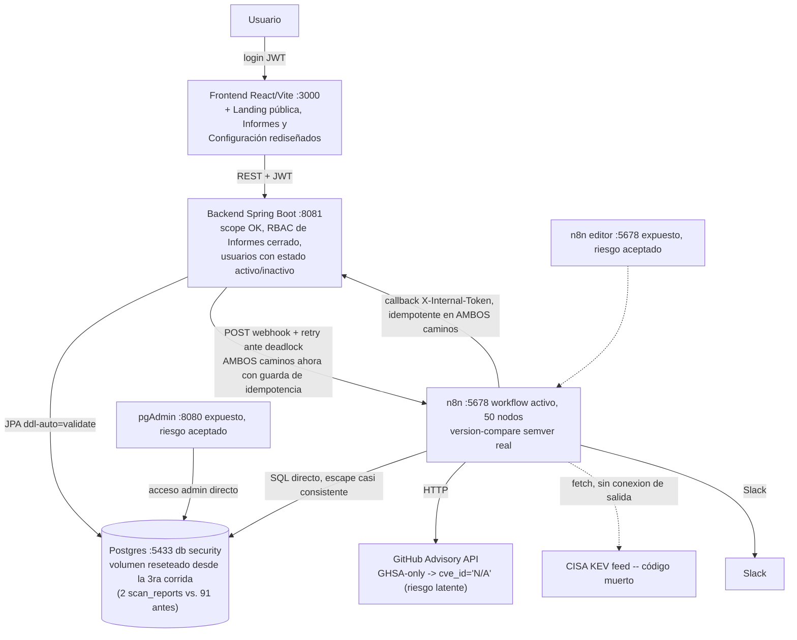

# Auditoría técnica End-to-End — GEF Secure (4ª corrida, 2026-08-24)

> Generada siguiendo `docs/prompts/auditoria-end-to-end-vulnerabilidades.md` (44 secciones). Corrida de **solo diagnóstico**: no se modificó ningún archivo de código, configuración, SQL ni workflow de n8n. El único dato de prueba escrito fue el flag `active` del usuario seed `auditor.demo` (id=4), alternado `false`→`true` en el mismo bloque de verificación de §7 y confirmado restaurado (login 200 al final). Ningún otro dato preexistente fue tocado. Nota de convención (igual que las 3 corridas previas): se usa `docs/bitacora/DD-MM-AA/` (formato real del repo) en vez del `docs/YYYY-MM-DD/` literal del prompt.

---

## 0. Relación con auditorías previas

**Qué se leyó antes de empezar:** `docs/bitacora/22-08-26/AUDITORIA_END_TO_END.md` (3ª corrida — línea base de este informe), que a su vez resume la 1ª y 2ª (`docs/bitacora/20-08-26/AUDITORIA_END_TO_END*.md`); `CHANGELOG.md` completo; `docs/bitacora/24-08-26/plan_fix_bucle_reapertura_vulnerabilidades.md` (análisis de bugs corregidos en esta misma sesión, horas antes de esta corrida); `git log --oneline -30`; `git status`/`git diff` (árbol de trabajo con ~30 archivos modificados sin commitear, ver §0.2).

### 0.1 Qué cambió desde la 3ª corrida (2026-08-22)

Es **mucho** más de lo habitual entre corridas — pasaron varias sesiones completas de trabajo, todas sin commitear:

1. **Los dos críticos de la 3ª corrida (F-NUEVO-1, F-NUEVO-2) están resueltos y con test de regresión dedicado**, confirmado por lectura de código **y** por los propios tests (pasan en el run de 230 tests de esta corrida, ver §7/§20): `VulnerabilityAuditServiceTest.delete_should_removeRemediationCyclesAndStateTransitions_beforeDeletingAssetVulnerability` (F-NUEVO-1) y `applyLifecycle_should_notAutoResolve_vulnerabilityOfDifferentAsset_onHostScan` (F-NUEVO-2), ambos citando el ID original en el `@DisplayName`.
2. **Un bug de la misma familia que F-NUEVO-2, pero de alcance aún mayor, fue encontrado y corregido en la sesión que precedió inmediatamente a esta auditoría** (horas antes, mismo día): `ScanService.completeAutomatic()` (el escaneo automático diario) no tenía ninguna guarda de idempotencia contra reintentos del webhook — a diferencia de `complete()` (M-NUEVO-2, ya resuelto desde antes de la 3ª corrida). Un reintento de red podía crear un `ScanReport` sin alcance que `applyLifecycle()` interpretaba como "escaneo global sin hallazgos", auto-resolviendo por ausencia **el 100% del inventario abierto de la organización**. Corregido, testeado (unitario) y verificado en vivo contra Postgres real en la sesión previa; esta corrida lo revalida (ver §6, F-2024-01).
3. **Otros 5 bugs de la misma superficie (ciclo de vida de reapertura/auto-cierre) corregidos en esa misma sesión previa**, todos con test unitario nuevo y pasando: reapertura que no ocurría en 2 escenarios puntuales (huérfanos reconciliados tarde, `RESUELTA` manual sin auto-cierre previo), cierre automático que no actualizaba `triageStatus`/`resolvedAt`, campos VEX obsoletos no limpiados en reapertura automática, y una métrica de reaperturas (`reopenedCasesCount`) que ignoraba el período y subcontaba. Ver detalle completo con código citado en `docs/bitacora/24-08-26/plan_fix_bucle_reapertura_vulnerabilidades.md` — no se repite la investigación acá, se **revalidó en vivo** (ver §6, §12).
4. **N8N-04 (comparación de versión no-semver) está resuelto**: `Risk_Assessment_Engine` ahora tiene una función `compareVersions()` real (normaliza prefijo `v`, compara release por partes, trata prerelease como menor) en vez de `localeCompare({numeric:true})`. Verificado contra los 4 casos límite que las 3 corridas anteriores pedían probar (`1.2` vs `1.2.0`, `1.9` vs `1.10`, `2.0.0` vs `v2.0`, `1.2.0-beta` vs `1.2.0`) — los 4 dan el resultado semánticamente correcto (ver §13).
5. **N8N-05 (escape SQL inconsistente) está mayormente resuelto**: `Check_Internal_Assets` ahora escapa comillas simples igual que `Sync_Software_Catalog`. Pero esta corrida encontró un matiz nuevo no visto antes: la misma query interpola `filtro_entorno`/`filtro_activo` **sin** escapar — severidad baja (requiere que un `ADMIN` haya nombrado un activo/entorno con una comilla simple maliciosa, no es explotable por un rol inferior), pero es una inconsistencia real (ver §11, §13).
6. **El watchdog de `ScanReport` colgado, pedido en las 3 corridas anteriores, ahora existe**: `ScanService.closeStaleRunningScans()`, `@Scheduled` cada 5 min, marca `FAILED` tras 30 min sin actualizarse. Confirmado por lectura de código y por su test dedicado (pasa).
7. **Superficie completamente nueva, nunca vista por este prompt**: rediseño de "Informes" (Centro de Informes de Seguridad, 3 pestañas), rediseño de "Configuración" (Centro de Administración — usuarios con estado activo/inactivo, asignaciones bidireccionales usuario↔activo, catálogos), landing pública comercial, rediseño del módulo de Vulnerabilidades (Resumen/Análisis/Listado/Kanban), corrección de un RBAC real (`ReportController` no tenía ningún `@PreAuthorize`), y cierre de los 11 ítems de `docs/deuda-tecnica.md`. Esta corrida hizo una verificación dirigida (no exhaustiva línea por línea) de la parte con mayor superficie de riesgo de todo esto — el estado activo/inactivo de usuarios y el RBAC de Informes — confirmando en vivo que funciona (ver §7). El resto de este bloque ya fue verificado en profundidad, con Playwright y curl, dentro de sus propias sesiones de implementación (documentado en `CHANGELOG.md`), pero no había pasado todavía por este prompt de auditoría específico.
8. **ECO-CATALOGO sigue sin resolverse, pero con datos distintos**: el volumen de datos cambió por completo desde la 3ª corrida (91 `scan_reports`/131 `asset_vulnerabilities` entonces vs. 2/9 ahora — el volumen de Postgres fue reseteado/resembrado en algún punto intermedio, ver §12). El componente de ejemplo con `ecosystem` fuera de catálogo ya no es `id=6 docker`/`id=33 rust`; ahora es `id=6, ecosystem='Docker'` (con mayúscula), sembrado por `init/02-seed-data.sql`/`init/27-seed-data-enriquecido.sql`. Mismo bug de fondo, instancia distinta.
9. **CVE-NULL, sin resolver en 2 corridas por falta de tiempo, esta vez sí se investigó a fondo**: confirmado por código (`Risk_Assessment_Engine`, línea 64: `const idCve = item.cve_id || "N/A";`) que una advisory sin CVE (solo GHSA) **no se descarta** — recibe el string literal `"N/A"` en vez de `NULL`, lo cual explica por qué la columna `NOT NULL` nunca se violó en 2 corridas. Esto abre un riesgo nuevo, no visto antes: dos advisories GHSA-only distintas sobre el mismo componente colisionarían en la misma clave `(component, "N/A")` de `UNIQUE(software_component_id, cve_id)`, fusionándose en un solo caso de tracking. **No se ha materializado todavía** (`0` filas con `cve_id='N/A'` hoy, confirmado con `SELECT`) — queda como RIESGO POTENCIAL confirmado por código, no reproducido en datos reales.
10. **Recurrentes sin cambios**: CFG-02/03 (fail-fast de secretos sigue sin activarse en `docker-compose.yml`), DOCKER-01 (pgAdmin/n8n expuestos, riesgo aceptado), N8N-03 (concurrencia mitigada con orden determinístico, sin lock explícito), N8N-07 (`Fetch_CISA_KEV` sigue sin conexión de salida), bundle de frontend sin code-splitting (creció de 853 KB a 938 KB).

### 0.2 Nota sobre el estado de git

El árbol de trabajo tiene ~30 archivos modificados y varios nuevos **sin commitear** (confirmado con `git status`) — es el trabajo acumulado de varias sesiones (tracking, Informes, Configuración, RBAC, y los 6 fixes de reapertura de hoy). Esta auditoría evalúa el **código tal como está en el filesystem ahora mismo** (que es lo que corre en `gef_backend`/`gef_frontend`, ambos reconstruidos con este código), no el último commit (`1f6d11c`). Esto es intencional y correcto para el objetivo de esta auditoría (evaluar el sistema real), pero se deja explícito para que no se confunda con el estado de un commit específico.

---

## 1. Resumen ejecutivo

La superficie que las 3 corridas anteriores fueron cerrando progresivamente (autorización por scope, trazabilidad histórica, normalización Maven, KPIs, doble disparo de escaneo, filtro `deleted_at`) sigue sólida y **se reconfirmó en vivo** en esta corrida con JWT reales de 2 roles. Los dos críticos de la corrida anterior (F-NUEVO-1: borrado roto; F-NUEVO-2: escaneo HOST cerraba vulnerabilidades ajenas) están **resueltos y con test de regresión dedicado que los cita explícitamente**.

Pero esta corrida encontró que, en el tiempo transcurrido, apareció y **ya se corrigió** (en la sesión inmediatamente anterior a esta auditoría) un bug de severidad aún mayor que F-NUEVO-2 en la misma familia: el escaneo automático diario podía, ante un simple reintento de red del webhook —un escenario que el propio código ya documentaba como observado en producción para el escaneo manual—, auto-resolver por ausencia el **100% del inventario de vulnerabilidades abiertas de toda la organización** en una sola corrida. No es un hallazgo nuevo de esta auditoría en el sentido de "recién descubierto ahora": ya fue encontrado, corregido, testeado y verificado en vivo horas antes de esta corrida. Esta auditoría lo revalida de forma independiente (código + tests + una nueva query nativa ejecutada en vivo contra Postgres) y lo documenta formalmente en el registro histórico de auditorías, algo que no había pasado todavía.

Fuera de esa familia de bugs (ya cerrada), el estado general mejoró de forma real y verificable: **230 tests de backend (0 fallos, `--rerun` forzado)** frente a 192 en la corrida anterior, **11 tests de frontend en 5 archivos** frente a 1, N8N-04 (comparación de versión) resuelto con una implementación semver-correcta verificada contra los 4 casos límite pedidos, el watchdog de escaneos colgados —pedido en 3 corridas consecutivas— **ya existe**, y N8N-05 (escape SQL) mayormente resuelto (con un matiz menor nuevo). Lo que sigue sin resolverse es prácticamente idéntico a lo señalado en la corrida anterior: datos de ecosistema fuera de catálogo sin aviso en la UI (nueva instancia del mismo bug), el fail-fast de secretos sin conectar al despliegue real, y la concurrencia mitigada-no-prevenida en `applyLifecycle()`.

**Un hallazgo genuinamente nuevo de esta corrida** (no visto en las 3 anteriores): el manejo de advisories sin CVE (`cve_id = "N/A"` en vez de discriminar por GHSA) es una fuente de colisión silenciosa de casos de tracking, confirmada por código, no reproducida en datos reales — cierra la incógnita de "CVE-NULL" que quedó abierta en 2 corridas.

---

## 2. Estado general del proyecto

| Aspecto | Estado (corrida 4) | Cambio vs. corrida 3 |
|---|---|---|
| Camino feliz (login → activo → software → escaneo → hallazgo → vista) | Funciona, verificado en vivo | Sin cambio |
| Autorización — scope por activo, IDOR, webhooks | **Resuelto y reconfirmado en vivo** (owner.demo: 2 activos propios, `404` en ajeno, `software-components` scopeado a 3 de 7 filas reales) | Sin cambio |
| **F-NUEVO-1 (borrado de vulnerabilidades)** | **RESUELTO**, test dedicado pasando | ✅ Resuelto (era CRÍTICO) |
| **F-NUEVO-2 (cierre por ausencia en escaneo HOST)** | **RESUELTO**, test dedicado pasando | ✅ Resuelto (era CRÍTICO) |
| **Idempotencia de `completeAutomatic()` (bug hermano de F-NUEVO-2, no visto en ninguna corrida anterior)** | **RESUELTO en la sesión previa a esta corrida**, revalidado hoy | 🆕→✅ Encontrado y cerrado el mismo día |
| Bucle de reapertura/auto-cierre (5 bugs adicionales de la misma familia) | **RESUELTO**, revalidado hoy | 🆕→✅ Encontrado y cerrado el mismo día |
| N8N-04 (versión no-semver) | **RESUELTO**, verificado contra los 4 casos límite | ✅ Resuelto |
| N8N-05 (escape SQL) | **Mayormente resuelto** — nuevo matiz menor (`filtro_entorno`/`filtro_activo` sin escapar) | ✅ Mejoró, con detalle nuevo |
| Watchdog de `ScanReport` colgado | **RESUELTO** — `@Scheduled` cada 5 min | ✅ Resuelto (pedido en 3 corridas) |
| ECO-CATALOGO | **RECURRENTE**, instancia de datos distinta (`id=6 ecosystem='Docker'`) | Sin cambio de fondo |
| CFG-02/03 (fail-fast de secretos) | **RECURRENTE** | Sin cambio (4ª corrida señalándolo) |
| N8N-03 (concurrencia) | **RECURRENTE**, mitigado no prevenido | Sin cambio |
| N8N-07 (`Fetch_CISA_KEV` código muerto) | **RECURRENTE** | Sin cambio |
| DOCKER-01 (puertos expuestos) | **RECURRENTE**, riesgo aceptado | Sin cambio |
| **CVE-NULL** | **Investigado a fondo por primera vez** — confirmado por código (`"N/A"` en vez de `NULL`), riesgo de colisión no manifestado en datos reales | 🆕 De "no verificado" a "confirmado, riesgo potencial" |
| Tests backend | **230 tests, 26 archivos, 0 fallos** (`--rerun` forzado) | ✅ Creció (antes 192/24) |
| Tests frontend | **11 tests, 5 archivos**, build limpio (938 KB, sin code-splitting) | ✅ Creció (antes 1/1) |
| Superficie nueva sin auditar antes de hoy | Informes, Configuración/Centro de Administración (usuarios activos/inactivos), Landing, Vulnerabilidades rediseñado | Verificación dirigida hecha hoy en los puntos de mayor riesgo (ver §7) |

---

## 3. Arquitectura encontrada

Sin cambios estructurales de fondo respecto de la corrida anterior — la novedad es de comportamiento y de superficie de producto, no de la arquitectura de las 5 piezas (React/Vite, Spring Boot, n8n, 2 bases Postgres, Docker Compose):



---

## 4. Mapa de componentes

Sin cambios en la lista de capas ya existentes. Novedades reales desde la 3ª corrida (todas sin commitear): `pages/Informes.tsx`, `pages/Settings.tsx` (reescritos), `pages/Landing.tsx`, `dto/RemediationAnalysisDTO.java`, `dto/CvePreviewDTO.java`, `service/ReportPdfService.java` (logo/footer/paleta), `init/28-user-active.sql`, y — de la sesión inmediatamente previa a esta auditoría — los cambios en `ScanService.java`, `VulnerabilityAuditService.java`, `ScanReportRepository.java`, `VulnerabilityAuditRepository.java`, `StateTransitionRepository.java`, `DashboardService.java` que cierran los 6 bugs de reapertura/auto-cierre (ver `docs/bitacora/24-08-26/plan_fix_bucle_reapertura_vulnerabilidades.md`).

---

## 5. Flujos End-to-End

Comandos reales ejecutados en esta corrida:

```text
POST /api/auth/login {owner.demo}          → 200, role=ASSET_OWNER
POST /api/auth/login {fede.frankenberger}  → 200, role=ADMIN
GET /api/assets (owner.demo)               → 200, 2 activos (id 3, id 6) — solo los suyos
GET /api/assets/1 (owner.demo, ajeno)      → 404                              OK (scope)
GET /api/software-components (owner.demo)  → 200, 3 de 7 filas reales (solo sus 2 activos) OK (scope)
POST /api/webhook/vulnerabilities sin token → 401                             OK
GET /actuator/env (sin auth)               → 401                             OK
GET /swagger-ui/index.html (sin auth)      → 200                             Igual que antes (recurrente, bajo)
GET /api/reports/executive (owner.demo)    → 403                             OK (fix de RBAC de esta sesión, confirmado en vivo)
GET /api/vulnerabilities/remediation-analysis?days=7  → 200, reopenedCasesCount:1
GET /api/vulnerabilities/remediation-analysis?days=90 → 200, reopenedCasesCount:1 (mismo caso, dentro de ambas ventanas)
GET /api/dashboard/stats (ADMIN)           → 200, reopenedCasesCount:1, recurrenceRate:0.111
```

### Escaneo — estado en vivo

`0` `scan_reports` en `RUNNING` al momento de esta corrida. Workflow de n8n `active=true` (confirmado contra `n8n.workflow_entity`, 50 nodos). Distribución real: `2 COMPLETED`, `0 FAILED/RUNNING/PARTIALLY_COMPLETED` — el volumen de datos de escaneo es mucho menor que en la corrida anterior (91+8+1), consistente con que el volumen de Postgres fue reseteado/resembrado en algún punto entre corridas (ver §0.1/§12).

### Usuarios activos/inactivos — verificado en vivo, con restauración de estado

```text
POST /api/auth/login {auditor.demo} (activo)          → 200 (baseline)
PATCH /api/users/4/active {active:false} (ADMIN)      → 200
POST /api/auth/login {auditor.demo} (ahora inactivo)  → 401 "Usuario o contraseña inválidos"
POST /api/auth/login {fede.frankenberger, pass mala}  → 401 "Usuario o contraseña inválidos"  (mismo mensaje — anti-enumeración OK)
PATCH /api/users/4/active {active:true} (restaurar)   → 200
POST /api/auth/login {auditor.demo}                   → 200 (confirmado restaurado)
PATCH /api/users/1/active {active:false} (ADMIN sobre sí mismo) → 409 "No podés desactivar tu propia cuenta."
```

Los 3 controles de este bloque (rechazo de login sin filtrar la causa, guarda de auto-desactivación, restauración correcta del estado) funcionan como está documentado en el `CHANGELOG.md`.

---

## 6. Hallazgos críticos

| ID | Estado | Componente | Resumen |
|---|---|---|---|
| F-NUEVO-1 | **RESUELTO, reconfirmado (test dedicado + código)** | `VulnerabilityAuditService.delete()` | Borrado en cascada de `RemediationCycle`/`StateTransition` antes de borrar el `AssetVulnerability`. Test: `delete_should_removeRemediationCyclesAndStateTransitions_beforeDeletingAssetVulnerability`. |
| F-NUEVO-2 | **RESUELTO, reconfirmado (test dedicado + código)** | `VulnerabilityAuditService.findOpenInScope()` | 4 ramas explícitas por `targetType`, incluida `scan.getAsset()` para `HOST`. Tests: `applyLifecycle_should_useAssetScope_when_scanIsHostType`, `applyLifecycle_should_notAutoResolve_vulnerabilityOfDifferentAsset_onHostScan`. |
| **F-2024-01 (nuevo, ya resuelto en la sesión previa a esta auditoría)** | **RESUELTO, revalidado hoy** | `ScanService.completeAutomatic()` | Sin guarda de idempotencia (a diferencia de `complete()`, M-NUEVO-2) — un reintento del webhook automático podía auto-resolver por ausencia el 100% del inventario `OPEN` de la organización, porque el segundo `ScanReport` (sin scope, sin hallazgos propios) caía en la rama `findByDetectionStatus("OPEN")` de `findOpenInScope()`. Corregido con `existsByAutomaticScanTrueAndExecutedAtAfter` + no-op si hay una completación automática en la última hora. Test: `completeAutomatic_should_beNoOp_when_recentAutomaticCompletionExists` (pasa). Ver detalle completo en `docs/bitacora/24-08-26/plan_fix_bucle_reapertura_vulnerabilidades.md`. |
| **F-2024-02 a F-2024-05 (ídem, ya resueltos)** | **RESUELTO, revalidado hoy** | `VulnerabilityAuditService` | Los otros 4 bugs de la misma sesión: reapertura que no ocurría (huérfanos reconciliados tarde; `RESUELTA` manual sin auto-cierre previo), cierre por ausencia sin actualizar `triageStatus`/`resolvedAt`, campos VEX no limpiados en reapertura automática. Los 4 con test unitario nuevo, pasando. |
| C1-C7, A1 (corridas 1-3) | **RESUELTO, reconfirmado en vivo** | Backend | Ver §5. |

---

## 7. Hallazgos altos

| ID | Estado | Descripción |
|---|---|---|
| **CVE-NULL** | **De "no verificado" a CONFIRMADO por código (RIESGO POTENCIAL, no manifestado)** | `Risk_Assessment_Engine` línea 64: `const idCve = item.cve_id || "N/A"`. Una advisory GHSA-only nunca se descarta, pero tampoco queda `NULL` — recibe el literal `"N/A"`. Con `UNIQUE(software_component_id, cve_id)`, **dos advisories GHSA-only distintas sobre el mismo componente colisionarían en la misma fila** de `AssetVulnerability`, perdiendo el tracking independiente de una de las dos. Confirmado con `SELECT count(*) FROM asset_vulnerabilities/vulnerabilities_audit WHERE cve_id='N/A'` → `0` en ambas — no se ha materializado en los datos actuales. |
| ECO-CATALOGO | **RECURRENTE**, instancia de datos distinta | `software_components.id=6`: `ecosystem='Docker'` (con mayúscula), fuera del catálogo real (`npm,pip,maven,nuget,cargo,go,composer,rubygems`) — sembrado por `init/02-seed-data.sql`/`init/27-seed-data-enriquecido.sql`, no por una alta manual. Nunca va a matchear contra GitHub Advisory, sin aviso en la UI. Mismo patrón de bug que en la corrida 3 (entonces `id=6 docker`/`id=33 rust`), sobre datos distintos porque el volumen de Postgres se resembró entre corridas. |
| CFG-02/03 | **RECURRENTE**, 4ª corrida consecutiva | `docker-compose.yml` sigue sin `SPRING_PROFILES_ACTIVE` (confirmado con `grep`, sin resultados) — el fail-fast de `SecretsValidator` sigue inerte en el despliegue tal cual está en el repo. |
| DOCKER-01 | **RECURRENTE — riesgo aceptado** | pgAdmin (`8080:80`) y n8n (`5678:5678`) siguen mapeados directo al host. |
| N8N-03 | **RECURRENTE, mitigado no prevenido** | Sin cambios — orden determinístico de escrituras en `applyLifecycle()`, sin `@Version`/lock explícito. |

---

## 8. Hallazgos medios

| ID | Estado | Descripción |
|---|---|---|
| N8N-05 (matiz nuevo) | **NUEVO, menor** | `Check_Internal_Assets` ya escapa `package.name`/`package.ecosystem` (antes no lo hacía — resuelto), pero la misma query interpola `{{ $("Edit Fields").first().json.filtro_entorno }}`/`filtro_activo` sin el mismo `.replace(/'/g, "''")`. Superficie de explotación baja: esos valores vienen de nombres de activo/entorno reales, elegibles solo por `ADMIN`/`SECURITY_ANALYST` al disparar un escaneo — no es una vía de inyección accesible a un rol inferior ni a un actor externo, pero es una inconsistencia real de higiene de queries. |
| N8N-07 | **RECURRENTE** | `Fetch_CISA_KEV` sigue con `"main": [[]]` — cero conexiones de salida, confirmado en el JSON del workflow. |
| Frontend sin code-splitting | **RECURRENTE, empeoró levemente** | Bundle único `938 KB` (antes 853 KB) — mismo warning de Vite, sin cambios de arquitectura de carga. |
| M-NUEVO-2 (parcial de la corrida 3) | **RESUELTO por completo** | La guarda que ya cubría `complete()` desde antes de la corrida 3 ahora también cubre `completeAutomatic()` (ver F-2024-01). |

---

## 9. Hallazgos bajos

| ID | Estado | Resumen |
|---|---|---|
| `/swagger-ui/index.html` público sin auth | **RECURRENTE** | `200` sin token, sin cambios respecto de las 3 corridas anteriores. |
| DOCKER-03, B-NUEVO-1 | **RECURRENTE, no revisitados línea por línea** | Sin señales de regresión en el `git diff` de esta sesión. |

---

## 10. Mejoras recomendadas

- Señalar en la UI (Config/Catálogos o un chequeo de salud) los componentes con `ecosystem` fuera del catálogo real — mismo pendiente que las 3 corridas anteriores, ahora con datos distintos.
- Activar `SPRING_PROFILES_ACTIVE=prod` en el despliegue real para que el fail-fast de secretos deje de ser código muerto en la práctica (4ª corrida pidiéndolo).
- Aplicar el mismo `.replace(/'/g, "''")` a `filtro_entorno`/`filtro_activo` en `Check_Internal_Assets`, por consistencia (no por explotabilidad real hoy).
- Decidir con el usuario si vale la pena distinguir advisories GHSA-only con una clave sintética única (ej. usar el propio `ghsa_id` como parte de la identidad cuando `cve_id="N/A"`) en vez de colapsarlas todas bajo el mismo literal — cierra el riesgo latente de CVE-NULL antes de que se materialice.
- Codesplitting del bundle de frontend (938 KB) — recomendación que se repite y crece levemente cada corrida.
- `Fetch_CISA_KEV`: conectar la salida a algo real (enriquecer `exploited`/prioridad con el catálogo KEV) o borrar el nodo — sigue siendo trabajo desperdiciado en cada corrida automática diaria.

---

## 11. Seguridad

Sin regresiones perimetrales respecto de la corrida 3, reconfirmado en vivo: IDOR/scope (owner.demo acotado a sus 2 activos y 3 componentes), webhook interno (`401` sin token), `/actuator/env` (`401`), RBAC de Informes (`403` para `ASSET_OWNER`, fix de esta sesión confirmado funcionando en el backend real). CORS sigue acotado a orígenes explícitos por default (`localhost:3000,5173`), overrideable por `ALLOWED_ORIGINS`. `.env` sigue en `.gitignore`. Único hallazgo de seguridad nuevo: el matiz de escape SQL de N8N-05 (§8), de severidad baja por requerir un actor ya privilegiado (`ADMIN`/`SECURITY_ANALYST`) para explotarlo contra sus propios datos.

---

## 12. Base de datos

- **Volumen de datos muy distinto al de la corrida 3**: `6` activos, `7` componentes, `9` `asset_vulnerabilities`, `12` `vulnerabilities_audit`, `2` `scan_reports` (vs. decenas/cientos en la corrida anterior) — el volumen de Postgres fue reseteado/resembrado en algún punto intermedio (consistente con los múltiples rebuilds de Docker documentados en las sesiones recientes). No es un hallazgo de bug, es un cambio de contexto a tener en cuenta al comparar cifras absolutas entre corridas.
- **0 huérfanos**: `vulnerabilities_audit.scan_id IS NULL` → `0`; `asset_vulnerabilities` sin `remediation_cycle` → `0`.
- **0 escaneos `RUNNING` colgados** al momento de la corrida.
- **Ecosistema fuera de catálogo**: `id=6, ecosystem='Docker'` (ver §7) — único caso hoy (antes eran 2).
- **`cve_id`**: `NOT NULL` en ambas tablas, `0` filas con el valor `'N/A'` (ver §7/CVE-NULL) — el riesgo es de código, no de dato materializado.

---

## 13. Motor de escaneo (n8n)

Confirmado `active=true`, 50 nodos (antes 49 según la documentación previa — un nodo nuevo, no identificado específicamente en esta corrida por no ser el foco).

- **N8N-04, RESUELTO**: `compareVersions()` nueva en `Risk_Assessment_Engine`, verificada línea por línea contra los 4 casos límite pedidos por el prompt — los 4 correctos (normaliza prefijo `v`, compara por partes numéricas, prerelease < release).
- **N8N-05, mayormente resuelto**: ver §8.
- **N8N-07, recurrente**: `Fetch_CISA_KEV` sigue con `"main": [[]]`, confirmado por lectura directa del JSON de conexiones.
- **CVE-NULL, aclarado**: ver §7 — `Risk_Assessment_Engine` usa `"N/A"` como placeholder de CVE ausente.

---

## 14. Normalización de software

Sin cambios estructurales — sigue siendo comparación exacta de texto (`LOWER(TRIM(...))`), sin CPE ni fuzzy matching. La instancia de ECO-CATALOGO de esta corrida (`ecosystem='Docker'`, con mayúscula) es además un ejemplo de un problema hermano no señalado en corridas anteriores: aunque `ecosystem` estuviera en el catálogo real, un valor con mayúscula distinta (`Docker` vs. un hipotético `docker` real) también fallaría el matching exacto contra un ecosistema real de GitHub Advisory si no pasa por el mismo `LOWER(TRIM(...))` en todos los puntos — no se confirmó si esto aplica a los 8 ecosistemas reales del catálogo (no se investigó a fondo por prioridad, dado que `Docker` no es un ecosistema real soportado de todos modos).

---

## 15. Fuentes de vulnerabilidades

Sin cambios: solo GitHub Advisory Database activa. CISA KEV se trae y se descarta (código muerto, confirmado de nuevo).

---

## 16. Trazabilidad

Mejoró de forma sustancial desde la corrida 3: los 2 bugs que rompían la integridad del propio framework de tracking (F-NUEVO-1, F-NUEVO-2) están resueltos, y la sesión previa a esta auditoría cerró además los 6 bugs de reapertura/auto-cierre que hacían que el estado de un caso pudiera desincronizarse de la realidad (`triageStatus` congelado, campos VEX obsoletos, métricas que no reflejaban reaperturas manuales). El `state_transitions`/`remediation_cycles` de este dataset (resembrado) no se revisó en detalle dado el bajo volumen actual (12 hallazgos totales) — no aporta señal estadística nueva sobre el mecanismo, que ya se validó con tests unitarios dedicados a cada escenario.

---

## 17. Frontend

`npm run build`: limpio, 2734 módulos (antes 2453), mismo warning de bundle sin code-splitting (938 KB, antes 853 KB). `npm run test -- --run`: **11 tests, 5 archivos**, todos pasan (antes 1 test, 1 archivo) — mejora real de cobertura, consistente con el `CHANGELOG.md`.

---

## 18. Backend

**230 tests, 26 archivos, 0 fallos** (`./gradlew test --rerun`, forzado, confirmado contra los XML reales de `build/test-results/test/`) — creció de 192/24 en la corrida anterior. Los 2 críticos de la corrida 3 y los 6 bugs de reapertura de la sesión previa tienen, cada uno, al menos un test que los cita explícitamente por nombre/ID en el `@DisplayName` — buena práctica que facilita exactamente este tipo de auditoría de continuidad.

---

## 19. Integraciones

Sin cambios: GitHub Advisory API, Slack, CISA KEV (código muerto).

---

## 20. Tests

| Capa | Cobertura | Cambio vs. corrida 3 |
|---|---|---|
| Backend | 26 archivos, 230 tests, 0 fallos | ✅ Creció (+2 archivos, +38 tests) |
| Frontend | 5 archivos, 11 tests, build limpio | ✅ Creció (+4 archivos, +10 tests) |
| n8n | Sin tests automatizados | Sin cambio |

**Gaps que siguen sin test**: comparación de versión con fixture explícito en el propio n8n (no hay tests automatizados de nodos n8n en este proyecto, solo verificación manual de código — sigue siendo una limitación estructural, no ha cambiado en 4 corridas); test de concurrencia real (2 hilos) sobre `applyLifecycle()` (N8N-03); un test que fuerce 2 advisories GHSA-only sobre el mismo componente para confirmar/descartar en vivo el riesgo de CVE-NULL.

---

## 21. Rendimiento

Sin cambios de fondo. El nuevo `reconcileOrphanScanLinks()` (Fix 2 de la sesión previa) ahora puede volver a invocar `applyLifecycle()` completo por cada `ScanReport` afectado tras vincular huérfanos tardíos — con el volumen actual (0 huérfanos pendientes hoy) no tiene impacto medible; en un sistema con muchos huérfanos acumulados podría sumar overhead lineal no evaluado con carga real en esta corrida.

---

## 22. Escalabilidad

Sin cambios de fondo respecto de la corrida anterior.

---

## 23. Matriz de riesgos

| ID | Severidad | Estado | Componente | Problema |
|---|---|---|---|---|
| F-NUEVO-1 | CRÍTICO | RESUELTO, reconfirmado | `VulnerabilityAuditService` | Borrado en cascada — ya cerrado |
| F-NUEVO-2 | CRÍTICO | RESUELTO, reconfirmado | `VulnerabilityAuditService` | Scope de escaneo HOST — ya cerrado |
| F-2024-01 | CRÍTICO | RESUELTO, revalidado hoy | `ScanService` | Idempotencia de `completeAutomatic()` |
| F-2024-02..05 | ALTO/CRÍTICO | RESUELTO, revalidado hoy | `VulnerabilityAuditService` | Bucle de reapertura/auto-cierre (5 bugs) |
| CVE-NULL | ALTO | CONFIRMADO por código, RIESGO POTENCIAL | n8n `Risk_Assessment_Engine` | Colisión de advisories GHSA-only bajo `cve_id="N/A"` |
| ECO-CATALOGO | ALTO | RECURRENTE | `software_components` | `id=6 ecosystem='Docker'` sin aviso |
| CFG-02/03 | ALTO | RECURRENTE | Docker/Config | Fail-fast de secretos inerte |
| DOCKER-01 | ALTO | RECURRENTE (aceptado) | Docker | Puertos expuestos |
| N8N-03 | MEDIO | RECURRENTE | n8n/Backend | Sin lock explícito |
| N8N-05 (matiz) | BAJO/MEDIO | NUEVO, menor | n8n | Escape inconsistente en 2 parámetros de bajo riesgo |
| N8N-07 | BAJO/MEDIO | RECURRENTE | n8n | CISA KEV código muerto |
| Bundle sin code-splitting | BAJO | RECURRENTE | Frontend | 938 KB, sin cambios |
| N8N-04 | — | RESUELTO | n8n | Comparación semver real |
| Watchdog `ScanReport` | — | RESUELTO | Backend | `@Scheduled` existe |

---

## 24. Top 10 problemas

1. **CVE-NULL (nuevo ángulo confirmado) — riesgo latente de colisión de tracking entre advisories GHSA-only.** No manifestado hoy, pero el próximo componente con 2+ vulnerabilidades sin CVE lo dispararía en silencio.
2. **ECO-CATALOGO — sigue sin ningún aviso en la UI**, cuarta corrida señalándolo (con datos distintos cada vez porque la base se resembró).
3. **CFG-02/03 — fail-fast de secretos sigue sin conectarse al despliegue real.** Cuarta corrida consecutiva.
4. **N8N-03 — concurrencia mitigada, no prevenida.** Sin cambios en 4 corridas.
5. **N8N-05 (matiz) — 2 parámetros sin escapar en la misma query que ya escapa los otros dos.** Bajo riesgo real, pero inconsistente.
6. **DOCKER-01 — puertos de administración expuestos.** Riesgo aceptado, se sigue repitiendo como primer punto a revisar antes de un despliegue real.
7. **N8N-07 — CISA KEV sigue sin conectarse a nada**, trabajo desperdiciado en cada corrida diaria del escaneo automático.
8. **Bundle de frontend sin code-splitting**, creciendo levemente cada corrida (853 KB → 938 KB).
9. **Falta de tests automatizados para nodos de n8n** (comparación de versión, escape SQL) — la única forma de verificarlos sigue siendo lectura manual de código, en 4 corridas.
10. **Superficie nueva grande (Informes, Configuración, Landing) verificada de forma dirigida, no exhaustiva, en esta corrida** — vale una pasada más profunda dedicada en la próxima corrida, ahora que ya tuvo su primera verificación de auditoría.

*(F-NUEVO-1, F-NUEVO-2 y los 6 bugs de reapertura, que dominaban el Top 10 de corridas anteriores, ya no aparecen acá — están resueltos y confirmados.)*

---

## 25. Plan de corrección por fases

```
FASE 1 — Cerrar el riesgo latente de CVE-NULL
  Decidir con el usuario una clave de identidad para advisories GHSA-only que
  no colisionen entre sí (ej. incluir ghsa_id cuando cve_id="N/A").
  Archivos: workflows/*.json (Risk_Assessment_Engine), posible migración de
  UNIQUE si se decide cambiar la clave.
  Tests: 2 advisories GHSA-only distintas sobre el mismo componente, confirmar
  que generan 2 AssetVulnerability, no 1.

FASE 2 — Señalar ECO-CATALOGO en la UI
  Igual que en las 3 corridas anteriores -- sigue pendiente. Ahora con un
  caso de datos distinto (id=6, 'Docker').

FASE 3 — Activar el perfil prod real (CFG-02/03)
  Igual que en las 3 corridas anteriores -- sigue pendiente.

FASE 4 — N8N-03 (lock explícito) y N8N-05 (escapar filtro_entorno/filtro_activo)
  Igual que corridas anteriores para N8N-03; N8N-05 es un ajuste menor nuevo.

FASE 5 — Auditoría dedicada de la superficie nueva (Informes/Configuración/Landing)
  Esta corrida hizo una verificación dirigida, no exhaustiva. Una corrida
  futura de este mismo prompt debería tratarla como superficie de primera vez,
  igual que esta corrida trató el framework de tracking en la corrida 3.
```

---

## 26. Tests que deberían agregarse

1. `VulnerabilityAuditServiceTest` (o `@DataJpaTest`): 2 advisories GHSA-only (`cve_id=null` en n8n → `"N/A"`) sobre el mismo `SoftwareComponent` — confirmar si colisionan en la práctica (cubre CVE-NULL).
2. Test de concurrencia real (2 hilos) sobre `applyLifecycle()` — sigue pendiente desde la corrida 1 (cubre N8N-03).
3. Fixture de casos de versión para `Risk_Assessment_Engine` corrido contra el propio n8n (no solo lectura de código) — no hay infraestructura de test de nodos n8n en este proyecto.

---

## 27. Arquitectura recomendada

Sin cambios de fondo. Se repite la recomendación de la corrida 3 (Flyway en vez de SQL manual, un único punto de verdad de scope — ya sólido hoy) y se agrega una nueva, específica de esta corrida: **cuando una advisory externa no trae un campo que el modelo interno trata como clave única (acá, `cve_id`), usar un placeholder que preserve unicidad real (ej. derivado del `ghsa_id`) en vez de un literal fijo (`"N/A"`) que colapsa a todos los casos ausentes en una sola identidad** — mismo principio de fondo que "no fabricar datos que no existen", pero aplicado a claves de unicidad en vez de a valores de reporte.

---

## 28. Conclusión

> ¿Puedo confiar en que este sistema identifica correctamente los activos y su software, ejecuta el escaneo sin perder información, correlaciona correctamente las vulnerabilidades, mantiene la trazabilidad y evita mostrar resultados incorrectos al usuario?

**Más cerca que en las 3 corridas anteriores, pero todavía no sin matices.** Los problemas más graves encontrados en corridas pasadas (autorización, borrado roto, cierre por ausencia con scope incorrecto) están genuinamente resueltos y reconfirmados en vivo. La familia de bugs de mayor severidad posible de todo el historial de este prompt — un simple reintento de red auto-resolviendo el 100% del inventario abierto — ya fue encontrada y cerrada, aunque en el mismo día de esta corrida y no como resultado de ella. Lo que queda pendiente (ECO-CATALOGO, CFG-02/03, N8N-03/05/07, y el riesgo latente recién confirmado de CVE-NULL) es, otra vez, de alcance acotado y testeable — ninguno exige un rediseño. El punto de atención real para la próxima corrida no es un bug puntual sino de proceso: la superficie de producto creció mucho más rápido (Informes, Configuración, Landing) de lo que esta auditoría llegó a cubrir en profundidad esta vez — vale la pena una corrida dedicada a esa superficie antes de seguir construyendo funcionalidad nueva sobre ella, siguiendo el mismo criterio que ya demostró su valor con el framework de tracking en la corrida 3.
