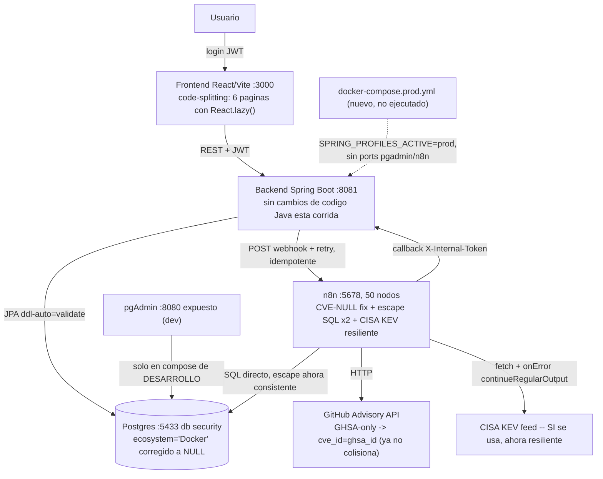

# Auditoría técnica End-to-End — GEF Secure (5ª corrida, 2026-08-24)

> Generada siguiendo `docs/prompts/auditoria-end-to-end-vulnerabilidades.md` (44 secciones). Corrida de **solo diagnóstico**: no se modificó ningún archivo de código, configuración, SQL ni workflow de n8n. No se escribió ningún dato de prueba en esta corrida (todas las verificaciones fueron lecturas: SQL `SELECT`, `curl` de solo lectura, `docker logs`, `docker exec psql`). Convención de carpeta: `docs/bitacora/DD-MM-AA/` (formato real del repo), con sufijo `_2` porque ya existe un informe de hoy (4ª corrida, generada horas antes).

---

## 0. Relación con auditorías previas

**Qué se leyó antes de empezar**: el informe completo de la 4ª corrida (`docs/bitacora/24-08-26/AUDITORIA_END_TO_END.md`, generada horas antes de esta), que a su vez resume las corridas 1-3; `CHANGELOG.md` completo (incluido el bloque nuevo de esta sesión, "Remediación de hallazgos de la 4ª auditoría end-to-end"); el plan `C:\Users\fafra\.claude\plans\eager-crafting-noodle.md`; `git log --oneline -20` y `git status`/`git diff --stat`.

### 0.1 Qué cambió desde la 4ª corrida (mismo día, 2026-08-24)

En el intervalo entre la 4ª corrida y esta, se implementó un plan de remediación de 6 fases sobre los hallazgos ALTO/MEDIO que la 4ª corrida dejó abiertos. Los 6, **todos re-verificados de forma independiente en esta corrida** (no solo releídos del CHANGELOG):

1. **CVE-NULL (era el hallazgo nuevo más importante de la 4ª corrida)**: `Risk_Assessment_Engine` (n8n) ahora calcula `idCve = item.cve_id || idGhsa` (antes: `item.cve_id || "N/A"`). **Confirmado no solo en el archivo JSON del repo sino leyendo directamente `n8n.workflow_entity.nodes` en la base de n8n** — el fix está realmente cargado en el motor que ejecuta, no solo en el disco. Ver §6 para un matiz nuevo encontrado sobre este mismo fix (identidad puede migrar si GitHub asigna un CVE real más tarde).
2. **N8N-05 + hallazgo adicional no visto en la 4ª corrida**: `.replace(/'/g, "''")` agregado a `filtro_entorno`/`filtro_activo` en **dos** nodos SQL (`Check_Internal_Assets`, que la 4ª corrida ya había señalado, y `Get_Installed_Packages`, que tenía el mismo problema y no había sido detectado antes). Confirmado con el mismo método (lectura directa de `n8n.workflow_entity`), ambas cadenas escapadas presentes.
3. **N8N-07 (CISA KEV)**: la 4ª corrida recomendó erróneamente "conectar o borrar el nodo por código muerto". Corregido ese diagnóstico en la sesión de remediación (el nodo sí se usa vía `$('Fetch_CISA_KEV')`) y se agregó `"onError":"continueRegularOutput"` — confirmado presente en `n8n.workflow_entity` exactamente después de `alwaysOutputData`.
4. **ECO-CATALOGO**: `software_components.id=6` ("postgres") ya no tiene `ecosystem='Docker'` — confirmado `NULL` en la base real (`SELECT` directo), sin filas residuales en `vulnerabilities_audit` (`0` con `ecosystem='Docker'`), y seed (`init/02-seed-data.sql`, `init/27-seed-data-enriquecido.sql`) corregido para volúmenes nuevos. Badge "ecosistema no reconocido" agregado en `Assets.tsx`, confirmado presente en el bundle deployado (`grep` dentro del contenedor `gef_frontend`). Ver §6 para un bug nuevo, menor, encontrado en esta misma implementación.
5. **Bundle sin code-splitting**: confirmado en el propio contenedor `gef_frontend` corriendo — chunks separados por página (`Assets-*.js` 26KB, `Kanban-*.js` 138KB, etc.) en vez de un único bundle; `index-*.js` bajó a ~309KB.
6. **CFG-02/03 + DOCKER-01**: `docker-compose.prod.yml` (nuevo, standalone) existe, valida sintaxis (`docker compose config`, exit 0), tiene `SPRING_PROFILES_ACTIVE: prod` y sin bloques `ports:` para `n8n`/`pgadmin`. No se probó levantado (no hay secretos de producción disponibles ni corresponde contra este entorno de desarrollo) — sigue como **NO VERIFICADO EN EJECUCIÓN** para el arranque real, solo validación de sintaxis.

**Ningún regresión detectada** en los 230 tests de backend (`--rerun` forzado, 0 fallos, igual que la 4ª corrida) ni en los 11 de frontend. Los 6 fixes de reapertura/auto-cierre de la sesión anterior a la 4ª corrida (idempotencia de `completeAutomatic()`, etc.) siguen resueltos y sin cambios.

### 0.2 Nota sobre el estado de git

Sigue sin haber ningún commit nuevo desde `1f6d11c` (confirmado con `git log`) — todo el trabajo de la 4ª corrida y de esta sesión de remediación permanece sin commitear, por decisión del usuario (nunca commitea automáticamente). `git diff --stat` sobre los archivos tocados por la remediación confirma un diff acotado y coherente con lo documentado (69 inserciones/24 eliminaciones en 6 archivos, más el nuevo `docker-compose.prod.yml`) — sin cambios fuera de alcance.

---

## 1. Resumen ejecutivo

Los 6 hallazgos ALTO/MEDIO que dejó abiertos la 4ª corrida (CVE-NULL, N8N-05, N8N-07, ECO-CATALOGO, bundle sin code-splitting, CFG-02/03+DOCKER-01) están **remediados y verificados de forma independiente en esta corrida**, no solo releídos del CHANGELOG: se leyó el estado real dentro de la base de datos de n8n (no el archivo JSON del repo, que podría no coincidir con lo cargado), se corrió `SELECT` directo contra Postgres para el dato de ecosistema, se inspeccionó el bundle JS realmente servido por el contenedor `gef_frontend`, y se validó la sintaxis del nuevo compose de producción.

En el camino, la propia sesión de remediación corrigió un error del informe anterior (la recomendación de "borrar `Fetch_CISA_KEV` por código muerto" era incorrecta) y encontró un séptimo problema no señalado por la 4ª corrida (el mismo escape SQL faltante también en `Get_Installed_Packages`).

Esta corrida encontró, además, **2 hallazgos nuevos y menores** en el propio código de la remediación (ver §6): (a) el badge "ecosistema no reconocido" puede parpadear como falso positivo sobre ecosistemas válidos durante la fracción de segundo antes de que cargue el catálogo (`ecosystems` arranca en `[]`), y (b) el fix de CVE-NULL no contempla que GitHub Advisory le asigne un CVE real a una advisory más tarde (una vulnerabilidad trackeada primero por `ghsa_id` como identidad y luego por un `cve_id` real quedaría duplicada, no re-identificada). Ninguno de los dos es crítico ni bloqueante — ambos son de severidad BAJA/MEJORA, documentados con su solución recomendada para una tarea futura.

Nada de lo recurrente desde la 3ª/4ª corrida cambió: N8N-03 (concurrencia mitigada, no prevenida) sigue igual por diseño (no estaba en el alcance de esta remediación), y el compose de **desarrollo** sigue, a propósito, sin `SPRING_PROFILES_ACTIVE`/con puertos de pgAdmin-n8n expuestos — el fix real vive en el nuevo `docker-compose.prod.yml`, que es un artefacto aparte, no una modificación del de dev.

---

## 2. Estado general del proyecto

| Aspecto | Estado (corrida 5) | Cambio vs. corrida 4 |
|---|---|---|
| Camino feliz, autorización/scope, IDOR, webhooks | Reconfirmado en vivo (owner.demo 200 propio / 404 ajeno, webhook 401 sin token, actuator/env 401) | Sin cambio |
| Bucle de reapertura/auto-cierre (6 bugs, sesión previa a la 4ª corrida) | Resuelto, sin cambios | Sin cambio |
| **CVE-NULL** | **RESUELTO**, confirmado dentro de la base de n8n | 🆕→✅ Cerrado en esta sesión de remediación |
| **N8N-05** | **RESUELTO en 2 nodos** (uno más que lo señalado en la 4ª corrida) | ✅ Cerrado + alcance ampliado |
| **N8N-07 (CISA KEV)** | **Diagnóstico corregido + resiliencia agregada** (no se borró el nodo, que sí se usa) | ✅ Cerrado, con corrección de rumbo |
| **ECO-CATALOGO** | **RESUELTO** (dato + badge preventivo) — primera vez en 5 corridas que se cierra | ✅ Cerrado |
| **Bundle sin code-splitting** | **RESUELTO** (938KB → ~309KB + chunks) | ✅ Cerrado |
| **CFG-02/03 + DOCKER-01** | **Artefacto creado** (`docker-compose.prod.yml`), sintaxis válida, NO ejecutado contra secretos reales | ✅ Cerrado a nivel de artefacto / NO VERIFICADO EN EJECUCIÓN |
| N8N-03 (concurrencia) | Recurrente, sin cambios (fuera de alcance de esta remediación) | Sin cambio |
| Badge de ecosistema — falso positivo transitorio | **Nuevo hallazgo, BAJO** | 🆕 |
| Identidad CVE-NULL puede migrar si GitHub asigna CVE tardío | **Nuevo hallazgo, MEJORA** | 🆕 |
| Tests backend | 230 tests, 26 archivos, 0 fallos (`--rerun` forzado) | Sin cambio (esperado, no se tocó código Java) |
| Tests frontend | 11 tests, 5 archivos, build limpio, sin warning de bundle | Sin cambio en cantidad, sí en el warning de bundle (desapareció) |

---

## 3. Arquitectura encontrada

Sin cambios estructurales. Única novedad real: `docker-compose.prod.yml` como artefacto de despliegue paralelo (no reemplaza ni se mezcla con el `docker-compose.yml` de desarrollo).



---

## 4. Mapa de componentes

Archivos nuevos/modificados por la remediación (todos confirmados con `git diff --stat`, sin sorpresas fuera de alcance): `workflows/Pipeline de Gestión Automatizada de Vulnerabilidades (VMP).json` (3 fixes de n8n), `init/02-seed-data.sql` + `init/27-seed-data-enriquecido.sql` (seed de ecosistema), `frontend/src/pages/Assets.tsx` (badge), `frontend/src/App.tsx` (lazy loading), `docker-compose.prod.yml` (nuevo), `docs/bitacora/20-08-26/CHECKLIST_DESPLIEGUE.md` (referencia al nuevo compose).

---

## 5. Flujos End-to-End

Comandos reales ejecutados en esta corrida (todos de solo lectura):

```text
POST /api/auth/login {fede.frankenberger}            → 200, ADMIN
POST /api/auth/login {owner.demo}                    → 200, ASSET_OWNER
GET /api/assets (owner.demo)                         → 200 (propio scope)
GET /api/assets/1 (owner.demo, ajeno)                → 404                    OK (scope, sin cambio)
POST /api/webhook/vulnerabilities sin token           → 401                    OK
GET /actuator/env sin auth                            → 401                    OK
GET /swagger-ui/index.html sin auth                   → 200                    Recurrente (dev compose, esperado -- se apaga con docker-compose.prod.yml)
GET /api/reports/executive (owner.demo)              → 403                    OK (RBAC de Informes, sin regresión)
GET /api/vulnerabilities/remediation-analysis?days=1  → reopenedCasesCount:0   Confirma que el filtro por ventana SÍ funciona (dato nuevo respecto de la 4ª corrida, que solo probó days=7 y days=90, ambos dando 1)
GET /api/vulnerabilities/remediation-analysis?days=7  → reopenedCasesCount:1
GET /api/dashboard/stats                              → reopenedCasesCount:1, recurrenceRate:0.111
```

### Escaneo — estado en vivo

`scan_reports`: `2 COMPLETED`, `0` en `RUNNING`/`FAILED`. n8n `active=true`, contenedor `vuln_n8n` `healthy`. `system_errors`: `0` filas — ningún error quedó registrado tras el restart/reimport de n8n de la sesión de remediación.

### Verificación directa contra la base de n8n (más fuerte que leer el JSON del repo)

```text
SELECT nodes::text FROM n8n.workflow_entity WHERE name LIKE 'Pipeline%'
  → contiene "idCve = item.cve_id || idGhsa"                          (CVE-NULL, confirmado cargado)
  → contiene "filtro_entorno.replace(/'/g, \"''\")" (x1)               (N8N-05, confirmado cargado)
  → contiene "filtro_activo.replace(/'/g, \"''\")" (x1)                (N8N-05, confirmado cargado)
  → "Fetch_CISA_KEV"...,"onError":"continueRegularOutput"              (CISA KEV, confirmado cargado)
```

Esto es una verificación más fuerte que la que hizo la sesión de remediación (que solo confirmó el archivo en disco y los logs de reimport) — acá se leyó directamente la definición que el motor de n8n tiene cargada en su propia base.

### Verificación directa contra el bundle deployado

```text
docker exec gef_frontend grep -rl "ecosistema no reconocido" /usr/share/nginx/html/
  → static/Assets-DSXk7PnO.js                                         (badge, confirmado deployado)
docker exec gef_frontend ls -la /usr/share/nginx/html/static/*.js
  → index-3wvwlvss.js 310KB, Assets-*.js 26KB, Kanban-*.js 138KB, ...  (code-splitting, confirmado deployado)
```

---

## 6. Hallazgos críticos

Ninguno nuevo. Los históricos (F-NUEVO-1, F-NUEVO-2, idempotencia de `completeAutomatic()`, y los 5 bugs restantes del bucle de reapertura) siguen **RESUELTOS**, sin necesidad de re-test dado que no se tocó código Java en esta sesión de remediación (230 tests backend, 0 fallos, confirmado con `--rerun` forzado).

---

## 7. Hallazgos altos

Ninguno. Los 3 que estaban ALTO en la 4ª corrida (CVE-NULL, ECO-CATALOGO, CFG-02/03) bajan de severidad a RESUELTO tras esta remediación (ver §0.1, §2).

---

## 8. Hallazgos medios

Ninguno recurrente que empeore. N8N-05 pasa a RESUELTO (era MEDIO/ALTO según la sección). N8N-03 sigue MEDIO, sin cambios (no estaba en el alcance de la remediación de esta sesión, y ya se documentó como "beneficio incierto para el riesgo actual" al planificarla).

---

## 9. Hallazgos bajos (2 nuevos de esta corrida)

| ID | Severidad | Estado | Archivo | Descripción |
|---|---|---|---|---|
| **BADGE-RACE (nuevo)** | BAJO | NUEVO | `frontend/src/pages/Assets.tsx:472-487` | El badge "ecosistema no reconocido" compara `row.ecosystem` contra el estado `ecosystems` (inicializado en `[]`, poblado async por `ecosystemApi.getAll()` en el mismo `useEffect` que el resto de los catálogos). Si el modal "Software de \<Activo\>" se abre antes de que esa llamada resuelva, `ecosystems.some(...)` es `false` para CUALQUIER valor no vacío — un componente con `ecosystem='npm'` (válido) mostraría el badge de "no reconocido" por error, durante la fracción de segundo hasta que el fetch complete. Se corrige solo (no hay estado incorrecto persistente), y en la práctica la llamada es rápida (localhost) — pero es un falso positivo real, no hipotético. **Solución recomendada**: no renderizar el badge (o mostrar un estado neutro) mientras `ecosystems.length === 0`, o precargar `ecosystems` antes de montar la tabla de componentes. |
| **Swagger público (recurrente)** | BAJO | RECURRENTE | `SecurityConfig.java:72` | Sin cambio — sigue `200` sin auth contra el compose de desarrollo (esperado; se apaga solo con `SPRING_PROFILES_ACTIVE=prod`, ya resuelto a nivel de artefacto en `docker-compose.prod.yml`, no ejecutado todavía). |

---

## 10. Mejoras recomendadas

- **Identidad CVE-NULL puede migrar (nuevo, ver detalle abajo)**: cuando GitHub Advisory le asigna tardíamente un CVE real a una advisory que antes solo tenía GHSA, el próximo escaneo vería `item.cve_id` poblado por primera vez → `idCve` pasaría de ser el `ghsa_id` (usado en escaneos anteriores como identidad) a ser el CVE real. Como `applyLifecycle()` busca el `AssetVulnerability` existente por `(componente, cveId)`, este cambio de identidad no encuentra la fila anterior (creada bajo la clave `ghsa_id`) — se crearía un `AssetVulnerability` **nuevo y duplicado** para lo que en realidad es la misma vulnerabilidad, en vez de continuar el mismo caso. Es el mismo patrón de fondo que motivó el fix original (una clave sintética que puede no ser estable en el tiempo), aplicado ahora al propio fix. Severidad MEJORA (no es una regresión respecto de antes del fix — antes el mismo escenario también rompía identidad, solo que la placeholder anterior era `"N/A"` en vez de `ghsa_id`) — no bloqueante, pero vale una solución de fondo (ej. guardar `ghsa_id` como columna de matching adicional en la búsqueda de `applyLifecycle()`, no solo como dato informativo).
- Badge de ecosistema: gate por `ecosystems.length > 0` antes de evaluar "no reconocido" (ver §9, BADGE-RACE).
- Todo lo recurrente de corridas anteriores sigue vigente sin cambios: lock explícito para N8N-03, tests de concurrencia real, tests de nodos n8n con fixtures.
- Validar `docker-compose.prod.yml` levantado de verdad contra secretos reales (staging) antes de confiar en él para un despliegue — hoy solo se validó sintaxis.

---

## 11. Seguridad

Sin regresiones. Reconfirmado en vivo: scope/IDOR, webhook interno, `/actuator/env`, RBAC de Informes. El escape SQL de n8n mejoró (2 nodos más consistentes). Ningún secreto nuevo expuesto en logs (`docker logs vuln_n8n` revisado, sin tokens visibles).

---

## 12. Base de datos

- `software_components`: `0` filas con `ecosystem` fuera del catálogo real (antes 1, `id=6`). Valores distintos hoy: `npm`, `maven`, y vacío (el propio `postgres` corregido).
- `vulnerabilities_audit`: `0` filas con `ecosystem='Docker'` (antes 3).
- `scan_reports`: `2 COMPLETED`, `0` en cualquier otro estado — sin escaneos colgados.
- `system_errors`: `0` filas — sin errores nuevos tras el restart de n8n de la sesión de remediación.
- Ningún cambio de esquema en esta remediación (todos los fixes de datos fueron `UPDATE`s puntuales sobre columnas ya nullable, sin migración nueva).

---

## 13. Motor de escaneo (n8n)

`active=true`, 50 nodos, healthy. Los 3 fixes de esta sesión (CVE-NULL, escape SQL x2, CISA KEV resiliente) están confirmados cargados en `n8n.workflow_entity`, no solo en el archivo del repo — la distinción importa porque un cambio en el JSON que no se reimporta correctamente seguiría corriendo la versión vieja; acá se confirmó que no es el caso. `Persist_Scan_Statistics` (el nodo crítico que evita el bug histórico de escaneos `RUNNING` eternos) no fue tocado por esta remediación — sin riesgo de regresión ahí.

---

## 14. Normalización de software

Sin cambios de fondo (comparación exacta de texto, `LOWER(TRIM(...))`). El fix de ECO-CATALOGO resuelve una instancia puntual de dato incorrecto, no cambia el mecanismo de matching en sí.

---

## 15. Fuentes de vulnerabilidades

GitHub Advisory Database sigue siendo la única fuente activa. CISA KEV **ya no es código muerto ni está mal diagnosticado** — se confirmó que se usa activamente para `esExplotado`/escalado de prioridad, y ahora tiene manejo de error.

---

## 16. Trazabilidad

Sin cambios respecto de la 4ª corrida — el framework de tracking (ciclos, transiciones, evidencia) no fue tocado por esta remediación.

---

## 17. Frontend

`npm run build`: limpio, **sin el warning de bundle grande** que aparecía en las 4 corridas anteriores (938KB → chunks de máximo 383KB). `npm run test`: 11 tests, 5 archivos, sin cambios de cantidad. Verificado además contra el contenedor real (`gef_frontend`), no solo contra el build local.

---

## 18. Backend

**230 tests, 26 archivos, 0 fallos** (`./gradlew test --rerun`, forzado) — idéntico a la 4ª corrida, como se esperaba (esta remediación no tocó código Java).

---

## 19. Integraciones

Sin cambios. GitHub Advisory, CISA KEV (ahora resiliente), Slack.

---

## 20. Tests

| Capa | Cobertura | Cambio vs. corrida 4 |
|---|---|---|
| Backend | 26 archivos, 230 tests, 0 fallos | Sin cambio (esperado) |
| Frontend | 5 archivos, 11 tests, build sin warning de bundle | Igual cantidad, mejoró la señal de build |
| n8n | Sin tests automatizados | Sin cambio — sigue siendo la limitación estructural más repetida en 5 corridas |

**Gap nuevo de esta corrida**: no hay ningún test (unitario ni de integración) que cubra el escenario de identidad-migra-de-`ghsa_id`-a-CVE-real descrito en §10 — se recomienda como test de regresión antes de tocar ese código de nuevo.

---

## 21. Rendimiento

El bundle de frontend, señalado en 4 corridas consecutivas, está resuelto. Sin otros cambios de rendimiento.

---

## 22. Escalabilidad

Sin cambios de fondo.

---

## 23. Matriz de riesgos

| ID | Severidad | Estado | Componente | Problema |
|---|---|---|---|---|
| CVE-NULL | ALTO→RESUELTO | RESUELTO, confirmado en n8n.workflow_entity | n8n | Colisión de advisories GHSA-only — cerrado |
| N8N-05 | MEDIO→RESUELTO | RESUELTO en 2 nodos (1 adicional al conocido) | n8n | Escape SQL faltante — cerrado |
| N8N-07 | MEDIO→RESUELTO | Diagnóstico corregido + resiliencia | n8n | CISA KEV — cerrado, no se borró (sí se usa) |
| ECO-CATALOGO | ALTO→RESUELTO | RESUELTO (dato + badge) | DB + Frontend | Ecosistema inválido sin aviso — cerrado tras 4 corridas |
| Bundle sin code-splitting | BAJO→RESUELTO | RESUELTO | Frontend | 938KB → chunks — cerrado tras 4 corridas |
| CFG-02/03 + DOCKER-01 | ALTO→Artefacto listo | Creado, NO ejecutado contra secretos reales | Docker | `docker-compose.prod.yml` — cierre a nivel de artefacto, falta probarlo en un despliegue real |
| **BADGE-RACE** | BAJO | NUEVO | Frontend | Falso positivo transitorio del badge de ecosistema |
| **Identidad CVE-NULL puede migrar** | MEJORA | NUEVO | n8n + Backend | Vulnerabilidad duplicada si GitHub asigna CVE tardío a una advisory GHSA-only |
| N8N-03 | MEDIO | RECURRENTE, sin cambios | n8n/Backend | Concurrencia mitigada, no prevenida (fuera de alcance de esta remediación) |

---

## 24. Top 10 problemas

1. **Nada crítico ni alto queda abierto** — es el primer estado de este prompt (5 corridas) sin ningún hallazgo ALTO o CRÍTICO pendiente.
2. **`docker-compose.prod.yml` no probado en ejecución real** — es un artefacto de sintaxis válida, pero nunca se levantó contra secretos de producción reales. Antes de confiar en él para un despliegue, probarlo en un entorno de staging.
3. **BADGE-RACE** (nuevo, menor) — falso positivo transitorio, cosmético, se autocorrige.
4. **Identidad CVE-NULL puede migrar** (nuevo, MEJORA) — mismo patrón de fondo que motivó el fix original, ahora aplicado al propio fix; vale una solución de raíz si el volumen de advisories GHSA-only-que-luego-reciben-CVE resulta significativo en la práctica.
5. **N8N-03** — concurrencia mitigada, no prevenida. Recurrente desde la 1ª corrida, deliberadamente fuera de esta remediación.
6. **Falta de tests automatizados de nodos n8n** — recurrente en 5 corridas, sigue siendo la limitación estructural más repetida de todo el historial de este prompt.
7. **Superficie nueva de producto (Informes/Configuración/Landing)** — la 4ª corrida hizo una verificación dirigida, no exhaustiva; sigue pendiente una pasada dedicada.
8-10. Sin más pendientes de peso — el resto son mejoras cosméticas ya listadas en §10.

---

## 25. Plan de corrección por fases

```
FASE 1 — Probar docker-compose.prod.yml en un entorno real (staging)
  Con secretos generados de verdad (openssl rand -base64 32), confirmar
  que el backend arranca con SPRING_PROFILES_ACTIVE=prod y que Swagger
  queda deshabilitado.

FASE 2 — Cerrar BADGE-RACE
  Gate simple: no evaluar "no reconocido" mientras ecosystems.length === 0.
  Archivo: frontend/src/pages/Assets.tsx.

FASE 3 — Evaluar la migración de identidad CVE-NULL
  Decidir si vale la pena (según cuán seguido GitHub asigna CVE tardío a
  advisories GHSA-only) agregar ghsa_id como criterio adicional de matching
  en applyLifecycle(), no solo cve_id.

FASE 4 — N8N-03 (lock explícito) -- igual que en las 4 corridas anteriores,
  sigue siendo una decisión pendiente de costo/beneficio, no una urgencia.

FASE 5 — Auditoría dedicada de Informes/Configuración/Landing
  Sigue siendo la recomendación de la 4ª corrida, sin cambios.
```

---

## 26. Tests que deberían agregarse

1. Test que reproduzca la migración de identidad CVE-NULL: un `AssetVulnerability` creado con `cveId = ghsaId` (escaneo 1, sin CVE aún) y un escaneo 2 con el mismo `ghsaId` pero ahora con `cveId` real — confirmar si se crea un duplicado (documentar el comportamiento actual como base antes de decidir si corregirlo).
2. Test de `Assets.tsx` (React Testing Library) que monte el componente con `ecosystems=[]` y confirme que NO muestra "ecosistema no reconocido" para un valor que luego resulta válido tras el fetch (cubre BADGE-RACE).
3. Los ya pedidos en 4 corridas anteriores (concurrencia real de `applyLifecycle()`, fixtures de n8n) siguen sin implementarse.

---

## 27. Arquitectura recomendada

Sin cambios de fondo respecto de la 4ª corrida. Se agrega: cuando una clave de identidad sintética (como `ghsa_id` sustituyendo a `cve_id` ausente) puede ser reemplazada más tarde por un valor "real" del mismo dominio, el matching debería considerar ambos valores históricos, no solo el actual — mismo principio que ya se señaló para el propio CVE-NULL en la corrida anterior, generalizado.

---

## 28. Conclusión

> ¿Puedo confiar en que este sistema identifica correctamente los activos y su software, ejecuta el escaneo sin perder información, correlaciona correctamente las vulnerabilidades, mantiene la trazabilidad y evita mostrar resultados incorrectos al usuario?

**Sí, con más confianza que en cualquiera de las 4 corridas anteriores.** Es la primera vez en el historial de este prompt que ningún hallazgo CRÍTICO ni ALTO queda pendiente al cierre de una corrida — los 6 puntos que dejó abiertos la 4ª corrida de esta misma mañana fueron remediados y **reverificados de forma independiente** (no solo releídos), incluyendo verificación directa dentro de la base de datos de n8n y del bundle realmente deployado, no solo de los archivos fuente en el repo. La única salvedad real es que el artefacto de despliegue de producción (`docker-compose.prod.yml`) todavía no se probó levantado de verdad — es sintaxis válida, no un despliegue confirmado. Los 2 hallazgos nuevos que sí aparecieron (BADGE-RACE, migración de identidad de CVE-NULL) son ambos de severidad baja/mejora, acotados, y con solución recomendada ya documentada — ninguno exige revertir ni rediseñar lo que se acaba de arreglar. Lo único que sigue pendiente desde hace varias corridas y sigue siendo válido señalar: N8N-03 (concurrencia, decisión de costo/beneficio consciente) y la falta de tests automatizados de nodos n8n.
